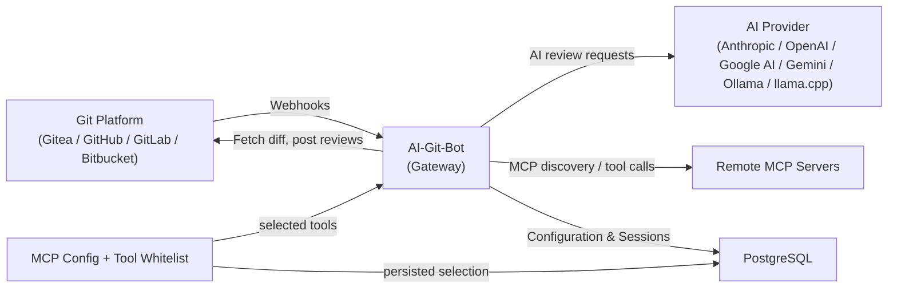

# AI-Git-Bot

[](LICENSE)
[](https://hub.docker.com/r/tmseidel/ai-git-bot)
[](https://github.com/tmseidel/ai-git-bot/releases)
[](https://github.com/tmseidel/ai-git-bot/stargazers)
[](https://github.com/tmseidel/ai-git-bot/issues)

🌐 言語選択：[English](README.md) · **日本語** · [中文](README.zh.md) · [한국어](README.ko.md)

> **チームがすでに使っている Git ツールの中で、必要だけれど不快なソフトウェア開発作業を自動化しましょう。**

どのチームにも *「やるべきだと分かっているのに、つい後回しになる」* エンジニアリング作業の一覧があります。コーディングを始める*前に*適切にスコープされた issue を書くこと。直したばかりのログインバグに対する回帰 E2E テストを追加すること。3 回目の force-push の後に PR を再レビューすること。古くなったプレビュー環境を破棄すること。こうした作業は**必要**です（省くとコードベースは少しずつ傷んでいきます）が、同時に**不快**でもあります（楽しい部分ではないので、締め切りの圧力がかかると真っ先に削られます）。

**AI-Git-Bot はそうした作業を、繰り返し実行できる自動化ワークフローに変えます。** それらは **Gitea、GitHub、GitHub Enterprise、GitLab、Bitbucket Cloud** の中でネイティブに動作し、チームが*すでに*発生させているイベント（issue の割り当て、PR の作成、reviewer の再リクエスト、コメントでの `@bot` メンション）によってトリガーされます。

> ## 📣 初めてですか？ **まずは pitch を読んでください。**
>
> **このプロジェクトがなぜ存在するのか、チームに何をもたらすのか、そして Copilot Workspace / GitLab Duo / Qodo / Aider と比べてどうなのか**を知りたいなら、pitch から始めるのが最短です。AI-Git-Bot が自分たちに合っているかどうかを最も早く判断できます。
>
> 👉 **[doc/pitch/PITCH.md](doc/pitch/PITCH.md)** — ロングフォーム pitch（約 10 分）

<p align="center">
  
</p>

## 🩹 解消する痛み

| 不快な作業 | よくある状況 | AI-Git-Bot が行うこと |
|---|---|---|
| 🧾 コードを書く前に **良い issue を書く** | 曖昧なバグ報告がキューに積まれ、数日後にチャットで再度説明が必要になります。受け入れ基準も欠けています。 | その issue に **writer bot** を割り当てると → 関連 issue とリポジトリ（読み取り専用）を調べ、*最小限の*確認質問だけを行い、受け入れ基準を含む構造化された `AI Created Issue: …` を作成します。 |
| 🔍 reviewer が手一杯でも **PR を一貫してレビューする** | レビューが流し読みになり、回帰が入り込み、同じコメントを毎回手作業で書くことになります。 | **review bot** は、bot が reviewer としてリクエストされるたびに同じレビューを実行します。大きな diff は分割され、コメントはインラインで付き、`@bot` メンションが議論を PR 内に留めます。 |
| 🧪 直したばかりのバグに対する **回帰 E2E テストを書く** | 「あとでテストを追加しよう」——そして結局追加されません。すべての PR で手動 QA が繰り返されます。 | デプロイ対象と `Full-stack QA` ワークフローを割り当てると → bot が Playwright テストを**計画し、作成し、デプロイし、実行**し、レポートを PR コメントとして投稿し、PR クローズ時に環境を破棄します。 |
| 🔬 **PR 内のコードに対するユニットテストを書く** | 新しい振る舞いがテストなしで出荷され、カバレッジが静かに下がっていきます。 | `unit-test-author` ワークフローを有効にすると → bot が PR diff を読み、**既存テストの隣にホワイトボックスなユニットテストを書き**、プロジェクト独自のランナー（`mvn` / `gradle` / `npm` / `pytest` / `go` / `cargo` / `dotnet` / `bundle` / `make` / `gcc` / `g++`）で実行し、PR ブランチにコミットして、結果とカバレッジを投稿します。プレビュー環境は不要です。 |
| 🛠️ **退屈な後続 issue を実装する**（rename、dependency bump、小さな refactor） | 作業が溜まり、シニアはやりたがらず、ジュニアはそこで詰まりがちです。 | issue を **coding bot** に割り当てると — ソースを読み、ワークスペースで変更案を作り、プロジェクト自身のビルドツール（Maven / Gradle / npm / Go / Cargo / .NET）で検証して、PR を開きます。 |
| 🔁 何かが flaky に失敗したとき **テストを再実行 / カバレッジを再生成する** | エンジニアがローカルで手動再実行し、レポートをコピーして、スクリーンショットを貼ります。 | `@bot rerun-tests` は既存スイートを再実行し、`@bot regenerate-tests <feedback>` はオペレーターのヒント付きでスイートを再計画します。 |
| 🧹 **古くなったプレビュー環境を破棄する** | 忘れられた PR プレビューが積み上がり、クラスタ予算を消費し、データ漏えいを引き起こします。 | PR クローズのライフサイクルフックが、デプロイ対象の `teardown` アクションを呼び出します — webhook、MCP tool、静的 no-op、または CI workflow dispatch（`CI_ACTION` 戦略）です。 |

> **今四半期で一番つらい作業を 1 つ選んでください。bot を 1 つつなぐ。それで完了です。他のワークフローは bot 単位の opt-in なので、触らないリポジトリには何も起きません。**

<p align="center">
  
</p>

## 🧰 コアワークフロー

各ワークフローは、管理 UI から bot ごとに有効化できる **第一級の名前付き PR ワークフロー** です。すべて同じオーケストレーター（`PrWorkflowOrchestrator`）を通るため、セッションメモリ、監査ログ、スラッシュコマンドディスパッチ、ツールホワイトリストを共有します。

| ワークフロー | トリガー | 生成されるもの |
|---|---|---|
| **Review** | bot が reviewer として割り当てられた状態で PR が開かれる、または bot が再リクエストされる | インライン + 要約レビューコメント、大きな diff の分割処理 |
| **Issue → Code (coding agent)** | issue が *coding* bot に割り当てられる | 変更を実装した pull request |
| **Issue → Better Issue (writer agent)** | issue が *writer* bot に割り当てられる | 受け入れ基準を含む構造化された `AI Created Issue` |
| **Interactive Q&A** | 任意の PR またはインラインレビューコメントで `@bot` がメンションされる | ファイル / diff コンテキスト付きのスレッド返信 |
| **Full-stack QA (E2E tests)** | `e2e-test` ワークフロー + デプロイ対象が設定された bot 上で PR が開かれる | 生成された Playwright スイート、PR に投稿される実行レポート、PR クローズ時の環境破棄 |
| **Unit tests (test author)** | `unit-test-author` ワークフローが設定された bot 上で PR が開かれる（または `@bot generate-tests`） | diff に対して生成されたホワイトボックスなユニットテストをプロジェクト独自のランナーで実行し、PR ブランチへコミットし、結果 + カバレッジを PR コメントとして投稿（[details](doc/PR_WORKFLOWS_UNIT_TEST.md)） |
| **Suite promotion** | オペレーターがスイートごとに opt-in | 生成されたスイートをリポジトリに「昇格」させる後続 PR（[user story を見る](doc/agentic-workflows/SUITE_PROMOTION_USER_STORY.md)） |

> オペレーター向けの詳細は [PR Workflows ガイド](doc/PR_WORKFLOWS.md) と [Agent ドキュメント](doc/AGENT.md) を参照してください。

> 🎥 **PR ワークフローが実際に動く様子を見る:** [AI-Git-Bot — PR workflow walkthrough on YouTube](https://www.youtube.com/watch?v=MjFmZHGIO-w)
>
> [](https://www.youtube.com/watch?v=MjFmZHGIO-w)

> ## 🧪 プロジェクト成熟度とテスト済み provider マトリクス
>
> AI-Git-Bot は単独メンテナーによるサイドプロジェクトです。すべての Git host × すべての AI provider 組み合わせに対して、現実的にフル機能を回すことはできません。そのため provider 固有コードの多くは **公式 API ドキュメントをもとに実装し、AI でレビューした上で**、私自身が本番で運用しているスタックでのみ end-to-end 検証しています。
>
> | Provider | 成熟度 |
> |---|---|
> | **Gitea** | ✅ **十分にテスト済み** — 主要ターゲットであり、毎リリースごとに end-to-end で検証しています（webhook、PR review、coding agent、writer agent、E2E full-stack QA を含む）。 |
> | **GitHub / GitHub Enterprise** | ✅ **十分にテスト済み** — プロジェクト自身が日常的な開発の中でこれらの連携とワークフローを広く使っているため、GitHub の機能セットは対象を絞ったテストだけでなく、実運用に近い利用の中でも継続的に検証されています。 |
> | **GitLab** | ⚠️ 実験的 — REST / Webhook ドキュメントをもとに実装。基本フローは smoke test 済みですが、大規模には検証していません。 |
> | **Bitbucket Cloud** | ⚠️ 実験的 — REST / Webhook ドキュメントをもとに実装。基本フローは smoke test 済みですが、大規模には検証していません。 |
>
> **Full-stack QA / E2E PR review ワークフロー**は最も複雑な可動部分です（デプロイ対象、生成されたテストスイート、コールバック、teardown lifecycle）。そのため **Gitea を含むすべての provider 上で実験的機能とみなすべき**です — host ごとに実行時セマンティクスが微妙に異なり、すべての組み合わせが検証済みではありません。
>
> 🐛 **バグ報告は大歓迎です** — [GitHub issue](https://github.com/tmseidel/ai-git-bot/issues) に provider、バージョン、ワークフロー、関連ログ抜粋を添えてください。マトリクス全体の粗い部分を最速で直す方法です。
>
> 🧰 **再現可能な system-test コンテナ** — 粗い部分を見つけやすくするため、すべての非自明なワークフローには [`systemtest/`](systemtest/) 配下に自己完結型の `docker-compose` スタックとレシピ README が付属しています。bot + 実際の Git host + サンプルアプリ +（必要に応じて）ローカル LLM を起動し、本番システムに触れずにワークフローを end-to-end で試せます：
>
> | スタック | Compose ファイル | レシピ |
> |---|---|---|
> | ローカル **Gitea** + runner + bot | [`docker-compose-local-gitea.yml`](systemtest/docker-compose-local-gitea.yml) | [`systemtest/README.md`](systemtest/README.md) |
> | ローカル **GitLab** + bot | [`docker-compose-local-gitlab.yml`](systemtest/docker-compose-local-gitlab.yml) | [`systemtest/README.md`](systemtest/README.md) |
> | Full-stack QA 用 E2E サンプルアプリ | [`docker-compose-e2e-sample.yml`](systemtest/docker-compose-e2e-sample.yml) | [`systemtest/README.md`](systemtest/README.md) |
> | `CI_ACTION` デプロイ戦略 | [`docker-compose-ci-action.yml`](systemtest/docker-compose-ci-action.yml) | [`systemtest/README-ci-action.md`](systemtest/README-ci-action.md) |
> | `MCP` デプロイ戦略 | [`docker-compose-mcp-deployment.yml`](systemtest/docker-compose-mcp-deployment.yml) | [`systemtest/README-mcp-deployment.md`](systemtest/README-mcp-deployment.md) |
> | GitHub 向け MCP tool-calling | [`docker-compose-mcp-github.yml`](systemtest/docker-compose-mcp-github.yml) | [`systemtest/README-mcp-github.md`](systemtest/README-mcp-github.md) |
> | Suite-promotion ワークフロー | — | [`systemtest/README-suite-promotion.md`](systemtest/README-suite-promotion.md) |
> | **Ollama** 経由のローカル LLM | [`docker-compose-ollama.yml`](systemtest/docker-compose-ollama.yml) | [`doc/OLLAMA.md`](doc/OLLAMA.md) |
> | **llama.cpp** 経由のローカル LLM | [`docker-compose-llamacpp.yml`](systemtest/docker-compose-llamacpp.yml) | [`doc/LLAMACPP.md`](doc/LLAMACPP.md) |
>
> これらのスタックのどれかでバグを再現できたら、使用した compose ファイルと bot ログを添えてください。多くの報告が 1 コミットで直せる問題になります。

## 🌍 E2E ワークフローはプレビュー環境をどこにデプロイするのか

**Full-stack QA** ワークフローには、テスト対象となる PR ごとの環境が必要です。チームごとに*かなり*異なるデプロイパイプラインをすでに持っているため、bot には 4 つの差し替え可能な実装を持つ小さな **`DeploymentStrategy` SPI** が用意されています。チームの現実に最も合うものを選んでください：

| 戦略 | 向いているケース | 具体的なユーザーストーリー |
|---|---|---|
| **`STATIC`** | Vercel / Netlify / GitLab review apps / Render — 予測可能な URL で PR ごとのプレビューをすでに作るもの | [フロントエンドリード Marco](doc/agentic-workflows/STATIC_DEPLOYMENT_USER_STORY.md) |
| **`WEBHOOK`** | Jenkins / TeamCity / 企業ファイアウォール背後のスクリプト — HMAC 署名付きコールバックを bot に `curl` できる場所 | [DevOps エンジニア Priya](doc/agentic-workflows/WEBHOOK_DEPLOYMENT_USER_STORY.md) |
| **`MCP`** | すでに MCP 経由で deploy / status / teardown を公開している内部プラットフォームチーム — 追加サービス不要、単一ホワイトリスト、inbound callback なし | [プラットフォームエンジニア Alex](doc/agentic-workflows/MCP_DEPLOYMENT_USER_STORY.md)（ノート PC での再現: `systemtest/docker-compose-mcp-deployment.yml`） |
| **`CI_ACTION`** | provider-native CI（GitHub Actions / GitLab CI / Bitbucket Pipelines / Gitea Actions）— 既存のリポジトリ資格情報で dispatch、新しい secret 不要 | [SRE Sam](doc/agentic-workflows/CI_ACTION_DEPLOYMENT_USER_STORY.md)（オペレーターレシピ: [`doc/PR_WORKFLOWS_CI_ACTIONS.md`](doc/PR_WORKFLOWS_CI_ACTIONS.md)；ノート PC での再現: `systemtest/docker-compose-ci-action.yml`） |

> agentic PR ワークフローの完全な **機能ドキュメント** — 概念、アーキテクチャ、ペルソナ駆動のユーザーストーリー、内部構造 — は [`doc/agentic-workflows/`](doc/agentic-workflows/README.md) にあります。

## ✍️ 2 つのエージェントペルソナを詳しく見る

### 🤖 Coding agent — 「この退屈な変更をやっておいて」系 issue 向け

issue を coding bot に割り当てると — タスクを解析し、ソースコードを読み、サンドボックス化されたワークスペースで変更を生成し、プロジェクトのビルドツール（Maven / Gradle / npm / Go / Cargo / .NET）で検証し、完成した pull request を開きます。

<details>
<summary>📸 スクリーンショット: 複数プラットフォームでの Coding agent</summary>

**GitHub:**


**GitLab:**


</details>

### ✍️ Writer agent — 「この issue はまだ実行可能ではない」チケット向け

コード変更ではなく *問題文そのもの* を良くしたいときに、issue を writer bot に割り当てます。writer agent は関連 issue を調べ、リポジトリを読み取り専用で探索して naming、影響を受けるコンポーネント、制約を理解したうえで、受け入れ基準を含む後続の `AI Created Issue: …` を作成します。

典型的な writer bot の利用例：

- 曖昧なバグ報告を、再現可能でテスト可能な issue に変える
- 機能要望を、構造化されたエンジニアリング作業項目に書き直す
- 不足している受け入れ基準、矛盾点、未解決の問いを浮かび上がらせる
- 元の作成者には、本当に必要な最小限の追質問だけをする

Writer bot は issue-assignment ワークフローを持つ provider（Gitea、GitHub、GitLab）を対象としています。PR review イベントは無視し、リポジトリファイルを変更することは決してありません。

## 🔍 PR でのレビュー + インタラクティブ Q&A

PR が開かれた時点で bot がすでに reviewer として割り当てられている、または後から bot が再リクエストされた場合、review bot はインライン + 要約フィードバックを投稿します。大きな diff は自動で分割され、token 制限に当たるとリトライされます。追質問をしたい場合は、任意のコメントまたはインラインレビューコメントで `@bot` をメンションしてください。bot は完全なファイル / diff コンテキストとセッション履歴をもとに返信します。

<details>
<summary>📸 スクリーンショット: 複数プラットフォームでのレビュー + 会話</summary>

**Gitea:** 

**GitHub:** 

**GitLab:** 

**Bitbucket:** 

**インラインコメントスレッド（Gitea）:** 

</details>

## 🧱 内部構造: AI と Git に依存しないゲートウェイ

1 つの bot が 4 つの Git プラットフォームと 5 つの AI provider に対応できる理由は、AI-Git-Bot が小さな **ゲートウェイ** として構成されているからです。各 Git プラットフォームは `RepositoryApiClient` SPI を通して接続され、各 AI provider は `AiClient` SPI を通して接続され、ツール呼び出し（組み込み + MCP）は統一された `AgentToolRouter` を流れます。これは確かに便利ですが、あくまで *それを可能にする基盤* であって headline feature ではありません。本当の headline feature は **上にあるワークフロー群** であり、この設計のおかげでそれらがどこでも動きます。

この内部構造に関心があるなら [Architecture ドキュメント](doc/ARCHITECTURE.md) を見てください。要点は次のとおりです：

- 🔗 **1 つの設定で複数リポジトリ** — AI integration を一度設定すれば、好きなだけ bot に紐づけられる
- 🔀 **自由な組み合わせ** — サポートされている任意の AI provider と任意の Git プラットフォームを組み合わせ可能
- 🛡️ **集中管理** — API key、token、prompt、tool whitelist を 1 つの管理 UI で扱える
- 🔐 **保存時に暗号化されるシークレット** — すべての認証情報に AES-256-GCM を適用
- 🧩 **MCP-ready** — リモート MCP server を bot に接続可能。tool 単位 whitelist によって、agent が見られる MCP ツールを正確に制御できる（[MCP Server Handling](doc/MCP_SERVER_HANDLING.md)）
- 📊 **単一ダッシュボード** — すべての bot とワークフロー実行にまたがる統計 + 監査

### 🔌 サポートされている AI provider

| Provider | デフォルト API URL | 推奨モデル |
|---|---|---|
| **Anthropic** | `https://api.anthropic.com` | claude-opus-4-7, claude-sonnet-4-6, claude-haiku-4-5-20251001 |
| **OpenAI** | `https://api.openai.com` | gpt-5.5, gpt-5.4, gpt-5.4-mini, gpt-5.3-codex |
| **Google AI / Gemini** | `https://generativelanguage.googleapis.com` | gemini-2.5-pro, gemini-2.5-flash, gemini-2.0-flash |
| **Ollama** | `http://localhost:11434` | ユーザー設定のローカルモデル |
| **llama.cpp** | `http://localhost:8081` | ユーザー設定の GGUF モデル |

### 🌐 サポートされている Git プラットフォーム

| Provider | 説明 |
|---|---|
| **Gitea** | セルフホスト Gitea インスタンス |
| **GitHub** | github.com |
| **GitHub Enterprise** | セルフホスト GitHub Enterprise Server |
| **GitLab** | gitlab.com および self-managed GitLab CE/EE |
| **Bitbucket Cloud** | bitbucket.org |

### その他のうれしい点

- **PR ごとのセッションメモリ** を PostgreSQL に保存し、追質問でも文脈を維持
- **再利用可能な名前付き system prompt** — review / coding / writer の各ペルソナ用に、bot ごとに 1 つ割り当て可能
- **bot ごとの組み込みツールホワイトリスト**（[BOT_TOOL_CONFIGURATIONS.md](doc/BOT_TOOL_CONFIGURATIONS.md)）
- **エンドツーエンドでセルフホスト可能** — ローカル LLM（Ollama、llama.cpp）を含み、何もインフラ外へ出す必要がない
- **軽量運用** — Docker イメージ 1 つ、PostgreSQL データベース 1 つ。Kubernetes 不要。
- **ヘルスエンドポイント** — オーケストレーター向け `/actuator/health`

## Docker

この bot は [Docker Hub](https://hub.docker.com/r/tmseidel/ai-git-bot) で Docker イメージとして利用できます。

```yaml
services:
  app:
    image: tmseidel/ai-git-bot:latest
    ports:
      - "8080:8080"
    environment:
      SPRING_PROFILES_ACTIVE: docker
      DATABASE_URL: jdbc:postgresql://db:5432/giteabot
      DATABASE_USERNAME: ${DATABASE_USERNAME:-giteabot}
      DATABASE_PASSWORD: ${DATABASE_PASSWORD:-giteabot}
      APP_ENCRYPTION_KEY: ${APP_ENCRYPTION_KEY:-change-me}
    depends_on:
      db:
        condition: service_healthy
    restart: unless-stopped

  db:
    image: postgres:17-alpine
    environment:
      POSTGRES_DB: giteabot
      POSTGRES_USER: ${DATABASE_USERNAME:-giteabot}
      POSTGRES_PASSWORD: ${DATABASE_PASSWORD:-giteabot}
    volumes:
      - pgdata:/var/lib/postgresql/data
    healthcheck:
      test: ["CMD-SHELL", "pg_isready -U ${DATABASE_USERNAME:-giteabot}"]
      interval: 5s
      timeout: 5s
      retries: 5
    restart: unless-stopped

volumes:
  pgdata:
```

## クイックスタート

### 1. アプリケーションを起動する

```bash
docker compose up --build -d
```

これにより次が起動します：
- **8080** ポートで動く bot アプリケーション
- 永続化のための **PostgreSQL 17** データベース

### 2. 初期設定

1. `http://localhost:8080` にアクセスします
2. 管理者アカウントを作成します
3. ログインして管理ダッシュボードに入ります

### 3. Integration を設定する

1. **AI Integration を作成する:**
   - **AI Integrations → New Integration** に移動
   - provider を選択します（例: "anthropic"）
   - API URL は provider のデフォルト値で自動入力されます
   - ドロップダウンからモデルを選択するか、カスタムモデル名を入力します
   - API key を入力します
   - OpenAI-compatible provider は、通常 "openai" を選択し、その provider のカスタム API URL、API key、モデルを入力することで設定できます。詳しくは [User Guide](doc/USER_GUIDE.md#openai-compatible-apis) を参照してください
   - Gemini の場合は UI で **gemini** を選択し、Google AI Studio の Gemini API key を使用してください。詳しくは [User Guide](doc/USER_GUIDE.md#google-ai) を参照してください

2. **Git Integration を作成する:**
   - **Git Integrations → New Integration** に移動
   - provider を選択します（Gitea、GitHub、GitLab、Bitbucket）
   - Git サーバー URL と API token を入力します
   - [Gitea Setup](doc/GITEA_SETUP.md)、[GitHub Setup](doc/GITHUB_SETUP.md)、[GitLab Setup](doc/GITLAB_SETUP.md)、[Bitbucket Setup](doc/BITBUCKET_SETUP.md) を参照してください

3. **Bot を作成する:**
   - **Bots → New Bot** に移動
   - PR review / issue implementation 用なら **Coding bot**、技術文書寄りの issue 下書き用なら **Writer bot** を選択します
   - AI と Git integration を選択します
   - **System settings** から system prompt エントリを選びます
   - 生成された **Webhook URL** をコピーします

### 4. Webhook を設定する

Git provider 側で webhook を設定し、PR イベントを bot に通知します。

- **Gitea:** [Gitea Setup](doc/GITEA_SETUP.md#4-configure-webhooks) を参照
- **GitHub:** [GitHub Setup](doc/GITHUB_SETUP.md#4-configure-webhooks) を参照
- **GitLab:** [GitLab Setup](doc/GITLAB_SETUP.md#4-configure-webhooks) を参照
- **Bitbucket Cloud:** [Bitbucket Setup](doc/BITBUCKET_SETUP.md#step-4-configure-the-webhook-in-bitbucket) を参照

詳細は [User Guide](doc/USER_GUIDE.md) を参照してください。

## アーキテクチャ概要



bot は Git provider から webhook を受け取り、PR diff を取得し、設定された AI provider にレビューを依頼し、その結果を再び Git 側へ投稿します。オプションの MCP 機能はアプリケーション層でオーケストレーションされ、設定ごとに保存されたツールホワイトリストによって制限されます。すべての設定（AI integrations、Git integrations、bots、MCP configurations、MCP selected tools）と会話セッションはデータベースに保存されます。

➡️ 詳細なコンポーネント図とリクエストフローは [Architecture Documentation](doc/ARCHITECTURE.md) を参照してください。

## ドキュメント

| ドキュメント | 説明 |
|----------|-------------|
| [User Guide](doc/USER_GUIDE.md) | Web UI の使い方、bot と integration の作成 |
| [MCP Server Handling](doc/MCP_SERVER_HANDLING.md) | MCP JSON 設定、ツールホワイトリスト選択、bot 詳細ビュー、MCP 呼び出しの透明性 |
| [Bot Tool Configurations](doc/BOT_TOOL_CONFIGURATIONS.md) | bot ごとの組み込み agent ツールホワイトリスト — 管理 UI、実行時強制、デフォルト設定、マイグレーション |
| [Architecture](doc/ARCHITECTURE.md) | コンポーネント図、リクエストフロー、webhook ルーティング |
| [Agent](doc/AGENT.md) | Coding agent と technical writer agent — セットアップ、ツール、ワークフロー |
| [Tool Calling KB](doc/TOOL_CALLING.md) | provider ごとにツール API が異なる理由、抽象化とフォールバック、モデルが誤動作したときの対処（レガシー tool-calling スイッチ含む） |
| **Git Provider セットアップ** | |
| [Gitea Setup](doc/GITEA_SETUP.md) | Gitea 用 bot ユーザー作成、権限、API token |
| [GitHub Setup](doc/GITHUB_SETUP.md) | GitHub 用 bot ユーザー作成、権限、PAT token |
| [GitLab Setup](doc/GITLAB_SETUP.md) | GitLab 用 bot ユーザー作成、権限、PAT token |
| [Bitbucket Setup](doc/BITBUCKET_SETUP.md) | Bitbucket Cloud 用 API token と webhook 設定 |
| **AI Provider セットアップ** | |
| [Using Ollama](doc/OLLAMA.md) | Ollama 経由でローカル LLM を使って実行 |
| [Using llama.cpp](doc/LLAMACPP.md) | llama.cpp と GBNF grammar サポートで実行 |
| **デプロイ** | |
| [Deployment](doc/DEPLOYMENT.md) | Docker Compose デプロイ、環境変数 |
| [Local Development](doc/LOCAL_DEVELOPMENT.md) | ビルド、テスト、プロジェクト構成 |
| **コミュニティ** | |
| [Contributing](CONTRIBUTING.md) | コントリビューションガイドライン、コーディング規約 |
| [Code of Conduct](CODE_OF_CONDUCT.md) | コミュニティ行動規範 |
| [Security Policy](SECURITY.md) | 脆弱性報告と運用者向けセキュリティガイダンス |
| [Changelog](CHANGELOG.md) | リリースノートと主要な変更 |
| [Citation Metadata](CITATION.cff) | 引用とソフトウェアカタログ用メタデータ |
| [CodeMeta](codemeta.json) | カタログやクローラー向けの機械可読ソフトウェアメタデータ |
| [LLM Index](llms.txt) | コンパクトな LLM / 検索エンジン向けエントリポイント |
| [Full LLM Reference](llms-full.txt) | LLM と RAG システム向けの拡張単一ファイルコンテキスト |

## ライセンス

[MIT](LICENSE)


