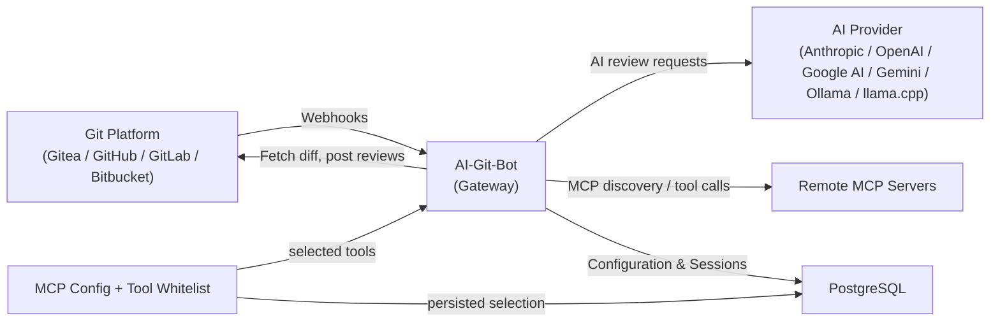

# AI-Git-Bot

[](LICENSE)
[](https://hub.docker.com/r/tmseidel/ai-git-bot)
[](https://github.com/tmseidel/ai-git-bot/releases)
[](https://github.com/tmseidel/ai-git-bot/stargazers)
[](https://github.com/tmseidel/ai-git-bot/issues)

🌐 언어 선택: [English](README.md) · **한국어** · [中文](README.zh.md) · [日本語](README.ja.md)

> **팀이 이미 사용하고 있는 Git 도구 안에서, 필요하지만 불편한 소프트웨어 개발 작업을 자동화하세요.**

모든 팀에는 *"우리가 해야 한다는 건 알지만 실제로는 잘 안 하는"* 엔지니어링 잡무 목록이 있습니다. 코딩을 시작하기 *전에* 범위가 잘 정의된 이슈를 작성하는 일. 방금 수정한 로그인 버그를 위한 회귀 E2E 테스트를 추가하는 일. 세 번째 force-push 이후 PR을 다시 리뷰하는 일. 오래된 프리뷰 환경을 정리하는 일. 이런 일들은 **필수적**입니다(건너뛰면 코드베이스가 서서히 망가집니다). 하지만 동시에 **불편한** 일입니다(재미있는 부분이 아니고, 마감 압박이 오면 가장 먼저 빠집니다).

**AI-Git-Bot은 그런 잡무를 반복 가능한 자동화 워크플로우로 바꿉니다.** 그리고 그 워크플로우는 **Gitea, GitHub, GitHub Enterprise, GitLab, Bitbucket Cloud** 안에서 네이티브하게 동작하며, 팀이 *이미* 만들어내고 있는 이벤트(issue 할당, PR 생성, reviewer 재요청, 댓글에서 `@bot` 언급)에 의해 트리거됩니다.

> ## 📣 처음 오셨나요? **먼저 pitch를 읽어보세요.**
>
> **이 프로젝트가 왜 존재하는지, 팀에 무엇을 해주는지, 그리고 Copilot Workspace / GitLab Duo / Qodo / Aider와 어떻게 비교되는지** 알고 싶다면 pitch부터 시작하세요. AI-Git-Bot이 여러분에게 맞는지 가장 빠르게 판단할 수 있는 방법입니다.
>
> 👉 **[doc/pitch/PITCH.md](doc/pitch/PITCH.md)** — 긴 형식의 pitch (~10분)

<p align="center">
  
</p>

## 🩹 해결해 주는 고통 포인트

| 불편한 작업 | 보통 무슨 일이 일어나는가 | AI-Git-Bot이 하는 일 |
|---|---|---|
| 🧾 어떤 코드도 작성하기 전에 **좋은 이슈를 작성하기** | 모호한 버그 리포트가 큐에 쌓이고 며칠 뒤 채팅에서 다시 설명하게 됩니다. 수용 기준도 빠져 있습니다. | 해당 이슈에 **writer bot**을 할당하면 → 관련 이슈와 저장소를(읽기 전용) 살펴보고, *최소한의* 확인 질문만 한 뒤, 수용 기준이 포함된 구조화된 `AI Created Issue: …`를 만듭니다. |
| 🔍 리뷰어가 너무 바쁘더라도 **PR을 일관되게 리뷰하기** | 리뷰가 대충 훑고 지나가고, 회귀 문제가 숨어들고, 같은 코멘트를 계속 손으로 반복해서 씁니다. | **review bot**이 봇이 리뷰어로 요청될 때마다 동일한 리뷰를 실행합니다. 큰 diff는 청크로 나뉘고, 코멘트는 인라인으로 달리며, `@bot` 멘션은 논의를 PR 안에 머물게 합니다. |
| 🧪 방금 수정한 버그에 대한 **회귀 E2E 테스트 작성하기** | “테스트는 나중에 추가하자” — 그리고 결국 추가되지 않습니다. 모든 PR에서 수동 QA가 반복됩니다. | 배포 대상과 `Full-stack QA` 워크플로우를 할당하면 → 봇이 Playwright 테스트를 **계획하고, 작성하고, 배포하고, 실행**한 뒤, 보고서를 PR 코멘트로 게시하고, PR이 닫히면 환경을 정리합니다. |
| 🔬 **PR 안의 코드에 대한 단위 테스트 작성하기** | 새로운 동작이 테스트 없이 배포되고, 커버리지가 조용히 떨어집니다. | `unit-test-author` 워크플로우를 활성화하면 → 봇이 PR diff를 읽고 **기존 테스트 옆에 화이트박스 단위 테스트를 작성**한 뒤, 프로젝트 자체 러너(`mvn` / `gradle` / `npm` / `pytest` / `go` / `cargo` / `dotnet` / `bundle` / `make` / `gcc` / `g++`)로 실행하고, PR 브랜치에 커밋하며, 결과 + 커버리지를 게시합니다. 프리뷰 환경은 필요 없습니다. |
| 🛠️ **지루한 후속 이슈 구현하기** (rename, dependency bump, 작은 refactor) | 일이 쌓여만 가고, 시니어 엔지니어는 하고 싶어 하지 않으며, 주니어는 막히기 쉽습니다. | 이슈를 **coding bot**에 할당하면 — 소스를 읽고, 작업 공간에서 변경을 초안으로 만들고, 프로젝트 자체 빌드 도구(Maven / Gradle / npm / Go / Cargo / .NET)로 검증한 뒤, PR을 엽니다. |
| 🔁 뭔가 flaky하게 실패했을 때 **테스트 재실행 / 커버리지 재생성하기** | 엔지니어가 로컬에서 수동으로 다시 돌리고, 리포트를 복사해 와서, 스크린샷을 붙여 넣습니다. | `@bot rerun-tests`는 기존 테스트 스위트를 다시 실행하고, `@bot regenerate-tests <feedback>`는 운영자 힌트를 반영해 스위트를 다시 계획합니다. |
| 🧹 **오래된 프리뷰 환경 정리하기** | 잊힌 PR 프리뷰가 계속 쌓이고, 클러스터 예산을 태우고, 데이터를 노출시킵니다. | PR 종료 lifecycle hook이 배포 대상의 `teardown` 액션을 호출합니다 — webhook, MCP tool, static no-op, 또는 CI workflow dispatch(`CI_ACTION` 전략) 방식입니다. |

> **이번 분기에 가장 아픈 작업 하나만 고르세요. 봇 하나만 연결하세요. 끝입니다. 다른 워크플로우는 봇별 opt-in이므로 — 건드리지 않는 저장소에는 아무 일도 일어나지 않습니다.**

<p align="center">
  
</p>

## 🧰 핵심 워크플로우

각 워크플로우는 관리자 UI에서 봇별로 활성화할 수 있는 **1급(named) PR 워크플로우**입니다. 모두 동일한 오케스트레이터(`PrWorkflowOrchestrator`)를 통해 실행되므로 세션 메모리, 감사 로그, 슬래시 명령 디스패치, 도구 화이트리스트를 공유합니다.

| 워크플로우 | 트리거 | 생성되는 것 |
|---|---|---|
| **Review** | 봇이 리뷰어로 지정된 상태에서 PR이 열리거나, 봇이 다시 요청됨 | 인라인 + 요약 리뷰 코멘트, 큰 diff는 분할 처리 |
| **Issue → Code (coding agent)** | 이슈가 *coding* bot에 할당됨 | 변경을 구현한 pull request |
| **Issue → Better Issue (writer agent)** | 이슈가 *writer* bot에 할당됨 | 수용 기준이 포함된 구조화된 `AI Created Issue` |
| **Interactive Q&A** | 임의의 PR 또는 인라인 리뷰 코멘트에서 `@bot` 멘션 | 파일 / diff 컨텍스트가 포함된 스레드형 답변 |
| **Full-stack QA (E2E tests)** | `e2e-test` 워크플로우 + 배포 대상이 설정된 봇에서 PR이 열림 | 생성된 Playwright 스위트, PR에 게시된 실행 리포트, PR 종료 시 환경 정리 |
| **Unit tests (test author)** | `unit-test-author` 워크플로우가 설정된 봇에서 PR이 열림(또는 `@bot generate-tests`) | diff에 대해 생성된 화이트박스 단위 테스트를 프로젝트 자체 러너로 실행하고, PR 브랜치에 커밋하며, 결과 + 커버리지를 PR 코멘트로 게시([details](doc/PR_WORKFLOWS_UNIT_TEST.md)) |
| **Suite promotion** | 운영자가 스위트별로 opt-in | 생성된 테스트 스위트를 저장소에 “졸업”시키는 후속 PR([user story 보기](doc/agentic-workflows/SUITE_PROMOTION_USER_STORY.md)) |

> 운영자 관점의 자세한 내용은 [PR Workflows 가이드](doc/PR_WORKFLOWS.md)와 [Agent 문서](doc/AGENT.md)를 참고하세요.

> 🎥 **PR 워크플로우가 실제로 동작하는 모습을 보세요:** [AI-Git-Bot — PR workflow walkthrough on YouTube](https://www.youtube.com/watch?v=MjFmZHGIO-w)
>
> [](https://www.youtube.com/watch?v=MjFmZHGIO-w)

> ## 🧪 프로젝트 성숙도와 테스트된 provider 매트릭스
>
> AI-Git-Bot은 1인 유지보수 사이드 프로젝트입니다. 모든 Git host × 모든 AI provider 조합에 대해 전체 기능 세트를 현실적으로 돌릴 수는 없기 때문에, provider별 코드는 대부분 **공식 API 문서를 바탕으로 구현하고 AI로 검토한 뒤**, 제가 실제 프로덕션에서 운영하는 스택에서만 end-to-end로 검증하고 있습니다.
>
> | Provider | 성숙도 |
> |---|---|
> | **Gitea** | ✅ **충분히 테스트됨** — 주요 대상 플랫폼이며, 매 릴리스마다 end-to-end로 검증됩니다(webhook, PR review, coding agent, writer agent, E2E full-stack QA 포함). |
> | **GitHub / GitHub Enterprise** | ✅ **충분히 테스트됨** — 프로젝트 자체가 일상적인 개발 과정에서 이 통합과 워크플로우를 광범위하게 사용하고 있으므로, GitHub 기능 세트는 표적 테스트뿐 아니라 실제 사용 속에서도 지속적으로 검증됩니다. |
> | **GitLab** | ⚠️ 실험적 — REST / Webhook 문서를 바탕으로 구현되었고, 기본 흐름은 smoke test 했지만 대규모 검증은 하지 못했습니다. |
> | **Bitbucket Cloud** | ⚠️ 실험적 — REST / Webhook 문서를 바탕으로 구현되었고, 기본 흐름은 smoke test 했지만 대규모 검증은 하지 못했습니다. |
>
> **Full-stack QA / E2E PR review 워크플로우**는 가장 복잡한 구성 요소입니다(배포 대상, 생성된 테스트 스위트, 콜백, teardown lifecycle). 따라서 **Gitea를 포함한 모든 provider에서 실험적 기능으로 간주해야 합니다** — 호스트마다 런타임 의미가 미묘하게 다르고, 모든 조합이 실제로 검증된 것은 아닙니다.
>
> 🐛 **버그 리포트는 매우 환영합니다** — [GitHub issue](https://github.com/tmseidel/ai-git-bot/issues)에 provider, 버전, 워크플로우, 관련 로그 발췌를 함께 남겨 주세요. 이것이 매트릭스 전반의 거친 모서리를 가장 빠르게 다듬는 방법입니다.
>
> 🧰 **재현 가능한 system-test 컨테이너** — 거친 부분을 더 쉽게 찾을 수 있도록, 모든 비단순 워크플로우에는 [`systemtest/`](systemtest/) 아래에 자기완결형 `docker-compose` 스택과 레시피 README가 함께 제공됩니다. bot + 실제 Git host + 샘플 앱 + (해당되는 경우) 로컬 LLM을 띄워, 어떤 프로덕션 시스템도 건드리지 않고 워크플로우를 end-to-end로 검증할 수 있습니다:
>
> | 스택 | Compose 파일 | 레시피 |
> |---|---|---|
> | 로컬 **Gitea** + runner + bot | [`docker-compose-local-gitea.yml`](systemtest/docker-compose-local-gitea.yml) | [`systemtest/README.md`](systemtest/README.md) |
> | 로컬 **GitLab** + bot | [`docker-compose-local-gitlab.yml`](systemtest/docker-compose-local-gitlab.yml) | [`systemtest/README.md`](systemtest/README.md) |
> | Full-stack QA용 E2E 샘플 앱 | [`docker-compose-e2e-sample.yml`](systemtest/docker-compose-e2e-sample.yml) | [`systemtest/README.md`](systemtest/README.md) |
> | `CI_ACTION` 배포 전략 | [`docker-compose-ci-action.yml`](systemtest/docker-compose-ci-action.yml) | [`systemtest/README-ci-action.md`](systemtest/README-ci-action.md) |
> | `MCP` 배포 전략 | [`docker-compose-mcp-deployment.yml`](systemtest/docker-compose-mcp-deployment.yml) | [`systemtest/README-mcp-deployment.md`](systemtest/README-mcp-deployment.md) |
> | GitHub 대상 MCP tool-calling | [`docker-compose-mcp-github.yml`](systemtest/docker-compose-mcp-github.yml) | [`systemtest/README-mcp-github.md`](systemtest/README-mcp-github.md) |
> | Suite-promotion 워크플로우 | — | [`systemtest/README-suite-promotion.md`](systemtest/README-suite-promotion.md) |
> | **Ollama**를 통한 로컬 LLM | [`docker-compose-ollama.yml`](systemtest/docker-compose-ollama.yml) | [`doc/OLLAMA.md`](doc/OLLAMA.md) |
> | **llama.cpp**를 통한 로컬 LLM | [`docker-compose-llamacpp.yml`](systemtest/docker-compose-llamacpp.yml) | [`doc/LLAMACPP.md`](doc/LLAMACPP.md) |
>
> 이 스택들 중 하나에서 버그를 재현할 수 있다면, 사용한 compose 파일과 bot 로그를 함께 첨부해 주세요. 그렇게 하면 많은 리포트가 한 번의 커밋으로 해결 가능한 문제로 바뀝니다.

## 🌍 E2E 워크플로우는 프리뷰 환경을 어디에 배포하나요

**Full-stack QA** 워크플로우는 테스트 대상이 되는 PR별 환경이 필요합니다. 팀마다 이미 *매우* 다른 배포 파이프라인을 가지고 있기 때문에, bot은 네 가지 교체 가능한 구현을 가진 작은 **`DeploymentStrategy` SPI**를 제공합니다. 팀이 이미 살고 있는 세계와 가장 잘 맞는 것을 고르세요:

| 전략 | 적합한 경우 | 구체적 사용자 스토리 |
|---|---|---|
| **`STATIC`** | Vercel / Netlify / GitLab review apps / Render — 예측 가능한 URL에서 PR별 프리뷰를 이미 만들어 주는 모든 시스템 | [프론트엔드 리드 Marco](doc/agentic-workflows/STATIC_DEPLOYMENT_USER_STORY.md) |
| **`WEBHOOK`** | Jenkins / TeamCity / 기업 방화벽 뒤 스크립트 — HMAC 서명 콜백을 bot으로 `curl` 할 수 있는 환경 | [DevOps 엔지니어 Priya](doc/agentic-workflows/WEBHOOK_DEPLOYMENT_USER_STORY.md) |
| **`MCP`** | 이미 MCP를 통해 deploy / status / teardown을 노출하는 내부 플랫폼 팀 — 추가 서비스 0개, 단일 화이트리스트, inbound callback 없음 | [플랫폼 엔지니어 Alex](doc/agentic-workflows/MCP_DEPLOYMENT_USER_STORY.md) (노트북 재현: `systemtest/docker-compose-mcp-deployment.yml`) |
| **`CI_ACTION`** | provider-native CI(GitHub Actions / GitLab CI / Bitbucket Pipelines / Gitea Actions) — 기존 저장소 자격 증명으로 디스패치, 새로운 secret 불필요 | [SRE Sam](doc/agentic-workflows/CI_ACTION_DEPLOYMENT_USER_STORY.md) (운영자 레시피: [`doc/PR_WORKFLOWS_CI_ACTIONS.md`](doc/PR_WORKFLOWS_CI_ACTIONS.md); 노트북 재현: `systemtest/docker-compose-ci-action.yml`) |

> agentic PR 워크플로우의 전체 **기능 문서** — 개념, 아키텍처, 페르소나 기반 사용자 스토리, 내부 구현 — 은 [`doc/agentic-workflows/`](doc/agentic-workflows/README.md) 아래에 있습니다.

## ✍️ 두 가지 에이전트 페르소나 자세히 보기

### 🤖 Coding agent — “그냥 이 지루한 변경을 해 줘”라는 이슈를 위한

이슈를 coding bot에 할당하면 — 작업을 분석하고, 소스 코드를 읽고, 샌드박스 작업 공간에서 변경을 생성하고, 프로젝트의 빌드 도구(Maven / Gradle / npm / Go / Cargo / .NET)로 검증한 뒤, 완성된 pull request를 엽니다.

<details>
<summary>📸 스크린샷: 플랫폼 전반의 Coding agent</summary>

**GitHub:**


**GitLab:**


</details>

### ✍️ Writer agent — “이 이슈는 아직 실행 가능하지 않다”는 티켓을 위한

코드를 바꾸는 것이 아니라 *문제 설명*을 개선하고 싶을 때 이슈를 writer bot에 할당하세요. writer agent는 관련 이슈를 살펴보고, 저장소를 읽기 전용으로 탐색해 naming, 영향받는 컴포넌트, 제약사항을 이해한 뒤, 수용 기준이 포함된 후속 `AI Created Issue: …`를 작성합니다.

전형적인 writer bot 사용 사례:

- 모호한 버그 리포트를 재현 가능하고 테스트 가능한 이슈로 바꾸기
- 기능 요청을 구조화된 엔지니어링 작업 항목으로 다시 쓰기
- 빠진 수용 기준, 모순점, 열린 질문을 드러내기
- 원 작성자에게 꼭 필요한 최소한의 후속 질문만 하기

Writer bot은 이슈 할당 워크플로우를 지원하는 provider(Gitea, GitHub, GitLab)를 대상으로 합니다. PR review 이벤트는 무시하며, 저장소 파일은 절대 수정하지 않습니다.

## 🔍 PR에서의 리뷰 + 대화형 Q&A

PR이 열릴 때 bot이 이미 리뷰어로 지정되어 있거나 — 이후에 bot이 다시 요청되면 — review bot은 인라인 + 요약 피드백을 게시합니다. 큰 diff는 토큰 제한에 걸리면 자동으로 나뉘어 재시도됩니다. 후속 질문을 하려면 임의의 코멘트나 인라인 리뷰 코멘트에서 `@bot`을 멘션하세요. bot은 전체 파일 / diff 컨텍스트와 세션 히스토리를 바탕으로 답변합니다.

<details>
<summary>📸 스크린샷: 플랫폼 전반의 리뷰 + 대화</summary>

**Gitea:** 

**GitHub:** 

**GitLab:** 

**Bitbucket:** 

**인라인 코멘트 스레드(Gitea):** 

</details>

## 🧱 내부 구조: AI와 Git에 종속되지 않는 게이트웨이

하나의 bot이 네 개의 Git 플랫폼과 다섯 개의 AI provider를 지원할 수 있는 이유는, AI-Git-Bot이 작은 **게이트웨이**로 구조화되어 있기 때문입니다. 각 Git 플랫폼은 `RepositoryApiClient` SPI를 통해 연결되고, 각 AI provider는 `AiClient` SPI를 통해 연결되며, 도구 호출(내장 + MCP)은 통합된 `AgentToolRouter`를 통해 흐릅니다. 이것도 유용하긴 하지만, 어디까지나 *가능하게 해 주는 인프라*일 뿐 headline feature는 아닙니다. 진짜 headline feature는 **위의 워크플로우들**이며, 이 설계 덕분에 그것들이 어디서나 동작합니다.

배관(plumbing)에 관심이 있다면 [Architecture 문서](doc/ARCHITECTURE.md)를 참고하세요. 한눈에 보면:

- 🔗 **한 번의 설정, 여러 저장소** — AI integration을 한 번 설정해 두고 원하는 만큼 여러 bot에 연결
- 🔀 **자유 조합** — 지원되는 어떤 AI provider와 어떤 Git 플랫폼도 조합 가능
- 🛡️ **중앙 집중식 제어** — API key, token, prompt, tool whitelist를 하나의 관리자 UI에서 관리
- 🔐 **저장 시 암호화되는 시크릿** — 모든 자격 증명에 AES-256-GCM 적용
- 🧩 **MCP-ready** — 원격 MCP 서버를 bot에 연결할 수 있으며, tool 단위 whitelist가 agent가 볼 수 있는 MCP 도구를 정확히 제어([MCP Server Handling](doc/MCP_SERVER_HANDLING.md))
- 📊 **단일 대시보드** — 모든 bot과 워크플로우 실행 전반의 통계 + 감사

### 🔌 지원되는 AI provider

| Provider | 기본 API URL | 추천 모델 |
|---|---|---|
| **Anthropic** | `https://api.anthropic.com` | claude-opus-4-7, claude-sonnet-4-6, claude-haiku-4-5-20251001 |
| **OpenAI** | `https://api.openai.com` | gpt-5.5, gpt-5.4, gpt-5.4-mini, gpt-5.3-codex |
| **Google AI / Gemini** | `https://generativelanguage.googleapis.com` | gemini-2.5-pro, gemini-2.5-flash, gemini-2.0-flash |
| **Ollama** | `http://localhost:11434` | 사용자 구성 로컬 모델 |
| **llama.cpp** | `http://localhost:8081` | 사용자 구성 GGUF 모델 |

### 🌐 지원되는 Git 플랫폼

| Provider | 설명 |
|---|---|
| **Gitea** | 셀프호스팅 Gitea 인스턴스 |
| **GitHub** | github.com |
| **GitHub Enterprise** | 셀프호스팅 GitHub Enterprise Server |
| **GitLab** | gitlab.com 및 self-managed GitLab CE/EE |
| **Bitbucket Cloud** | bitbucket.org |

### 그 밖의 장점

- **PR별 세션 메모리**를 PostgreSQL에 저장하여 후속 질문도 컨텍스트를 유지
- **재사용 가능한 이름 있는 system prompt** — review / coding / writer 페르소나별로, bot마다 하나씩 할당 가능
- **봇별 내장 도구 화이트리스트** ([BOT_TOOL_CONFIGURATIONS.md](doc/BOT_TOOL_CONFIGURATIONS.md))
- **엔드투엔드 셀프호스팅 가능** — 로컬 LLM(Ollama, llama.cpp) 포함, 어떤 것도 인프라 밖으로 나갈 필요 없음
- **가벼운 운영** — Docker 이미지 하나, PostgreSQL 데이터베이스 하나. Kubernetes 불필요.
- **헬스 엔드포인트** — 오케스트레이터용 `/actuator/health`

## Docker

이 bot은 [Docker Hub](https://hub.docker.com/r/tmseidel/ai-git-bot)에서 Docker 이미지로 제공됩니다.

```yaml
services:
  app:
    image: tmseidel/ai-git-bot:latest
    ports:
      - "8080:8080"
    environment:
      SPRING_PROFILES_ACTIVE: docker
      DATABASE_URL: jdbc:postgresql://db:5432/giteabot
      DATABASE_USERNAME: ${DATABASE_USERNAME:-giteabot}
      DATABASE_PASSWORD: ${DATABASE_PASSWORD:-giteabot}
      APP_ENCRYPTION_KEY: ${APP_ENCRYPTION_KEY:-change-me}
    depends_on:
      db:
        condition: service_healthy
    restart: unless-stopped

  db:
    image: postgres:17-alpine
    environment:
      POSTGRES_DB: giteabot
      POSTGRES_USER: ${DATABASE_USERNAME:-giteabot}
      POSTGRES_PASSWORD: ${DATABASE_PASSWORD:-giteabot}
    volumes:
      - pgdata:/var/lib/postgresql/data
    healthcheck:
      test: ["CMD-SHELL", "pg_isready -U ${DATABASE_USERNAME:-giteabot}"]
      interval: 5s
      timeout: 5s
      retries: 5
    restart: unless-stopped

volumes:
  pgdata:
```

## 빠른 시작

### 1. 애플리케이션 시작

```bash
docker compose up --build -d
```

이 명령은 다음을 시작합니다:
- **8080** 포트의 bot 애플리케이션
- 영속성을 위한 **PostgreSQL 17** 데이터베이스

### 2. 초기 설정

1. `http://localhost:8080`으로 이동합니다
2. 관리자 계정을 만듭니다
3. 로그인하여 관리 대시보드에 접근합니다

### 3. 연동 구성

1. **AI Integration 만들기:**
   - **AI Integrations → New Integration** 으로 이동
   - provider를 선택합니다(예: "anthropic")
   - API URL은 해당 provider의 기본값으로 자동 채워집니다
   - 드롭다운에서 모델을 선택하거나 사용자 지정 모델명을 입력합니다
   - API key를 입력합니다
   - OpenAI-compatible provider는 보통 "openai"를 선택한 뒤 provider의 사용자 지정 API URL, API key, 모델을 입력해서 설정할 수 있습니다. 자세한 내용은 [User Guide](doc/USER_GUIDE.md#openai-compatible-apis)를 참고하세요
   - Gemini의 경우 UI에서 **gemini** 를 선택하고 Google AI Studio의 Gemini API key를 사용하세요. 자세한 내용은 [User Guide](doc/USER_GUIDE.md#google-ai)를 참고하세요

2. **Git Integration 만들기:**
   - **Git Integrations → New Integration** 으로 이동
   - provider를 선택합니다(Gitea, GitHub, GitLab, Bitbucket)
   - Git 서버 URL과 API token을 입력합니다
   - [Gitea Setup](doc/GITEA_SETUP.md), [GitHub Setup](doc/GITHUB_SETUP.md), [GitLab Setup](doc/GITLAB_SETUP.md), [Bitbucket Setup](doc/BITBUCKET_SETUP.md)를 참고하세요

3. **Bot 만들기:**
   - **Bots → New Bot** 으로 이동
   - PR review / issue implementation 용도라면 **Coding bot**, 기술 문서형 이슈 초안 용도라면 **Writer bot**을 선택합니다
   - AI와 Git integration을 선택합니다
   - **System settings** 에서 system prompt 항목을 선택합니다
   - 생성된 **Webhook URL** 을 복사합니다

### 4. Webhook 구성

Git provider에서 webhook을 설정해 PR 이벤트를 bot에게 알리세요.

- **Gitea:** [Gitea Setup](doc/GITEA_SETUP.md#4-configure-webhooks) 참고
- **GitHub:** [GitHub Setup](doc/GITHUB_SETUP.md#4-configure-webhooks) 참고
- **GitLab:** [GitLab Setup](doc/GITLAB_SETUP.md#4-configure-webhooks) 참고
- **Bitbucket Cloud:** [Bitbucket Setup](doc/BITBUCKET_SETUP.md#step-4-configure-the-webhook-in-bitbucket) 참고

자세한 내용은 [User Guide](doc/USER_GUIDE.md)를 참고하세요.

## 아키텍처 개요



bot은 Git provider로부터 webhook을 수신하고, PR diff를 가져와, 설정된 AI provider에게 리뷰를 요청하고, 그 결과를 다시 Git 쪽에 게시합니다. 선택적인 MCP 기능은 애플리케이션 계층에서 오케스트레이션되며, 각 설정에 저장된 도구 화이트리스트로 제한됩니다. 모든 설정(AI integrations, Git integrations, bots, MCP configurations, MCP selected tools)과 대화 세션은 데이터베이스에 저장됩니다.

➡️ 자세한 컴포넌트 다이어그램과 요청 흐름은 [Architecture Documentation](doc/ARCHITECTURE.md)를 참고하세요.

## 문서

| 문서 | 설명 |
|----------|-------------|
| [User Guide](doc/USER_GUIDE.md) | Web UI 사용법, bot과 integration 생성 |
| [MCP Server Handling](doc/MCP_SERVER_HANDLING.md) | MCP JSON 설정, 도구 화이트리스트 선택, bot 상세 보기, MCP 호출 투명성 |
| [Bot Tool Configurations](doc/BOT_TOOL_CONFIGURATIONS.md) | 봇별 내장 agent 도구 화이트리스트 — 관리자 UI, 런타임 강제, 기본 설정, 마이그레이션 |
| [Architecture](doc/ARCHITECTURE.md) | 컴포넌트 다이어그램, 요청 흐름, webhook 라우팅 |
| [Agent](doc/AGENT.md) | Coding agent와 technical writer agent — 설정, 도구, 워크플로우 |
| [Tool Calling KB](doc/TOOL_CALLING.md) | provider별 도구 API가 왜 다른지, 추상화와 fallback, 모델이 오동작할 때의 대응(레거시 tool-calling 스위치 포함) |
| **Git Provider 설정** | |
| [Gitea Setup](doc/GITEA_SETUP.md) | Gitea용 bot 사용자 생성, 권한, API token |
| [GitHub Setup](doc/GITHUB_SETUP.md) | GitHub용 bot 사용자 생성, 권한, PAT token |
| [GitLab Setup](doc/GITLAB_SETUP.md) | GitLab용 bot 사용자 생성, 권한, PAT token |
| [Bitbucket Setup](doc/BITBUCKET_SETUP.md) | Bitbucket Cloud용 API token 및 webhook 설정 |
| **AI Provider 설정** | |
| [Using Ollama](doc/OLLAMA.md) | Ollama를 통해 로컬 LLM 실행 |
| [Using llama.cpp](doc/LLAMACPP.md) | llama.cpp와 GBNF 문법 지원으로 실행 |
| **배포** | |
| [Deployment](doc/DEPLOYMENT.md) | Docker Compose 배포, 환경 변수 |
| [Local Development](doc/LOCAL_DEVELOPMENT.md) | 빌드, 테스트, 프로젝트 구조 |
| **커뮤니티** | |
| [Contributing](CONTRIBUTING.md) | 기여 가이드라인, 코딩 규약 |
| [Code of Conduct](CODE_OF_CONDUCT.md) | 커뮤니티 행동 강령 |
| [Security Policy](SECURITY.md) | 취약점 보고와 운영자 보안 가이드 |
| [Changelog](CHANGELOG.md) | 릴리스 노트와 주요 변경 사항 |
| [Citation Metadata](CITATION.cff) | 인용 및 소프트웨어 카탈로그 메타데이터 |
| [CodeMeta](codemeta.json) | 카탈로그와 크롤러를 위한 기계 판독형 소프트웨어 메타데이터 |
| [LLM Index](llms.txt) | 간결한 LLM / 검색 엔진 진입점 |
| [Full LLM Reference](llms-full.txt) | LLM과 RAG 시스템용 확장 단일 파일 컨텍스트 |

## 라이선스

[MIT](LICENSE)


