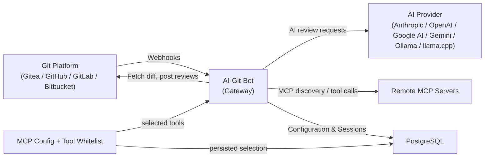

# AI-Git-Bot

[](LICENSE)
[](https://hub.docker.com/r/tmseidel/ai-git-bot)
[](https://github.com/tmseidel/ai-git-bot/releases)
[](https://github.com/tmseidel/ai-git-bot/stargazers)
[](https://github.com/tmseidel/ai-git-bot/issues)

> **Automate the necessary-but-uncomfortable parts of software development — directly inside the Git tools your team already uses.**

Every team has a list of *"we know we should be doing this"* engineering chores. Writing a properly scoped issue *before* coding starts. Adding a regression E2E test for that login bug. Re-reviewing a PR after the third force-push. Tearing down a stale preview environment. These chores are **necessary** (skipping them rots the codebase) but **uncomfortable** (they aren't the fun part, and they get cut first under deadline pressure).

**AI-Git-Bot turns those chores into repeatable, automated workflows** that live natively inside **Gitea, GitHub, GitHub Enterprise, GitLab, and Bitbucket Cloud** — triggered by the events your team is *already* producing (issue assigned, PR opened, reviewer re-requested, `@bot` mentioned in a comment).

> ## 📣 New here? **Read the pitch first.**
>
> If you want to know **why this project exists, what it does for your team, and how it compares to Copilot Workspace / GitLab Duo / Qodo / Aider**, start with the pitch — it's the fastest way to decide whether AI-Git-Bot is for you.
>
> 👉 **[doc/pitch/PITCH.md](doc/pitch/PITCH.md)** — the long-form pitch (~10 min read)


<p align="center">
  
</p>

## 🩹 The pain points it removes

| The uncomfortable chore | What usually happens | What AI-Git-Bot does |
|---|---|---|
| 🧾 **Writing a good issue** before any code is written | Vague bug reports get queued and re-clarified in chat days later. Acceptance criteria are missing. | Assign a **writer bot** to the issue → it inspects related issues + the repo (read-only), asks the *minimum* clarifying questions, and produces a structured `AI Created Issue: …` with acceptance criteria. |
| 🔍 **Reviewing PRs consistently** even when the reviewer is swamped | Reviews are skimmed, regressions slip in, the same comments keep getting written by hand. | A **review bot** runs the same review every time the bot is requested as reviewer — large diffs are chunked, comments land inline, and `@bot` mentions keep the discussion in the PR. |
| 🧪 **Writing regression E2E tests** for the bug you just fixed | "We'll add a test later" — and we never do. Manual QA is repeated for every PR. | Assign a deployment target + the `Full-stack QA` workflow → the bot **plans, authors, deploys, and runs** Playwright tests per PR, posts the report as a PR comment, and tears the environment down on close. |
| 🛠️ **Implementing the boring follow-up issues** (rename, dependency bump, small refactor) | They pile up; senior engineers don't want them; juniors get blocked on them. | Assign an issue to a **coding bot** — it reads the source, drafts the change in a workspace, validates with the project's own build tooling (Maven / Gradle / npm / Go / Cargo / .NET), and opens a PR. |
| 🔁 **Re-running tests / regenerating coverage** when something flaked | Engineer manually re-runs locally, copies the report, pastes a screenshot. | `@bot rerun-tests` re-executes the existing suite; `@bot regenerate-tests <feedback>` re-plans the suite with operator hints. |
| 🧹 **Tearing down stale preview environments** | Forgotten PR previews accumulate, burn cluster budget, leak data. | PR-close lifecycle hook calls the deployment target's `teardown` action — webhook, MCP tool, static no-op, or a CI workflow dispatch (the `CI_ACTION` strategy). |

> **Pick the chore that hurts most this quarter. Wire one bot. Done. The other workflows are opt-in per bot — nothing changes for repos you don't touch.**

<p align="center">
  
</p>

## 🧰 The core workflows

Each workflow is a **first-class, named PR workflow** you can enable per bot via the admin UI. They all run through the same orchestrator (`PrWorkflowOrchestrator`) so they share session memory, audit logs, slash-command dispatch, and tool whitelisting.

| Workflow | Triggered by | What it produces |
|---|---|---|
| **Review** | PR opened with bot as reviewer, or bot re-requested | Inline + summary review comments, chunked for large diffs  |
| **Issue → Code (coding agent)** | Issue assigned to a *coding* bot | A pull request implementing the change  |
| **Issue → Better Issue (writer agent)** | Issue assigned to a *writer* bot | A structured `AI Created Issue` with acceptance criteria  |
| **Interactive Q&A** | `@bot` mention in any PR or inline review comment | Threaded reply with file/diff context  |
| **Full-stack QA (E2E tests)** | PR opened on a bot with an `e2e-test` workflow + deployment target | Generated Playwright suite, run report posted to PR, environment torn down on PR close  |
| **Suite promotion** | Operator opts in per suite | A follow-up PR that "graduates" a generated suite into the repo ([see user story](doc/agentic-workflows/SUITE_PROMOTION_USER_STORY.md)) |

> See the [PR Workflows guide](doc/PR_WORKFLOWS.md) and [Agent documentation](doc/AGENT.md) for the operator-facing details.

> 🎥 **Watch the PR workflows in action:** [AI-Git-Bot — PR workflow walkthrough on YouTube](https://www.youtube.com/watch?v=MjFmZHGIO-w)
>
> [](https://www.youtube.com/watch?v=MjFmZHGIO-w)

> ## 🧪 Project maturity & tested provider matrix
>
> AI-Git-Bot is a single-maintainer side project. I cannot realistically run
> the full feature set against every Git host × every AI provider combination,
> so most provider-specific code is built **from the official API
> documentation and reviewed by AI**, then validated end-to-end only on the
> stack I actually run in production.
>
> | Provider | Maturity |
> |---|---|
> | **Gitea** | ✅ **Well-tested** — primary target, exercised end-to-end (incl. webhooks, PR review, coding agent, writer agent, E2E full-stack QA) on every release. |
> | **GitHub / GitHub Enterprise** | ⚠️ Experimental — implemented from the REST/Webhook docs; basic flows have been smoke-tested but not exercised at scale. |
> | **GitLab** | ⚠️ Experimental — same caveat as GitHub. |
> | **Bitbucket Cloud** | ⚠️ Experimental — same caveat. |
>
> The **Full-stack QA / E2E PR review workflow** is the most complex
> moving part (deployment targets, generated test suites, callbacks,
> teardown lifecycle) and should be considered **experimental on every
> provider including Gitea** — runtime semantics differ subtly between
> hosts and not every combination has been exercised.
>
> 🐛 **Bug reports are very welcome** — please open a
> [GitHub issue](https://github.com/tmseidel/ai-git-bot/issues) with the
> provider, version, workflow, and the relevant log excerpt; that is the
> fastest path to fixing the rough edges across the matrix.
>
> 🧰 **Reproducible system-test containers** — to keep the rough edges
> findable, every non-trivial workflow ships with a self-contained
> `docker-compose` stack under [`systemtest/`](systemtest/) plus a recipe
> README. Bring up the bot + a real Git host + sample apps + (where
> applicable) a local LLM and exercise the workflow end-to-end without
> touching any production system:
>
> | Stack | Compose file | Recipe |
> |---|---|---|
> | Local **Gitea** + runner + bot | [`docker-compose-local-gitea.yml`](systemtest/docker-compose-local-gitea.yml) | [`systemtest/README.md`](systemtest/README.md) |
> | Local **GitLab** + bot | [`docker-compose-local-gitlab.yml`](systemtest/docker-compose-local-gitlab.yml) | [`systemtest/README.md`](systemtest/README.md) |
> | E2E sample app for Full-stack QA | [`docker-compose-e2e-sample.yml`](systemtest/docker-compose-e2e-sample.yml) | [`systemtest/README.md`](systemtest/README.md) |
> | `CI_ACTION` deployment strategy | [`docker-compose-ci-action.yml`](systemtest/docker-compose-ci-action.yml) | [`systemtest/README-ci-action.md`](systemtest/README-ci-action.md) |
> | `MCP` deployment strategy | [`docker-compose-mcp-deployment.yml`](systemtest/docker-compose-mcp-deployment.yml) | [`systemtest/README-mcp-deployment.md`](systemtest/README-mcp-deployment.md) |
> | MCP tool-calling against GitHub | [`docker-compose-mcp-github.yml`](systemtest/docker-compose-mcp-github.yml) | [`systemtest/README-mcp-github.md`](systemtest/README-mcp-github.md) |
> | Suite-promotion workflow | — | [`systemtest/README-suite-promotion.md`](systemtest/README-suite-promotion.md) |
> | Local LLM via **Ollama** | [`docker-compose-ollama.yml`](systemtest/docker-compose-ollama.yml) | [`doc/OLLAMA.md`](doc/OLLAMA.md) |
> | Local LLM via **llama.cpp** | [`docker-compose-llamacpp.yml`](systemtest/docker-compose-llamacpp.yml) | [`doc/LLAMACPP.md`](doc/LLAMACPP.md) |
>
> If you can reproduce a bug against one of these stacks, attach the
> compose file you used + the bot log; that turns most reports into a
> 1-commit fix.


## 🌍 Where the E2E workflow deploys its preview environment

The **Full-stack QA** workflow needs a per-PR environment to test against. Different teams already have *very* different deploy pipelines — so the bot ships a small **`DeploymentStrategy` SPI** with four interchangeable implementations. Pick the one that matches the world your team already lives in:

| Strategy | Best for | Concrete user story |
|---|---|---|
| **`STATIC`** | Vercel / Netlify / GitLab review apps / Render — anything that already creates a preview-per-PR at a predictable URL. | [Marco the Frontend Lead](doc/agentic-workflows/STATIC_DEPLOYMENT_USER_STORY.md)  |
| **`WEBHOOK`** | Jenkins / TeamCity / scripts behind a corporate firewall — anywhere you can `curl` an HMAC-signed callback back to the bot. | [Priya the DevOps Engineer](doc/agentic-workflows/WEBHOOK_DEPLOYMENT_USER_STORY.md)  |
| **`MCP`** | Internal platform teams already exposing deploy/status/teardown over MCP — zero extra services, single whitelist, no inbound callback. | [Alex the Platform Engineer](doc/agentic-workflows/MCP_DEPLOYMENT_USER_STORY.md) (laptop reproduction: `systemtest/docker-compose-mcp-deployment.yml`)  |
| **`CI_ACTION`** | Provider-native CI (GitHub Actions / GitLab CI / Bitbucket Pipelines / Gitea Actions) — dispatched via existing repo credentials, zero new secrets. | [Sam the SRE](doc/agentic-workflows/CI_ACTION_DEPLOYMENT_USER_STORY.md) (operator recipes: [`doc/PR_WORKFLOWS_CI_ACTIONS.md`](doc/PR_WORKFLOWS_CI_ACTIONS.md); laptop reproduction: `systemtest/docker-compose-ci-action.yml`)  |

> The full **feature documentation** for the agentic PR workflows — concept, architecture, persona-driven user stories, internals — lives under [`doc/agentic-workflows/`](doc/agentic-workflows/README.md).

## ✍️ The two agent personas in detail

### 🤖 Coding agent — for "just do the boring change" issues

Assign an issue to a coding bot — it analyzes the task, reads source code, generates the change in a sandboxed workspace, validates with the project's build tooling (Maven / Gradle / npm / Go / Cargo / .NET), and opens a finished pull request.

<details>
<summary>📸 Screenshots: Coding agent across platforms</summary>

**GitHub:**


**GitLab:**


</details>

### ✍️ Writer agent — for "this issue isn't actionable yet" tickets

Assign an issue to a writer bot when you want the *problem statement* improved, not the code changed. The writer agent inspects related issues and explores the repo read-only to understand naming, affected components, and constraints before drafting a follow-up `AI Created Issue: …` with acceptance criteria.

Typical writer-bot use cases:

- turn vague bug reports into reproducible, testable issues
- rewrite feature requests into structured engineering work items
- surface missing acceptance criteria, contradictions, and open questions
- ask the original author only the *minimum* critical follow-up questions

Writer bots target providers with issue-assignment workflows (Gitea, GitHub, GitLab). They ignore PR-review events and never modify repository files.

## 🔍 Review + interactive Q&A in PRs

When a PR is opened with the bot already assigned as reviewer — or the bot is later re-requested — the review bot posts inline + summary feedback. Large diffs are chunked automatically with retry on token limits. Mention `@bot` in any comment or inline review comment to ask follow-up questions; the bot replies with full file/diff context and session history.

<details>
<summary>📸 Screenshots: Reviews + conversations across platforms</summary>

**Gitea:** 

**GitHub:** 

**GitLab:** 

**Bitbucket:** 

**Inline comment thread (Gitea):** 

</details>

## 🧱 Under the hood: an AI- and Git-agnostic gateway

The reason a single bot can serve four Git platforms and five AI providers is that AI-Git-Bot is structured as a small **gateway**: every Git platform plugs in through a `RepositoryApiClient` SPI, every AI provider through an `AiClient` SPI, and tool calls (built-in + MCP) flow through a unified `AgentToolRouter`. That's useful — but it's *enabling infrastructure*, not the headline feature. The headline feature is the **workflows above**, which happen to work everywhere because of this design.

If you do care about the plumbing, see the [Architecture documentation](doc/ARCHITECTURE.md). At a glance:

- 🔗 **One configuration, many repositories** — set up an AI integration once, attach it to as many bots as you like
- 🔀 **Mix & match** — any supported AI provider with any supported Git platform
- 🛡️ **Centralized control** — API keys, tokens, prompts, and tool whitelists managed in one admin UI
- 🔐 **Encrypted secrets at rest** — AES-256-GCM for every credential
- 🧩 **MCP-ready** — remote MCP servers can be attached to bots; the per-tool whitelist controls exactly which MCP tools an agent sees ([MCP Server Handling](doc/MCP_SERVER_HANDLING.md))
- 📊 **Single dashboard** — statistics + audit across every bot and workflow run

### 🔌 Supported AI providers

| Provider | Default API URL | Suggested models |
|---|---|---|
| **Anthropic** | `https://api.anthropic.com` | claude-opus-4-7, claude-sonnet-4-6, claude-haiku-4-5-20251001 |
| **OpenAI** | `https://api.openai.com` | gpt-5.5, gpt-5.4, gpt-5.4-mini, gpt-5.3-codex |
| **Google AI / Gemini** | `https://generativelanguage.googleapis.com` | gemini-2.5-pro, gemini-2.5-flash, gemini-2.0-flash |
| **Ollama** | `http://localhost:11434` | User-configured local models |
| **llama.cpp** | `http://localhost:8081` | User-configured GGUF models |

### 🌐 Supported Git platforms

| Provider | Description |
|---|---|
| **Gitea** | Self-hosted Gitea instances |
| **GitHub** | github.com |
| **GitHub Enterprise** | Self-hosted GitHub Enterprise Server |
| **GitLab** | gitlab.com and self-managed GitLab CE/EE |
| **Bitbucket Cloud** | bitbucket.org |

### Other niceties

- **Session memory per PR**, persisted in PostgreSQL, so follow-up questions stay context-aware
- **Reusable named system prompts** for review / coding / writer personas — assign one per bot
- **Per-bot built-in tool whitelist** ([BOT_TOOL_CONFIGURATIONS.md](doc/BOT_TOOL_CONFIGURATIONS.md))
- **Self-hostable end-to-end** including local LLMs (Ollama, llama.cpp) — nothing has to leave your infrastructure
- **Lightweight ops** — one Docker image, one PostgreSQL database. No Kubernetes required.
- **Health endpoint** — `/actuator/health` for orchestrators

## Docker

The bot is available as a Docker image on [Docker Hub](https://hub.docker.com/r/tmseidel/ai-git-bot).

```yaml
services:
  app:
    image: tmseidel/ai-git-bot:latest
    ports:
      - "8080:8080"
    environment:
      SPRING_PROFILES_ACTIVE: docker
      DATABASE_URL: jdbc:postgresql://db:5432/giteabot
      DATABASE_USERNAME: ${DATABASE_USERNAME:-giteabot}
      DATABASE_PASSWORD: ${DATABASE_PASSWORD:-giteabot}
      APP_ENCRYPTION_KEY: ${APP_ENCRYPTION_KEY:-change-me}
    depends_on:
      db:
        condition: service_healthy
    restart: unless-stopped

  db:
    image: postgres:17-alpine
    environment:
      POSTGRES_DB: giteabot
      POSTGRES_USER: ${DATABASE_USERNAME:-giteabot}
      POSTGRES_PASSWORD: ${DATABASE_PASSWORD:-giteabot}
    volumes:
      - pgdata:/var/lib/postgresql/data
    healthcheck:
      test: ["CMD-SHELL", "pg_isready -U ${DATABASE_USERNAME:-giteabot}"]
      interval: 5s
      timeout: 5s
      retries: 5
    restart: unless-stopped

volumes:
  pgdata:
```

## Quick Start

### 1. Start the Application

```bash
docker compose up --build -d
```

This starts:
- The bot application on port **8080**
- A **PostgreSQL 17** database for persistence

### 2. Initial Setup

1. Navigate to `http://localhost:8080`
2. Create your administrator account
3. Log in to access the management dashboard

### 3. Configure Integrations

1. **Create an AI Integration:**
   - Go to **AI Integrations → New Integration**
   - Select a provider (e.g. "anthropic")
   - The API URL is auto-filled with the provider's default
   - Select a model from the dropdown or enter a custom model name
   - Enter your API key
   - OpenAI-compatible providers can often be configured by selecting "openai" and entering the provider's custom API URL, API key, and model; see the [User Guide](doc/USER_GUIDE.md#openai-compatible-apis)
   - For Gemini, select **gemini** in the UI and use a Gemini API key from Google AI Studio; see the [User Guide](doc/USER_GUIDE.md#google-ai)

2. **Create a Git Integration:**
   - Go to **Git Integrations → New Integration**
   - Select your provider (Gitea, GitHub, GitLab, or Bitbucket)
   - Enter your Git server URL and API token
   - See [Gitea Setup](doc/GITEA_SETUP.md), [GitHub Setup](doc/GITHUB_SETUP.md), [GitLab Setup](doc/GITLAB_SETUP.md), or [Bitbucket Setup](doc/BITBUCKET_SETUP.md)

3. **Create a Bot:**
   - Go to **Bots → New Bot**
   - Choose **Coding bot** for pull-request review/issue implementation, or **Writer bot** for technical-writing issue drafts
   - Select your AI and Git integrations
   - Select a system prompt entry from **System settings**
   - Copy the generated **Webhook URL**

### 4. Configure Webhooks

Configure webhooks in your Git provider to notify the bot about PR events.

- **Gitea:** See [Gitea Setup](doc/GITEA_SETUP.md#4-configure-webhooks)
- **GitHub:** See [GitHub Setup](doc/GITHUB_SETUP.md#4-configure-webhooks)
- **GitLab:** See [GitLab Setup](doc/GITLAB_SETUP.md#4-configure-webhooks)
- **Bitbucket Cloud:** See [Bitbucket Setup](doc/BITBUCKET_SETUP.md#step-4-configure-the-webhook-in-bitbucket)

See the [User Guide](doc/USER_GUIDE.md) for detailed instructions.

## Architecture Overview



The bot receives webhooks from your Git provider, fetches PR diffs, sends them to the configured AI provider for review, and posts the results back. Optional MCP capabilities are orchestrated in the application layer and limited by a persisted per-configuration tool whitelist. All configuration (AI integrations, Git integrations, bots, MCP configurations, MCP selected tools) and conversation sessions are persisted in the database.

➡️ See the [Architecture Documentation](doc/ARCHITECTURE.md) for detailed component diagrams and request flows.

## Documentation

| Document | Description |
|----------|-------------|
| [User Guide](doc/USER_GUIDE.md) | Web UI usage, creating bots and integrations |
| [MCP Server Handling](doc/MCP_SERVER_HANDLING.md) | MCP JSON setup, tool whitelist selection, bot details view, and MCP call transparency |
| [Bot Tool Configurations](doc/BOT_TOOL_CONFIGURATIONS.md) | Per-bot whitelist of built-in agent tools — admin UI, runtime enforcement, default config, migration |
| [Architecture](doc/ARCHITECTURE.md) | Component diagrams, request flows, webhook routing |
| [Agent](doc/AGENT.md) | Coding agent and technical writer agent — setup, tools, and workflows |
| [Tool Calling KB](doc/TOOL_CALLING.md) | Why provider tool APIs differ, abstractions, fallbacks, and what to do when a model misbehaves (incl. the legacy tool-calling switch) |
| **Git Provider Setup** | |
| [Gitea Setup](doc/GITEA_SETUP.md) | Bot user creation, permissions, API tokens for Gitea |
| [GitHub Setup](doc/GITHUB_SETUP.md) | Bot user creation, permissions, PAT tokens for GitHub |
| [GitLab Setup](doc/GITLAB_SETUP.md) | Bot user creation, permissions, PAT tokens for GitLab |
| [Bitbucket Setup](doc/BITBUCKET_SETUP.md) | API tokens and webhook configuration for Bitbucket Cloud |
| **AI Provider Setup** | |
| [Using Ollama](doc/OLLAMA.md) | Running with local LLMs via Ollama |
| [Using llama.cpp](doc/LLAMACPP.md) | Running with llama.cpp and GBNF grammar support |
| **Deployment** | |
| [Deployment](doc/DEPLOYMENT.md) | Docker Compose deployment, environment variables |
| [Local Development](doc/LOCAL_DEVELOPMENT.md) | Building, testing, project structure |
| **Community** | |
| [Contributing](CONTRIBUTING.md) | Contribution guidelines, coding conventions |
| [Code of Conduct](CODE_OF_CONDUCT.md) | Community standards |
| [Security Policy](SECURITY.md) | Vulnerability reporting and operator security guidance |
| [Changelog](CHANGELOG.md) | Release notes and notable changes |
| [Citation Metadata](CITATION.cff) | Citation and software catalog metadata |
| [CodeMeta](codemeta.json) | Machine-readable software metadata for catalogs and crawlers |
| [LLM Index](llms.txt) | Compact LLM and search-engine entry point |
| [Full LLM Reference](llms-full.txt) | Expanded single-file context for LLMs and RAG systems |

## License

[MIT](LICENSE)
