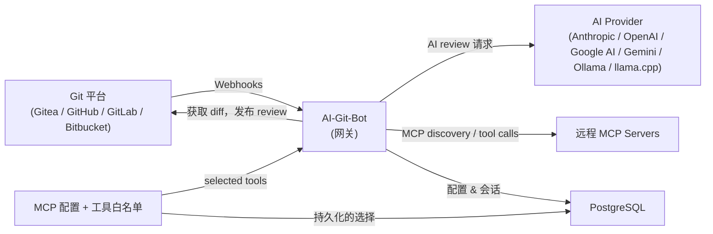

# AI-Git-Bot

[](LICENSE)
[](https://hub.docker.com/r/tmseidel/ai-git-bot)
[](https://github.com/tmseidel/ai-git-bot/releases)
[](https://github.com/tmseidel/ai-git-bot/stargazers)
[](https://github.com/tmseidel/ai-git-bot/issues)

🌐 语言版本：[English](README.md) · [한국어](README.ko.md) · [日本語](README.ja.md) · **中文**

> **直接在您的团队已经在使用的 Git 工具中，自动化软件开发中那些必要但令人不适的部分。**

每个团队都有一份 *“我们知道应该做，但总是没做”* 的工程任务清单。在开始编码**之前**写一个范围明确的 issue。为刚修复的登录 bug 加一个回归 E2E 测试。第三次 force-push 之后重新审查 PR。清理掉过期的预览环境。这些任务**必要**（跳过它们会让代码库慢慢腐坏），但也**令人不适**（它们不是有趣的部分，在截止日期压力下最先被砍掉）。

**AI-Git-Bot 将这些任务变成可重复执行的自动化工作流**，并原生存在于 **Gitea、GitHub、GitHub Enterprise、GitLab 和 Bitbucket Cloud** 中——由您的团队*已经*在产生的事件触发（issue 被分配、PR 被打开、重新请求 reviewer、在评论中提到 `@bot`）。

> ## 📣 第一次来？**先读 pitch。**
>
> 如果您想了解**这个项目为什么存在、它能为团队带来什么，以及它与 Copilot Workspace / GitLab Duo / Qodo / Aider 相比如何**，请先从 pitch 开始——这是判断 AI-Git-Bot 是否适合您的最快方式。
>
> 👉 **[doc/pitch/PITCH.md](doc/pitch/PITCH.md)** — 长版 pitch（约 10 分钟）

<p align="center">
  
</p>

## 🩹 它消除的痛点

| 令人不适的任务 | 通常会发生什么 | AI-Git-Bot 做什么 |
|---|---|---|
| 🧾 **在任何代码写出来之前先写一个好 issue** | 模糊的 bug 报告被排进队列，几天后又得在聊天里重新澄清。验收标准缺失。 | 把一个**写作 bot** 分配给该 issue → 它会检查相关 issue + 仓库（只读），提出*最少量*的澄清问题，并生成带有验收标准的结构化 `AI Created Issue: …`。 |
| 🔍 **即使 reviewer 已经忙不过来，也要持续一致地审查 PR** | 审查被草草带过，回归问题混进来，同样的评论一遍遍靠手写。 | 一个**审查 bot** 会在每次机器人被请求担任 reviewer 时执行同样的审查——大 diff 会被分块，评论以内联形式落在代码上，`@bot` 提及会让讨论留在 PR 内。 |
| 🧪 **为刚修好的 bug 写回归 E2E 测试** | “我们以后再补测试”——然后永远没补。每个 PR 都要重复手动 QA。 | 分配一个部署目标 + `Full-stack QA` 工作流 → 机器人会**规划、编写、部署并运行** Playwright 测试，将报告作为 PR 评论发布，并在关闭 PR 时拆除环境。 |
| 🔬 **为 PR 中的代码编写单元测试** | 新行为在没有测试的情况下上线；覆盖率悄悄下滑。 | 启用 `unit-test-author` 工作流 → 机器人会读取 PR diff，**在现有测试旁边写出白盒单元测试**，用项目自己的运行器（`mvn` / `gradle` / `npm` / `pytest` / `go` / `cargo` / `dotnet` / `bundle` / `make` / `gcc` / `g++`）执行，把测试提交到 PR 分支上，并将结果 + 覆盖率作为 PR 评论发布（[详情](doc/PR_WORKFLOWS_UNIT_TEST.md)） |
| 🛠️ **实现那些无聊的后续 issue**（重命名、依赖升级、小规模重构） | 它们越堆越多；资深工程师不想做；初级工程师又容易被卡住。 | 将 issue 分配给一个**编码 bot**——它会读取源码，在工作区中起草改动，使用项目自身的构建工具（Maven / Gradle / npm / Go / Cargo / .NET）进行验证，并打开一个完成态的 pull request。 |
| 🔁 **在某些东西偶发失败后重新跑测试 / 重新生成覆盖率** | 工程师手动本地重跑，复制报告，再贴一张截图。 | `@bot rerun-tests` 会重新执行现有测试套件；`@bot regenerate-tests <feedback>` 会结合操作员提示重新规划套件。 |
| 🧹 **清理陈旧的预览环境** | 被遗忘的 PR 预览不断累积，烧掉集群预算，还可能泄露数据。 | PR 关闭生命周期钩子会调用部署目标的 `teardown` 动作——可以是 webhook、MCP 工具、静态 no-op，或者 CI 工作流派发（`CI_ACTION` 策略）。 |

> **先挑本季度最痛的一件事。接一个 bot。完成。其他工作流都是按 bot 选择启用——对您没碰的仓库不会有任何变化。**

<p align="center">
  
</p>

## 🧰 核心工作流

每个工作流都是一个**一等、具名的 PR 工作流**，可以通过管理 UI 按 bot 启用。它们都通过同一个编排器（`PrWorkflowOrchestrator`）运行，因此共享会话记忆、审计日志、slash-command 分发以及工具白名单。

| 工作流 | 触发方式 | 产出内容 |
|---|---|---|
| **Review** | PR 打开时 bot 已被指定为 reviewer，或后来重新请求 bot | 内联 + 摘要审查评论；大 diff 会被分块处理 |
| **Issue → Code（编码代理）** | issue 被分配给*编码* bot | 一个实现改动的 pull request |
| **Issue → Better Issue（写作代理）** | issue 被分配给*写作* bot | 一个带验收标准的结构化 `AI Created Issue` |
| **Interactive Q&A** | 在任何 PR 或内联审查评论中提到 `@bot` | 带文件 / diff 上下文的线程式回复 |
| **Full-stack QA（E2E tests）** | PR 在配置了 `e2e-test` 工作流 + 部署目标的 bot 上打开 | 生成的 Playwright 套件、发布到 PR 的运行报告、在 PR 关闭时拆除环境 |
| **Unit tests（测试作者）** | PR 在配置了 `unit-test-author` 工作流的 bot 上打开（或执行 `@bot generate-tests`） | 针对 diff 生成的白盒单元测试，用项目自己的运行器执行，提交到 PR 分支，并将结果 + 覆盖率作为 PR 评论发布（[详情](doc/PR_WORKFLOWS_UNIT_TEST.md)） |
| **Suite promotion** | 操作员按套件选择启用 | 一个后续 PR，将生成的测试套件“毕业”进仓库（[见用户故事](doc/agentic-workflows/SUITE_PROMOTION_USER_STORY.md)） |

> 面向操作员的细节，请参见 [PR Workflows 指南](doc/PR_WORKFLOWS.md) 和 [Agent 文档](doc/AGENT.md)。

> 🎥 **观看 PR 工作流实际运行：** [AI-Git-Bot — YouTube 上的 PR workflow walkthrough](https://www.youtube.com/watch?v=MjFmZHGIO-w)
>
> [](https://www.youtube.com/watch?v=MjFmZHGIO-w)

> ## 🧪 项目成熟度与已测试的 provider 矩阵
>
> AI-Git-Bot 是一个单维护者的副业项目。我不可能现实地在每一种 Git host × 每一种 AI provider 的组合上完整跑一遍全部功能，因此大多数 provider 专用代码都是**依据官方 API 文档实现，并由 AI 审查**，然后只在我自己实际在生产中运行的那套栈上做端到端验证。
>
> | Provider | 成熟度 |
> |---|---|
> | **Gitea** | ✅ **测试较充分** — 主目标平台；每次发布都会对其进行端到端测试（包括 webhook、PR review、coding agent、writer agent、E2E full-stack QA）。 |
> | **GitHub / GitHub Enterprise** | ✅ **测试较充分** — 项目本身在日常开发中就大量使用这些集成和工作流，因此除了有针对性的测试之外，GitHub 功能集也会在真实使用中被持续验证。 |
> | **GitLab** | ⚠️ 实验性 — 根据 REST / Webhook 文档实现；基础流程做过 smoke test，但未进行大规模验证。 |
> | **Bitbucket Cloud** | ⚠️ 实验性 — 根据 REST / Webhook 文档实现；基础流程做过 smoke test，但未进行大规模验证。 |
>
> **Full-stack QA / E2E PR review 工作流**是最复杂的活动部件（部署目标、生成的测试套件、回调、teardown 生命周期），因此应被视为**在所有 provider 上都仍属实验性，包括 Gitea**——不同 host 之间的运行语义存在微妙差异，而且并非每种组合都已经跑过。
>
> 🐛 **非常欢迎 bug 报告** —— 请在 [GitHub issue](https://github.com/tmseidel/ai-git-bot/issues) 中附上 provider、版本、工作流以及相关日志摘录；这是修复矩阵中粗糙边角最快的方式。
>
> 🧰 **可复现的 system-test 容器** —— 为了让这些粗糙边角更容易被发现，每一个非平凡工作流都附带了一个位于 [`systemtest/`](systemtest/) 下的自包含 `docker-compose` 栈以及对应的说明 README。您可以启动 bot + 真实 Git host + 示例应用 +（在适用时）本地 LLM，在不触碰任何生产系统的前提下完成端到端演练：
>
> | 栈 | Compose 文件 | 说明 |
> |---|---|---|
> | 本地 **Gitea** + runner + bot | [`docker-compose-local-gitea.yml`](systemtest/docker-compose-local-gitea.yml) | [`systemtest/README.md`](systemtest/README.md) |
> | 本地 **GitLab** + bot | [`docker-compose-local-gitlab.yml`](systemtest/docker-compose-local-gitlab.yml) | [`systemtest/README.md`](systemtest/README.md) |
> | 用于 Full-stack QA 的 E2E 示例应用 | [`docker-compose-e2e-sample.yml`](systemtest/docker-compose-e2e-sample.yml) | [`systemtest/README.md`](systemtest/README.md) |
> | `CI_ACTION` 部署策略 | [`docker-compose-ci-action.yml`](systemtest/docker-compose-ci-action.yml) | [`systemtest/README-ci-action.md`](systemtest/README-ci-action.md) |
> | `MCP` 部署策略 | [`docker-compose-mcp-deployment.yml`](systemtest/docker-compose-mcp-deployment.yml) | [`systemtest/README-mcp-deployment.md`](systemtest/README-mcp-deployment.md) |
> | 针对 GitHub 的 MCP 工具调用 | [`docker-compose-mcp-github.yml`](systemtest/docker-compose-mcp-github.yml) | [`systemtest/README-mcp-github.md`](systemtest/README-mcp-github.md) |
> | Suite-promotion 工作流 | — | [`systemtest/README-suite-promotion.md`](systemtest/README-suite-promotion.md) |
> | 通过 **Ollama** 运行本地 LLM | [`docker-compose-ollama.yml`](systemtest/docker-compose-ollama.yml) | [`doc/OLLAMA.md`](doc/OLLAMA.md) |
> | 通过 **llama.cpp** 运行本地 LLM | [`docker-compose-llamacpp.yml`](systemtest/docker-compose-llamacpp.yml) | [`doc/LLAMACPP.md`](doc/LLAMACPP.md) |
>
> 如果您能在这些栈中的某一个上复现 bug，请附上您使用的 compose 文件和 bot 日志；这往往能把很多报告直接变成一次提交就能修掉的问题。

## 🌍 E2E 工作流将预览环境部署到哪里

**Full-stack QA** 工作流需要一个按 PR 隔离的环境来执行测试。不同团队本来就生活在*非常*不同的部署流水线里——因此 bot 提供了一个小型 **`DeploymentStrategy` SPI**，内含四种可互换实现。选一个最符合您团队现状的即可：

| 策略 | 最适合什么场景 | 具体用户故事 |
|---|---|---|
| **`STATIC`** | Vercel / Netlify / GitLab review apps / Render —— 任何已经能在固定 URL 上为每个 PR 建立预览环境的系统。 | [前端负责人 Marco](doc/agentic-workflows/STATIC_DEPLOYMENT_USER_STORY.md) |
| **`WEBHOOK`** | Jenkins / TeamCity / 企业防火墙后的脚本 —— 凡是您可以 `curl` 一个带 HMAC 签名的回调回 bot 的地方。 | [DevOps 工程师 Priya](doc/agentic-workflows/WEBHOOK_DEPLOYMENT_USER_STORY.md) |
| **`MCP`** | 已经通过 MCP 暴露 deploy / status / teardown 的内部平台团队 —— 无需额外服务、单一白名单、没有入站回调。 | [平台工程师 Alex](doc/agentic-workflows/MCP_DEPLOYMENT_USER_STORY.md)（笔记本复现：`systemtest/docker-compose-mcp-deployment.yml`） |
| **`CI_ACTION`** | Provider 原生 CI（GitHub Actions / GitLab CI / Bitbucket Pipelines / Gitea Actions）—— 使用现有仓库凭据派发，无需新增 secret。 | [SRE Sam](doc/agentic-workflows/CI_ACTION_DEPLOYMENT_USER_STORY.md)（操作说明：[`doc/PR_WORKFLOWS_CI_ACTIONS.md`](doc/PR_WORKFLOWS_CI_ACTIONS.md)；笔记本复现：`systemtest/docker-compose-ci-action.yml`） |

> 有关 agentic PR 工作流的完整**功能文档**——概念、架构、以角色为核心的用户故事、内部实现——都位于 [`doc/agentic-workflows/`](doc/agentic-workflows/README.md) 下。

## ✍️ 两种代理角色详解

### 🤖 Coding agent —— 用于“把这个无聊改动直接做了”的 issue

把一个 issue 分配给编码 bot —— 它会分析任务、读取源码、在隔离的工作区中生成改动，用项目自身的构建工具（Maven / Gradle / npm / Go / Cargo / .NET）进行验证，并打开一个完成态的 pull request。

<details>
<summary>📸 截图：跨平台的 Coding agent</summary>

**GitHub：**


**GitLab：**


</details>

### ✍️ Writer agent —— 用于“这个 issue 现在还不可执行”的工单

当您想改进的是*问题表述*，而不是直接改代码时，请把 issue 分配给写作 bot。Writer agent 会检查相关 issue，并以只读方式探索仓库，以理解命名方式、受影响组件与约束条件，然后再起草一个带有验收标准的后续 `AI Created Issue: …`。

典型的 writer bot 使用场景：

- 把模糊的 bug 报告转成可复现、可测试的 issue
- 把功能请求重写为结构化的工程工作项
- 揭示缺失的验收标准、矛盾之处和开放问题
- 只向原作者提出*最少量*关键的追问

Writer bot 面向支持 issue-assignment 工作流的 provider（Gitea、GitHub、GitLab）。它们会忽略 PR review 事件，也绝不会修改仓库文件。

## 🔍 PR 中的审查 + 交互式问答

当一个 PR 打开时 bot 已经被指定为 reviewer——或者后来又重新请求了 bot——review bot 会发布内联 + 摘要反馈。大 diff 会自动分块，并在 token 限制时进行重试。在任何评论或内联审查评论中提到 `@bot` 来提出后续问题；bot 会带着完整的文件 / diff 上下文和会话历史进行回复。

<details>
<summary>📸 截图：跨平台的审查 + 对话</summary>

**Gitea：** 

**GitHub：** 

**GitLab：** 

**Bitbucket：** 

**内联评论线程（Gitea）：** 

</details>

## 🧱 底层机制：一个与 AI 和 Git 解耦的网关

一个 bot 能同时服务四种 Git 平台和五种 AI provider 的原因，是 AI-Git-Bot 被组织成了一个小型**网关**：每个 Git 平台通过 `RepositoryApiClient` SPI 接入，每个 AI provider 通过 `AiClient` SPI 接入，而工具调用（内置 + MCP）则通过统一的 `AgentToolRouter` 流动。这当然有价值——但它只是*使能型基础设施*，而不是 headline feature。真正的 headline feature 是**上面的那些工作流**，而正是因为这种设计，它们才能在各个平台上工作。

如果您确实关心底层实现，请参见 [Architecture 文档](doc/ARCHITECTURE.md)。快速概览：

- 🔗 **一次配置，多个仓库复用** —— 配一次 AI integration，就能挂到任意多个 bot 上
- 🔀 **自由组合** —— 任意受支持的 AI provider 都可与任意受支持的 Git 平台搭配
- 🛡️ **集中控制** —— API key、token、prompt 和工具白名单都在同一个管理 UI 中管理
- 🔐 **静态存储时加密的密钥** —— 所有凭据都使用 AES-256-GCM
- 🧩 **MCP-ready** —— 可将远程 MCP server 连接到 bot；按工具配置的白名单可精确控制 agent 能看到哪些 MCP 工具（[MCP Server Handling](doc/MCP_SERVER_HANDLING.md)）
- 📊 **统一仪表盘** —— 覆盖所有 bot 与工作流运行的统计 + 审计

### 🔌 支持的 AI providers

| Provider | 默认 API URL | 推荐模型 |
|---|---|---|
| **Anthropic** | `https://api.anthropic.com` | claude-opus-4-7, claude-sonnet-4-6, claude-haiku-4-5-20251001 |
| **OpenAI** | `https://api.openai.com` | gpt-5.5, gpt-5.4, gpt-5.4-mini, gpt-5.3-codex |
| **Google AI / Gemini** | `https://generativelanguage.googleapis.com` | gemini-2.5-pro, gemini-2.5-flash, gemini-2.0-flash |
| **Ollama** | `http://localhost:11434` | 用户自定义的本地模型 |
| **llama.cpp** | `http://localhost:8081` | 用户自定义的 GGUF 模型 |

### 🌐 支持的 Git 平台

| Provider | 说明 |
|---|---|
| **Gitea** | 自托管 Gitea 实例 |
| **GitHub** | github.com |
| **GitHub Enterprise** | 自托管 GitHub Enterprise Server |
| **GitLab** | gitlab.com 与自管理 GitLab CE/EE |
| **Bitbucket Cloud** | bitbucket.org |

### 其他加分项

- **按 PR 维护会话记忆**，并持久化到 PostgreSQL，因此后续提问能保留上下文
- **可复用的具名 system prompt**，面向 review / coding / writer 三种角色——每个 bot 可分配一个
- **按 bot 配置的内置工具白名单**（[BOT_TOOL_CONFIGURATIONS.md](doc/BOT_TOOL_CONFIGURATIONS.md)）
- **支持完整自托管**，包括本地 LLM（Ollama、llama.cpp）——无需把任何内容发出您的基础设施
- **轻量运维** —— 一个 Docker 镜像，一个 PostgreSQL 数据库。无需 Kubernetes。
- **健康检查端点** —— 编排器可使用 `/actuator/health`

## Docker

该 bot 以 Docker 镜像形式发布在 [Docker Hub](https://hub.docker.com/r/tmseidel/ai-git-bot)。

```yaml
services:
  app:
    image: tmseidel/ai-git-bot:latest
    ports:
      - "8080:8080"
    environment:
      SPRING_PROFILES_ACTIVE: docker
      DATABASE_URL: jdbc:postgresql://db:5432/giteabot
      DATABASE_USERNAME: ${DATABASE_USERNAME:-giteabot}
      DATABASE_PASSWORD: ${DATABASE_PASSWORD:-giteabot}
      APP_ENCRYPTION_KEY: ${APP_ENCRYPTION_KEY:-change-me}
    depends_on:
      db:
        condition: service_healthy
    restart: unless-stopped

  db:
    image: postgres:17-alpine
    environment:
      POSTGRES_DB: giteabot
      POSTGRES_USER: ${DATABASE_USERNAME:-giteabot}
      POSTGRES_PASSWORD: ${DATABASE_PASSWORD:-giteabot}
    volumes:
      - pgdata:/var/lib/postgresql/data
    healthcheck:
      test: ["CMD-SHELL", "pg_isready -U ${DATABASE_USERNAME:-giteabot}"]
      interval: 5s
      timeout: 5s
      retries: 5
    restart: unless-stopped

volumes:
  pgdata:
```

## 快速开始

### 1. 启动应用

```bash
docker compose up --build -d
```

这会启动：
- 运行在 **8080** 端口上的 bot 应用
- 用于持久化的 **PostgreSQL 17** 数据库

### 2. 初始设置

1. 访问 `http://localhost:8080`
2. 创建您的管理员账号
3. 登录以进入管理面板

### 3. 配置集成

1. **创建 AI Integration：**
   - 前往 **AI Integrations → New Integration**
   - 选择 provider（例如 “anthropic”）
   - API URL 会自动填充为该 provider 的默认值
   - 从下拉框中选择模型，或手动输入自定义模型名
   - 输入您的 API key
   - 对于 OpenAI-compatible provider，通常可以通过选择 “openai” 并填写该 provider 的自定义 API URL、API key 和模型来完成配置；参见 [User Guide](doc/USER_GUIDE.md#openai-compatible-apis)
   - 对于 Gemini，请在 UI 中选择 **gemini**，并使用来自 Google AI Studio 的 Gemini API key；参见 [User Guide](doc/USER_GUIDE.md#google-ai)

2. **创建 Git Integration：**
   - 前往 **Git Integrations → New Integration**
   - 选择您的 provider（Gitea、GitHub、GitLab 或 Bitbucket）
   - 输入 Git 服务器 URL 和 API token
   - 参见 [Gitea Setup](doc/GITEA_SETUP.md)、[GitHub Setup](doc/GITHUB_SETUP.md)、[GitLab Setup](doc/GITLAB_SETUP.md) 或 [Bitbucket Setup](doc/BITBUCKET_SETUP.md)

3. **创建一个 Bot：**
   - 前往 **Bots → New Bot**
   - 选择 **Coding bot** 用于 PR review / issue implementation，或选择 **Writer bot** 用于技术写作型 issue 草稿
   - 选择您的 AI 和 Git integrations
   - 从 **System settings** 中选择一个 system prompt 条目
   - 复制生成的 **Webhook URL**

### 4. 配置 Webhook

在您的 Git provider 中配置 webhook，以便在 PR 事件发生时通知 bot。

- **Gitea：** 参见 [Gitea Setup](doc/GITEA_SETUP.md#4-configure-webhooks)
- **GitHub：** 参见 [GitHub Setup](doc/GITHUB_SETUP.md#4-configure-webhooks)
- **GitLab：** 参见 [GitLab Setup](doc/GITLAB_SETUP.md#4-configure-webhooks)
- **Bitbucket Cloud：** 参见 [Bitbucket Setup](doc/BITBUCKET_SETUP.md#step-4-configure-the-webhook-in-bitbucket)

详细说明请参见 [User Guide](doc/USER_GUIDE.md)。

## 架构概览



bot 会接收来自 Git provider 的 webhook，抓取 PR diff，将其发送给配置好的 AI provider 做审查，并把结果再发布回去。可选的 MCP 能力由应用层进行编排，并受每个配置持久化工具白名单的限制。所有配置（AI integrations、Git integrations、bots、MCP configurations、MCP selected tools）以及对话会话都会持久化到数据库中。

➡️ 详细的组件图和请求流请参见 [Architecture Documentation](doc/ARCHITECTURE.md)。

## 文档

| 文档 | 说明 |
|----------|-------------|
| [User Guide](doc/USER_GUIDE.md) | Web UI 的使用方式；创建 bots 和 integrations |
| [MCP Server Handling](doc/MCP_SERVER_HANDLING.md) | MCP JSON 配置、工具白名单选择、bot 详情页以及 MCP 调用透明性 |
| [Bot Tool Configurations](doc/BOT_TOOL_CONFIGURATIONS.md) | 按 bot 配置内置 agent 工具白名单——管理 UI、运行时强制、默认配置、迁移 |
| [Architecture](doc/ARCHITECTURE.md) | 组件图、请求流、webhook 路由 |
| [Agent](doc/AGENT.md) | Coding agent 和 technical writer agent——配置、工具与工作流 |
| [Tool Calling KB](doc/TOOL_CALLING.md) | 为什么各 provider 的工具 API 不同、抽象层与回退机制，以及模型行为异常时如何处理（含旧版 tool-calling 开关） |
| **Git Provider 设置** | |
| [Gitea Setup](doc/GITEA_SETUP.md) | Gitea 的 bot 用户创建、权限和 API token |
| [GitHub Setup](doc/GITHUB_SETUP.md) | GitHub 的 bot 用户创建、权限和 PAT token |
| [GitLab Setup](doc/GITLAB_SETUP.md) | GitLab 的 bot 用户创建、权限和 PAT token |
| [Bitbucket Setup](doc/BITBUCKET_SETUP.md) | Bitbucket Cloud 的 API token 与 webhook 配置 |
| **AI Provider 设置** | |
| [Using Ollama](doc/OLLAMA.md) | 通过 Ollama 运行本地 LLM |
| [Using llama.cpp](doc/LLAMACPP.md) | 通过 llama.cpp 运行，并支持 GBNF grammar |
| **部署** | |
| [Deployment](doc/DEPLOYMENT.md) | Docker Compose 部署、环境变量 |
| [Local Development](doc/LOCAL_DEVELOPMENT.md) | 构建、测试、项目结构 |
| **社区** | |
| [Contributing](CONTRIBUTING.md) | 贡献指南、编码约定 |
| [Code of Conduct](CODE_OF_CONDUCT.md) | 社区行为规范 |
| [Security Policy](SECURITY.md) | 漏洞报告与操作安全指南 |
| [Changelog](CHANGELOG.md) | 发布说明与重要变更 |
| [Citation Metadata](CITATION.cff) | 引用与软件目录元数据 |
| [CodeMeta](codemeta.json) | 面向目录与爬虫的机器可读软件元数据 |
| [LLM Index](llms.txt) | 紧凑型 LLM / 搜索引擎入口 |
| [Full LLM Reference](llms-full.txt) | 面向 LLM 与 RAG 系统的扩展单文件上下文 |

## 许可证

[MIT](LICENSE)


