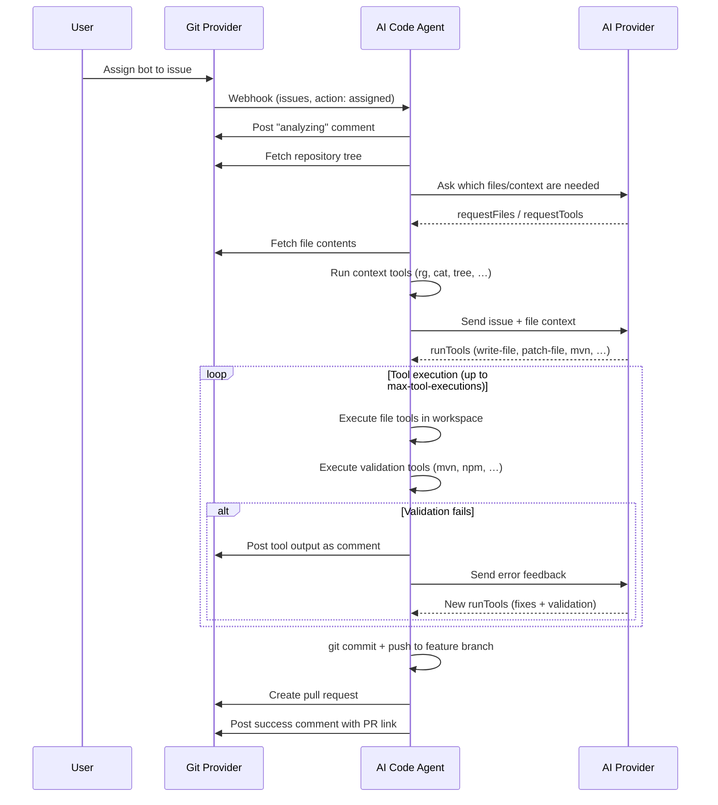
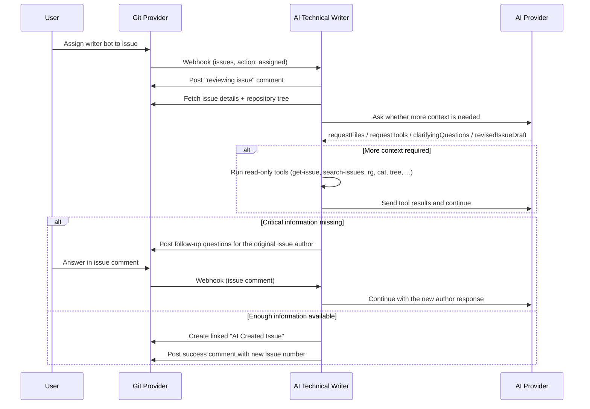

# Agents: Coding + Technical Writer

AI-Git-Bot includes two **issue-driven agent workflows** — the "Agent" half of *"Half Bot, half Agent"*:

- the **coding agent**, which implements an assigned issue in a feature branch and opens a pull request
- the **technical writer agent**, which improves an assigned issue into a clearer, more actionable follow-up issue

Both workflows start from issue webhooks, keep session state in the database, and can inspect repository context in a cloned workspace. They differ in what they are allowed to do next.

| Bot type | Trigger | Workspace access | Output |
|---|---|---|---|
| **Coding bot** | Assign the bot to an issue and keep **Agent Enabled** on | Read + write + validation tools | Branch, commit, pull request |
| **Writer bot** | Assign the bot to an issue | Read-only issue and repository context tools | Clarifying questions or a new `AI Created Issue: ...` |

> Issue-based agents require provider support for issue webhooks and issue assignment workflows. In practice this means **Gitea, GitHub, and GitLab**. Bitbucket Cloud remains pull-request-review only.

## Coding Agent Workflow



1. A user assigns the bot's user account to an issue.
2. The Git provider sends an `issues` webhook with `action: "assigned"`.
3. The bot posts a progress comment and fetches the repository file tree.
4. The bot asks the AI which files and context it needs (`requestFiles`, `requestTools`).
5. The bot fetches file contents and runs context tools (`cat`, `rg`, `tree`, …) in the cloned workspace.
6. The bot sends the issue description and collected context to the AI.
7. The AI responds with a `runTools` array containing **file tools** (to write/patch files) and **validation tools** (to build/test).
8. **Tool execution loop**: the bot runs all tools sequentially in the workspace. Validation errors are posted as comments and fed back to the AI for correction (up to `max-retries` times).
9. Once all validation tools pass, the workspace is committed and pushed to a new feature branch.
10. The bot creates a pull request and posts a summary comment linking to it.

## Technical Writer Workflow



1. A user assigns a **Writer bot** to an issue.
2. The bot opens a **read-only workspace** on the issue's base branch (or the repository default branch).
3. The AI evaluates the issue for completeness, consistency, feasibility, testability, and implementation readiness.
4. The AI may request more context from the repository or related issues using read-only tools.
5. If critical details are missing, the bot asks the **original issue author** the minimum necessary follow-up questions.
6. Only the original issue author can continue a waiting writer session; comments from other users are ignored for that continuation step.
7. When the draft is ready, the bot creates a new issue titled `AI Created Issue: <original title>` and links it back to the source discussion.

## Choosing the Right Agent

Use the **coding agent** when the issue is already implementation-ready and you want a feature branch and PR.

Use the **writer agent** when the issue is still too vague, incomplete, contradictory, or hard to test and you want the bot to turn it into a better engineering work item first.

If a coding-agent session already exists for an issue, the writer bot does **not** start a second workflow on top of it. Instead it asks users to clone the issue for a separate writer pass.

## Coding-Agent File Tools

All coding-agent file modifications are performed through explicit **file tools** inside a cloned workspace. The AI no longer produces diff blocks or JSON file-change arrays — it calls tools just like it calls build tools.

| Tool | Arguments | Description |
|---|---|---|
| `write-file` | `path`, `content` | Create or overwrite a file with the given content |
| `patch-file` | `path`, `search`, `replacement` | Exact string replacement inside a file |
| `mkdir` | `path` | Create a directory (including parents) |
| `delete-file` | `path` | Delete a file |

**File tools are silent** — their results are not posted as public comments on the issue. Only validation tool output (build errors, test failures) is visible to the user.

### Why tool-based, not diff-based?

The previous approach required the AI to produce SEARCH/REPLACE diff blocks in a structured JSON format (`fileChanges`). In practice this was fragile:

- Only premium AI models could reliably produce syntactically valid diffs
- Even small differences between the expected and actual file content (variable names, whitespace) caused diff application to fail
- The AI had to hold the entire JSON diff structure in its working context, burning tokens

With file tools, the AI instead:

1. Uses `cat` in `requestTools` (or a dedicated context-only round) to read the exact current content of a file
2. Uses `patch-file` in a later `runTools` batch with the verbatim text it just read as the search string
3. Or uses `write-file` to replace the whole file when the change is large

This works reliably with **any model tier**.

## Shared Context Tools

Before and during issue work, the agents can request read-only repository context:

| Tool | Description |
|---|---|
| `branch-switcher` | Switch the workspace/context branch before subsequent branch-dependent reads |
| `cat` | Read a file (with optional line range) |
| `rg` / `ripgrep` / `grep` | Search for patterns across files |
| `find` | Find files matching a glob pattern |
| `tree` | Show directory structure |
| `git-log` | Commit history for a file |
| `git-blame` | Per-line authorship |

Context tool results are fed back to the AI but **not posted publicly**.

### Writer-Agent-Only Issue Tools

The writer agent can also use issue-specific read-only tools:

| Tool | Description |
|---|---|
| `get-issue` | Fetch details for a specific issue in the current repository |
| `search-issues` | Search for related issues in the current repository |

The writer agent can additionally request `branch-switcher` before any further repository reads when it needs context from another base branch. Writer bots never request `write-file`, `patch-file`, build tools, or validation tools.

## Validation Tools (Coding Agent)

After making file changes, the coding agent includes validation tools in the **same `runTools` array**:

The examples below show common defaults; the coding agent should choose the tool arguments that best validate the actual changes (for example `mvn compile`, `mvn test`, `mvn verify`, `dotnet build`, or `dotnet test`).

- **Maven** (`pom.xml`): `{"id": "<uuid>", "tool": "mvn", "args": ["compile", "-q", "-B"]}`
- **Gradle** (`build.gradle`): `{"id": "<uuid>", "tool": "gradle", "args": ["compileJava", "-q"]}`
- **npm** (`package.json`): `{"id": "<uuid>", "tool": "npm", "args": ["run", "build"]}`
- **Cargo** (`Cargo.toml`): `{"id": "<uuid>", "tool": "cargo", "args": ["build"]}`
- **Go** (`go.mod`): `{"id": "<uuid>", "tool": "go", "args": ["build", "./..."]}`
- **Python**: `{"id": "<uuid>", "tool": "python3", "args": ["-m", "py_compile", "file.py"]}`
- **Make** (`Makefile`): `{"id": "<uuid>", "tool": "make", "args": ["-j4"]}`
- **CMake** (`CMakeLists.txt`): `{"id": "<uuid>", "tool": "cmake", "args": ["--build", ".", "--config", "Debug"]}`
- **.NET** (`*.sln`, `*.csproj`): `{"id": "<uuid>", "tool": "dotnet", "args": ["build"]}`

## Setup

### 1. Coding Agent is Enabled by Default

The **coding agent** is enabled by default. If you need to disable coding-agent issue implementation globally, set the following environment variable (or application property):

```bash
export AGENT_ENABLED=false
```

This toggle does **not** disable writer bots. Writer workflows are selected per bot by choosing the **Writer bot** type in the web UI.

### 2. Configure Webhooks

In addition to the existing webhook events (Pull Request, Issue Comment, etc.), enable the **Issues** event type in your webhook configuration:

**For Gitea:**
- Go to **Settings → Webhooks → Edit**
- Check **Issues** under "Custom Events"
- Save

**For GitHub:**
- Go to **Settings → Webhooks → Edit**
- Under "Which events would you like to trigger this webhook?", ensure **Issues** is checked
- Save

> Note for GitHub issue webhooks: native payloads do not include an issue branch ref.
> To work on a non-default branch, the agent can request a `branch-switcher` tool call
> during context discovery before additional file/tool requests.
> The GitHub payload translator still accepts `issue.ref` when present for non-standard
> translated/custom payloads and forwards it as compatibility metadata.

### 3. Required Permissions

Required permissions depend on the agent mode:

- **Coding agent**
  - **Repository write**: Create branches, push commits, create pull requests
  - **Issues write**: Post progress and validation comments
- **Writer agent**
  - **Repository read/clone**: Prepare a read-only local workspace for context gathering
  - **Issues write**: Post clarifying questions, failure notices, and create the improved issue

Ensure the bot user has at least the permissions needed for the workflow you want to run.

### 4. Optional Configuration

These settings mainly affect the **coding agent** validation workflow:

| Environment Variable | Property | Default | Description |
|---|---|---|---|
| `AGENT_ENABLED` | `agent.enabled` | `true` | Enable/disable the coding-agent feature |
| `AGENT_MAX_TOKENS` | `agent.max-tokens` | `32768` | Maximum tokens for AI responses |
| `AGENT_BRANCH_PREFIX` | `agent.branch-prefix` | `ai-agent/` | Prefix for created branches |
| `AGENT_ALLOWED_REPOS` | `agent.allowed-repos` | *(empty = all)* | Comma-separated list of `owner/repo` where coding agent is active |
| `AGENT_VALIDATION_ENABLED` | `agent.validation.enabled` | `true` | Enable build/test validation before commit |
| `AGENT_VALIDATION_MAX_RETRIES` | `agent.validation.max-retries` | `3` | Max AI correction attempts on validation failure |
| `AGENT_VALIDATION_MAX_TOOL_EXECUTIONS` | `agent.validation.max-tool-executions` | `10` | Max total tool rounds per session |
| `AGENT_VALIDATION_TOOL_TIMEOUT` | `agent.validation.tool-timeout-seconds` | `300` | Timeout for each tool command |
| `AGENT_VALIDATION_AVAILABLE_TOOLS` | `agent.validation.available-tools` | `mvn,gradle,npm,...,dotnet` | Comma-separated list of available validation tools |

## AI-Driven Code Generation and Validation (Coding Agent)

The coding agent uses AI-driven tool calls where the AI decides which file operations and validation commands to run based on the project structure.

### How It Works

1. The AI analyzes the repository file tree (e.g., sees `pom.xml`) and reads relevant source files via `requestTools` such as `cat`
2. If it needs to inspect a file before patching it, the AI first requests context in a dedicated context step:
   ```json
   {
     "summary": "Inspect HelloService before patching it",
     "requestTools": [
       {"id": "550e8400-e29b-41d4-a716-446655440001", "tool": "cat",
        "args": ["src/main/java/HelloService.java", "1", "40"]}
     ]
   }
   ```
3. After receiving that context, the AI responds with a `runTools` array that mixes file tools and validation tools:
   ```json
   {
     "summary": "Add greeting method to HelloService",
     "runTools": [
       {"id": "550e8400-e29b-41d4-a716-446655440002", "tool": "patch-file",
        "args": ["src/main/java/HelloService.java",
                 "    // end of class\n}",
                 "    public String greet(String name) {\n        return \"Hello, \" + name;\n    }\n\n    // end of class\n}"]},
       {"id": "550e8400-e29b-41d4-a716-446655440003", "tool": "mvn",
        "args": ["test", "-q", "-B"]}
     ]
   }
   ```
4. The bot executes all tools sequentially in the cloned workspace.
5. `cat` should not be placed in the same `runTools` batch as a dependent `patch-file`; inspect first, then patch.
6. File tool results are silent; validation tool output (`mvn`, `npm`, `dotnet`, …) is posted as an issue comment.
7. If there are build/test errors, the AI fixes the code and requests the tools again.
8. Once all validation tools succeed, the workspace is committed and pushed.

### Installed Build Tools

The Docker image includes the following build tools:

| Language | Tools |
|----------|-------|
| **Java** | `mvn` (Maven), `gradle`, OpenJDK 21 |
| **JavaScript/TypeScript** | `npm`, `node` |
| **Python** | `python3`, `pip` |
| **Go** | `go` |
| **Rust** | `cargo`, `rustc` |
| **C/C++** | `gcc`, `g++`, `make`, `cmake` |
| **Ruby** | `ruby`, `bundle` |
| **.NET** | `dotnet` (.NET SDK) |

### Configuration

You can customize which validation tools are available:

```yaml
agent:
  validation:
    enabled: true
    max-retries: 3
    max-tool-executions: 10
    tool-timeout-seconds: 300
    available-tools:
      - mvn
      - gradle
      - npm
      - go
      - cargo
      - python3
      - make
      - dotnet
```

## Dynamic File Requests

Before generating the implementation, the AI can request additional files or run context tools it needs:

```json
{
  "summary": "Need more context before implementing",
  "requestFiles": ["src/main/java/Service.java", "src/main/resources/application.yml"],
  "requestTools": [
    {"id": "550e8400-e29b-41d4-a716-446655440010", "tool": "rg",
     "args": ["UserService", "src/main/java"]}
  ]
}
```

The bot fetches the files and runs the tools, then asks the AI to continue with the collected context. This avoids sending all files upfront and keeps token usage low.

## Example Docker Compose

```yaml
services:
  app:
    image: tmseidel/ai-git-bot:latest
    environment:
      SPRING_PROFILES_ACTIVE: docker
      DATABASE_URL: jdbc:postgresql://db:5432/giteabot
      DATABASE_USERNAME: giteabot
      DATABASE_PASSWORD: change-me
      APP_ENCRYPTION_KEY: your-secure-encryption-key
      AGENT_BRANCH_PREFIX: "ai-agent/"
      # AGENT_ENABLED: "false"  # Uncomment to disable the coding agent
      # AGENT_ALLOWED_REPOS: "myorg/repo1,myorg/repo2"
```

Then configure the **AI Integration**, **Git Integration**, **System Prompt** entry, and **Coding bot / Writer bot** in the web UI.

## Security Considerations

1. **No auto-merge**: The coding agent creates a pull request but never merges it. A human must review and approve all changes.
2. **Repository whitelist**: Use `agent.allowed-repos` to restrict which repositories the coding agent can operate on.
3. **Path traversal protection**: File tools reject any path that escapes the workspace root (e.g. `../../etc/passwd`).
4. **Prompt injection protection**: The agent prompts include guardrails against prompt injection from issue descriptions and repository content.
5. **Workspace cleanup**: The temporary clone is always deleted after the session, whether it succeeded or failed.
6. **Feature toggle**: The coding agent is enabled by default (`agent.enabled=true`). Set `AGENT_ENABLED=false` to disable it if needed.
7. **Writer isolation**: The writer agent uses read-only repository context and never mutates repository files.

## Limitations

1. **Context window limits**: Large repositories may exceed the AI provider's context window. Both agent types limit the amount of repository content sent as context.
2. **Complex multi-file changes**: The coding agent works best for focused, well-described issues. Very complex issues requiring changes across many files may produce incomplete or incorrect implementations.
3. **Iterative refinement**: The coding agent auto-corrects errors through iterative AI feedback. After `max-retries` attempts it will create the PR with a warning comment if validation still fails.
4. **Writer dependency on issue quality**: The writer agent can improve incomplete issues, but it still depends on repository context and timely answers from the original issue author when key facts are missing.
5. **No dependency management**: The coding agent cannot add new project dependencies (e.g., Maven/Gradle dependencies) and assume they will resolve automatically.
6. **Ollama/Local LLM support**: Structured-agent workflows require models that reliably follow JSON output. Most small local LLMs are **not recommended** for either coding or writer sessions.

## Ollama Limitations

⚠️ **The agent feature has limited support with Ollama and other local LLMs.**

The coding and writer agents require the AI to respond with strict JSON structures containing `requestTools`, `clarifyingQuestions`, `revisedIssueDraft`, or `runTools` entries.

### Automatic JSON Mode

The bot **automatically enables Ollama's JSON mode** when agent workflows are used. This forces the model to output valid JSON and significantly improves reliability. You can verify this in the logs:

```
INFO: Ollama chat request: JSON mode enabled for structured output
```

However, even with JSON mode enabled, local models may:

- Produce incomplete or malformed JSON for complex requests
- Struggle with multi-file implementations
- Forget to use `cat` before `patch-file` and produce incorrect search strings
- Ask low-quality or repetitive follow-up questions in writer sessions

**Recommendations:**

| Use Case | Recommended Provider |
|----------|---------------------|
| **Coding agent (issue implementation)** | Anthropic Claude or OpenAI GPT-4/5 class models |
| **Writer agent (issue drafting)** | Anthropic Claude or OpenAI GPT-4/5 class models |
| **Agent with local LLM** | Ollama with 32B+ parameter models |
| **Code reviews (PR comments)** | Any provider, including small Ollama models |

### Using Larger Models with Ollama

Larger models (32B+ parameters) have significantly better instruction-following capabilities and **may work** with the agent:

| Model | Agent Compatibility | RAM Required |
|-------|---------------------|--------------|
| `qwen2.5-coder:32b` | ✅ Best chance | ~24 GB+ |
| `deepseek-coder:33b` | ✅ Best chance | ~24 GB+ |
| `codellama:70b` | ✅ Best chance | ~48 GB+ |
| `deepseek-coder-v2:16b` | ⚠️ May work | ~12 GB+ |

**Important:** Even these larger models may occasionally fail. For reliable production use, cloud-based providers (Anthropic, OpenAI) are recommended.

To try the agent with a larger Ollama model:

```bash
ollama pull qwen2.5-coder:32b
```

Then in the web UI:

1. Create or edit an **Ollama** AI integration and set the model to `qwen2.5-coder:32b`.
2. Assign that integration to your bot.
3. For a **coding bot**, keep **Agent Enabled** turned on.
4. For a **writer bot**, assign the writer bot to an issue only after validating that the model can handle structured JSON reliably.

To **disable the coding agent** when using smaller Ollama models (recommended):

Turn off **Agent Enabled** on the coding bot in the web UI. Writer workflows are selected separately via **Bot Type = Writer bot**.

## Error Handling

- If either agent fails with an unhandled internal error, it posts a visible failure comment on the issue and cleans up the workspace.
- If the AI response cannot be parsed, the coding agent or writer agent retries with feedback about the expected format.
- If a `patch-file` call fails because the search text is not found, the error is returned to the coding agent so it can re-read the file and try again.
- If the writer agent reaches its context-round limit without enough information, it posts a comment asking for more detail and waits for the original issue author.

## Branch Naming

Branches created by the coding agent follow the pattern:

```
{branch-prefix}issue-{issue-number}
```

For example: `ai-agent/issue-42`

Writer agents stay in a read-only workspace and do not create Git branches.
