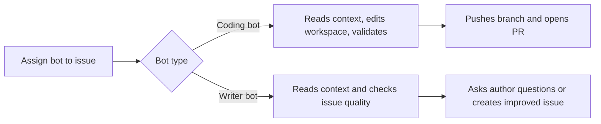

# Issue Agents: Coding and Writer

AI-Git-Bot has two issue-driven agents for administrators to enable on bots:

| Bot type | Best for | Trigger | Result |
|---|---|---|---|
| **Coding bot** | Issues that are ready to implement | Assign the bot to an issue and keep **Agent Enabled** on | Feature branch, commit, and pull request |
| **Writer bot** | Vague or incomplete issues | Assign the writer bot to an issue | Clarifying questions or a new improved issue |

Issue agents require issue webhooks and assignment events. They are supported for **Gitea, GitHub, and GitLab**. Bitbucket Cloud is PR-review only.

## Choosing the right agent

Use the **coding agent** when the issue already describes a clear implementation, acceptance criteria, and expected tests. It can edit files, run validation, push a branch, and open a PR.

Use the **writer agent** when an issue is ambiguous, contradictory, too broad, or missing testable outcomes. It reads repository and issue context, asks the original author follow-up questions when needed, and creates a linked issue titled `AI Created Issue: <original title>` when the draft is ready.

Writer bots do not mutate repositories. If a coding-agent session already exists for an issue, the writer bot will not start a competing workflow on the same issue.

## What operators and users see



Both agents post visible progress, error, and completion comments on the issue. Repository context gathering is not posted publicly. For the coding agent, build/test output may be posted when validation fails so users can understand why the bot is retrying.

## Setup

### 1. Create the integrations

In the admin UI, configure:

1. **AI Integration** — provider, model, API URL/key, and tool-calling mode.
2. **Git Integration** — the Git provider credentials used by the bot.
3. **System Prompt** — the prompt set used for reviews and issue-agent workflows.
4. **Bot** — choose **Bot Type**: **Coding bot** or **Writer bot**.

For coding bots, keep **Agent Enabled** on when the bot should implement assigned issues. Writer bots use their bot type instead of the **Agent Enabled** switch.

### 2. Configure webhooks

Point your repository webhook at the bot URL shown on the bot edit page and enable the **Issues** event.

- **Gitea:** repository **Settings → Webhooks → Edit → Custom Events → Issues**.
- **GitHub:** repository **Settings → Webhooks → Edit → Let me select individual events → Issues**.
- **GitLab:** enable issue events for the project webhook.

GitHub issue webhooks normally do not include a branch ref. Coding-agent work starts from the repository default branch unless the agent can infer or switch to another branch from available context.

### 3. Grant permissions

| Agent | Required permissions |
|---|---|
| Coding agent | Repository write access to create branches, push commits, and open pull requests; issue write access for progress/error comments |
| Writer agent | Repository read/clone access for context; issue write access to ask questions and create the improved issue |

For public repositories, use the bot form's **User Whitelist** to restrict who can trigger AI-spending interactions.

## Configuration reference

Common issue-agent settings can be set as environment variables or Spring properties:

| Environment variable | Property | Default | Applies to | Purpose |
|---|---|---|---|---|
| `AGENT_ENABLED` | `agent.enabled` | `true` | Coding | Global coding-agent feature toggle |
| `AGENT_BRANCH_PREFIX` | `agent.branch-prefix` | `ai-agent/` | Coding | Prefix for created branches |
| `AGENT_ALLOWED_REPOS` | `agent.allowed-repos` | empty = all | Coding | Comma-separated `owner/repo` allow-list |
| `AGENT_MAX_FILES` | `agent.max-files` | `20` | Coding | Maximum files the agent may modify |
| `AGENT_MAX_FILE_CONTENT_CHARS` | `agent.max-file-content-chars` | `100000` | Both | Max file-content characters included in prompts |
| `AGENT_CONTEXT_MAX_TREE_FILES` | `agent.context.max-tree-files` | `500` | Coding | Repository tree entries included in context |
| `AGENT_CONTEXT_MAX_ISSUE_COMMENTS` | `agent.context.max-issue-comments` | `50` | Coding | Issue comments included in context |
| `AGENT_CONTEXT_MAX_ISSUE_COMMENTS_CHARS` | `agent.context.max-issue-comments-chars` | `20000` | Coding | Total issue-comment context budget |
| `AGENT_CONTEXT_MAX_SINGLE_ISSUE_COMMENT_CHARS` | `agent.context.max-single-issue-comment-chars` | `4000` | Coding | Per-comment context budget |
| `AGENT_VALIDATION_ENABLED` | `agent.validation.enabled` | `true` | Coding | Require build/test validation before finishing |
| `AGENT_BUDGET_MAX_ROUNDS` | `agent.budget.max-rounds` | `20` | Both | Maximum agent loop rounds |
| `AGENT_BUDGET_MAX_CONTENT_ROUNDS` | `agent.budget.max-context-rounds` | `10` | Both | Maximum context-only rounds |
| `AGENT_BUDGET_MAX_CONTEXT_TOOL_REQUESTS_PER_ROUND` | `agent.budget.max-context-tool-requests-per-round` | `10` | Coding | Context-tool requests per AI round |
| `AGENT_BUDGET_MAX_TOKENS_PER_CALL` | `agent.budget.max-tokens-per-call` | `16384` | Both | Token budget per AI call |
| `AGENT_BUDGET_MAX_VALIDATION_RETRIES` | `agent.budget.max-validation-retries` | `10` | Coding | AI correction attempts after validation failure |
| `AGENT_BUDGET_MAX_HISTORY_CHARS` | `agent.budget.max-history-chars` | `180000` | Both | Maximum characters for agent conversation history |
| `AGENT_BUDGET_MAX_TOOL_RESULT_CHARS` | `agent.budget.max-tool-result-chars` | `8000` | Both | Maximum characters for tool execution results |

Additional advanced properties include `agent.validation.max-tool-executions`, `agent.validation.tool-timeout-seconds`, `agent.validation.available-tools`, `agent.schema.enforce`, and the opt-in `agent.critic.*` settings. Keep defaults unless you are tuning cost, reliability, or the installed toolchain.

Example Docker Compose environment:

```yaml
services:
  app:
    image: tmseidel/ai-git-bot:latest
    environment:
      SPRING_PROFILES_ACTIVE: docker
      DATABASE_URL: jdbc:postgresql://db:5432/giteabot
      DATABASE_USERNAME: giteabot
      DATABASE_PASSWORD: change-me
      APP_ENCRYPTION_KEY: your-secure-encryption-key
      AGENT_BRANCH_PREFIX: "ai-agent/"
      # AGENT_ENABLED: "false"
      # AGENT_ALLOWED_REPOS: "myorg/repo1,myorg/repo2"
```

## Validation and build-tool support

The coding agent can inspect the repository, edit files, and ask to run validation tools that are enabled for the bot. Validation output is visible on the issue when it fails; successful file edits are not posted as public tool logs.

The default validation tool allow-list includes Maven, Gradle, npm/Node, Go, Cargo/Rust, Python/pip, Make, gcc/g++, Ruby/Bundler, and .NET. The application Docker image is expected to contain those tools. If your image does not, adjust `agent.validation.available-tools` and the bot's **Tool Configuration** so the model only sees commands that can run.

Build/test workflows can auto-detect common project types from files such as `pom.xml`, `build.gradle`, `package.json`, `go.mod`, `Cargo.toml`, `*.csproj`, `Gemfile`, `pyproject.toml`, and `Makefile`. The coding agent still relies on the model to choose an appropriate validation command for the actual change.

## Tool-calling mode

For **AI Integrations**, **Enable native tool calling** is on by default and recommended for frontier models. Turn it off only when a provider/model behaves poorly in agentic workflows; this forces the legacy JSON-in-prompt fallback. llama.cpp always uses legacy mode. See [TOOL_CALLING.md](TOOL_CALLING.md) for the troubleshooting playbook.

## Security considerations

- **No auto-merge:** the coding agent opens a PR; humans still review and merge.
- **Repository allow-list:** use `agent.allowed-repos` for coding-agent scope control.
- **Bot/user permissions:** give the bot only the repository and issue permissions required for its role.
- **Tool whitelist:** use **Tool Configuration** to limit built-in tools exposed to a bot.
- **MCP whitelist:** if MCP is configured, only selected MCP tools are exposed.
- **Path safety:** file operations are constrained to the cloned workspace.
- **Prompt injection:** prompts include guardrails, but all generated changes should be reviewed.
- **Writer isolation:** writer bots are read-only for repository content.

## Limitations

- Large repositories or long issue discussions may exceed the model context window; the bot sends bounded context.
- Coding works best for focused issues. Broad refactors and multi-system changes may be incomplete.
- Validation can retry only within configured budgets. If retries are exhausted, the bot reports the failure instead of silently continuing.
- The coding agent can edit dependency files, but it cannot guarantee external package availability or credentials.
- Writer sessions that need missing business context wait for the original issue author; comments from other users do not continue that waiting step.

## Ollama Limitations

Ollama and other local LLMs have limited support for coding and writer agents. The bot enables Ollama JSON mode for structured agent output, but small or heavily quantized models may still produce malformed plans, skip validation, fabricate paths, or ask low-quality writer questions.

Recommended starting points:

| Use case | Recommendation |
|---|---|
| Production coding/writer agents | Anthropic Claude or OpenAI GPT-4/5 class models |
| Local experimentation | Ollama with larger coder models, ideally 32B+ parameters |
| Basic PR review comments | Smaller local models may be acceptable |

Larger Ollama models such as `qwen2.5-coder:32b`, `deepseek-coder:33b`, or `codellama:70b` have the best chance, but cloud providers remain more reliable for production agent work. For smaller local models, turn off **Agent Enabled** on coding bots and avoid assigning writer bots until you have tested structured output quality.

## Error handling

- Unhandled failures produce a visible issue comment and the workspace is cleaned up.
- Malformed AI responses are retried with feedback about the expected structure.
- Failed file edits or validation commands are returned to the model so it can try again within the configured budget.
- A user can often resume a stuck session by commenting `try again`, `please retry`, or `redo`.

## Branch naming

Coding-agent branches use:

```text
{agent.branch-prefix}issue-{issue-number}
```

For example: `ai-agent/issue-42`. Writer agents do not create branches.
