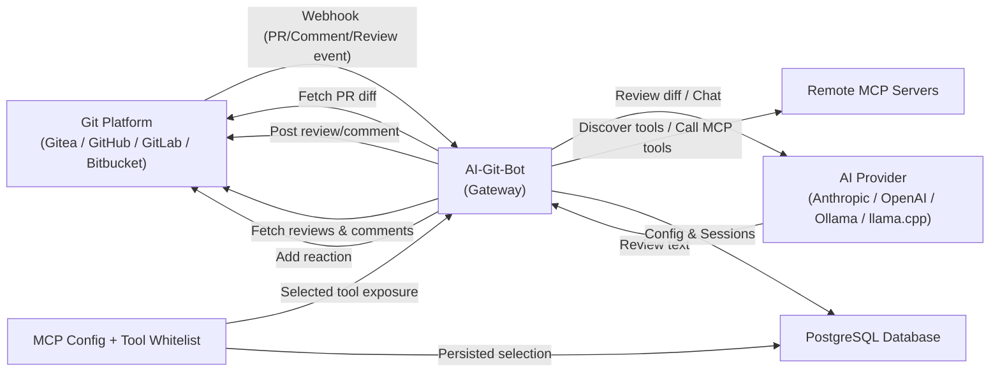
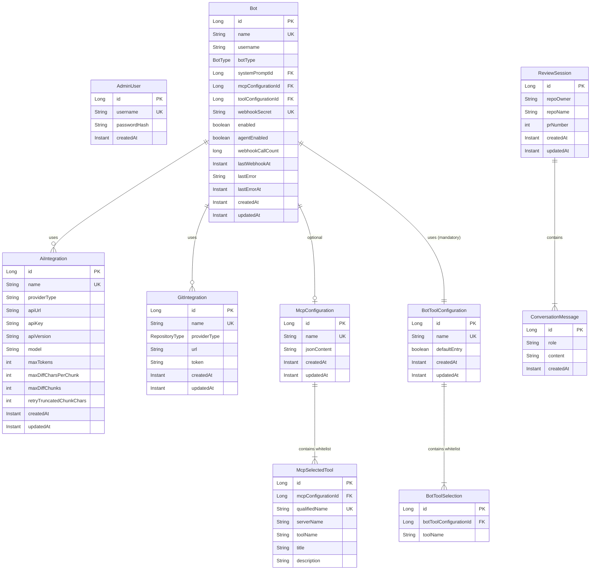
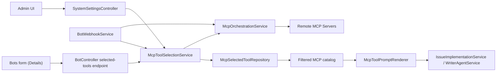
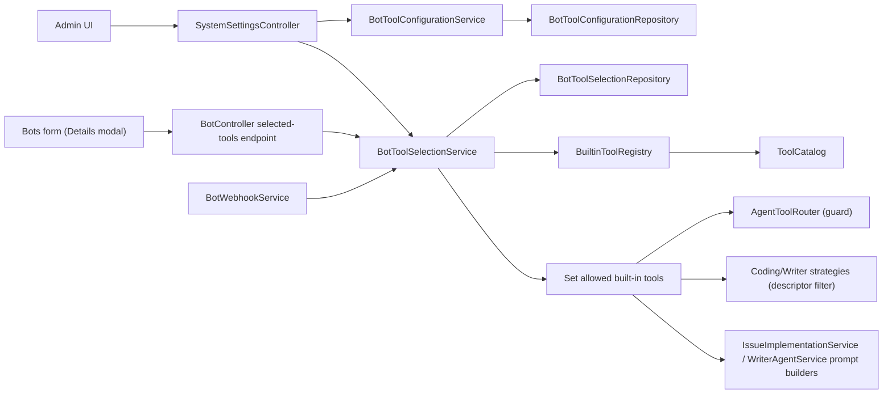
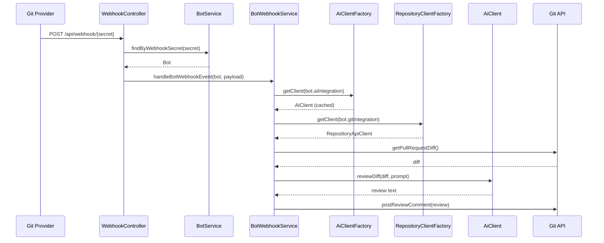
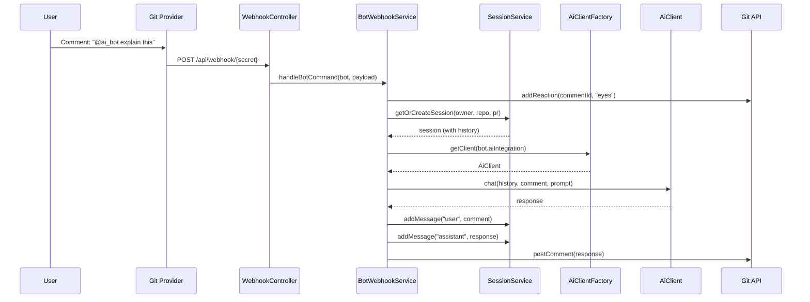
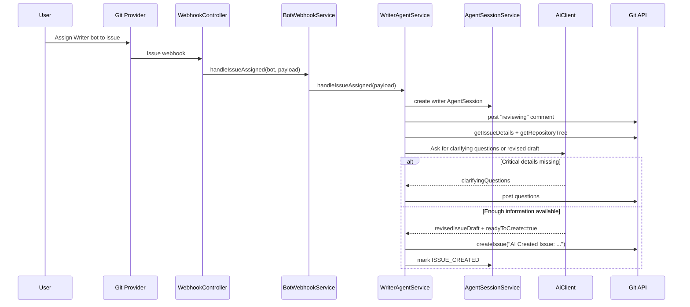
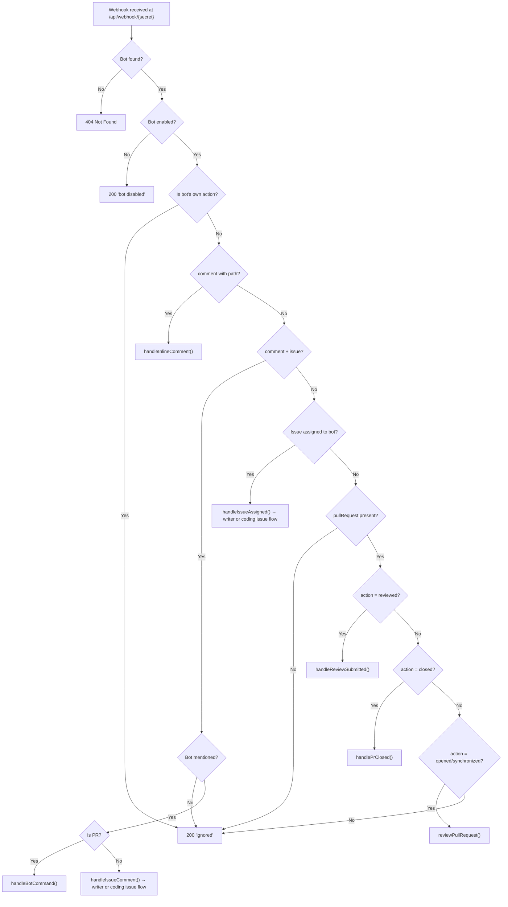
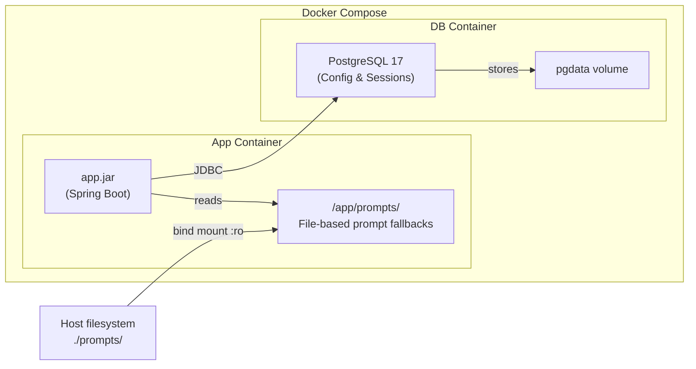

# Architecture — AI-Git-Bot

This document describes the high-level architecture of the AI-Git-Bot, the intelligent **Gateway** between Git platforms and AI providers. It covers component responsibilities, the Gateway design pattern, and request flows.

## The Gateway Concept

AI-Git-Bot acts as a **central gateway** that decouples Git hosting platforms from AI providers. This means:

- **Any Git platform** (Gitea, GitHub, GitLab, Bitbucket) can be connected with **any AI provider** (Anthropic, OpenAI, Ollama, llama.cpp)
- Multiple bots with different configurations can run in parallel
- All webhook routing, session management, and credential handling is centralized in a single application
- The same AI configuration can serve multiple repositories across different Git platforms

## System Overview



The gateway sits between Git hosting platforms (Gitea, GitHub, GitLab, or Bitbucket), configurable AI providers, and optional remote MCP servers. When a pull request is opened or updated, the Git provider sends a webhook to the gateway. The gateway fetches the diff, sends it to the configured AI provider for review, and posts the review back as a PR comment. All configuration (AI integrations, Git integrations, bots, MCP configurations, MCP selected-tool whitelist) and conversation sessions are persisted in a database.

The gateway also responds to inline review comments and submitted reviews containing bot mentions by fetching the relevant review data from the Git API and posting context-aware replies. In **agent mode**, it supports two issue-based workflows: a **coding agent** that implements issues and opens pull requests, and a **technical writer agent** that improves vague issues into structured, implementation-ready follow-up issues.

## Component Diagram

```mermaid
graph TD
    subgraph "Spring Boot Application"
        subgraph "Web Layer"
          UnifiedWebhookController["UnifiedWebhookController<br/><i>Single webhook endpoint</i>"]
          ProviderWebhookHandlers["Provider Webhook Handlers<br/><i>Gitea / GitHub / GitLab / Bitbucket translation</i>"]
            AdminControllers["Admin Controllers<br/><i>Dashboard, Bots, Integrations</i>"]
            SetupController["SetupController<br/><i>Initial setup</i>"]
        end
        
        subgraph "Service Layer"
            BotService["BotService<br/><i>Bot CRUD</i>"]
            BotWebhookService["BotWebhookService<br/><i>Webhook processing</i>"]
            AiIntegrationService["AiIntegrationService<br/><i>AI config CRUD</i>"]
            GitIntegrationService["GitIntegrationService<br/><i>Git config CRUD</i>"]
            SessionService["SessionService<br/><i>Session lifecycle</i>"]
            McpToolSelectionService["McpToolSelectionService<br/><i>Whitelist persistence/filtering</i>"]
            McpOrchestrationService["McpOrchestrationService<br/><i>MCP discovery + execution</i>"]
            BotToolConfigurationService["BotToolConfigurationService<br/><i>Built-in tool config CRUD/clone</i>"]
            BotToolSelectionService["BotToolSelectionService<br/><i>Built-in tool whitelist persistence/filtering</i>"]
            EncryptionService["EncryptionService<br/><i>API key encryption</i>"]
        end

        subgraph "AI Provider Layer"
            AiClientFactory["AiClientFactory<br/><i>Client creation & caching</i>"]
            AiProviderRegistry["AiProviderRegistry<br/><i>Provider discovery</i>"]
            subgraph "Provider Metadata"
                AnthropicMeta["AnthropicProviderMetadata"]
                OpenAiMeta["OpenAiProviderMetadata"]
                OllamaMeta["OllamaProviderMetadata"]
                LlamaCppMeta["LlamaCppProviderMetadata"]
            end
            subgraph "AI Clients"
                AiInterface["AiClient<br/><i>Interface</i>"]
                AbstractClient["AbstractAiClient<br/><i>Chunking & retry</i>"]
                AnthropicImpl["AnthropicAiClient"]
                OpenAiImpl["OpenAiClient"]
                OllamaImpl["OllamaClient"]
                LlamaCppImpl["LlamaCppClient"]
            end
        end

        subgraph "Repository Provider Layer"
            RepoClientFactory["RepositoryClientFactory<br/><i>Client creation</i>"]
            RepoProviderRegistry["RepositoryProviderRegistry<br/><i>Provider discovery</i>"]
            subgraph "Repository Provider Metadata"
                GiteaMeta["GiteaProviderMetadata"]
                GitHubMeta["GitHubProviderMetadata"]
                GitLabMeta["GitLabProviderMetadata"]
                BitbucketMeta["BitbucketProviderMetadata"]
            end
            subgraph "Repository Clients"
                RepoInterface["RepositoryApiClient<br/><i>Interface</i>"]
                GiteaClient["GiteaApiClient"]
                GitHubClient["GitHubApiClient"]
                GitLabClient["GitLabApiClient"]
                BitbucketClient["BitbucketApiClient"]
            end
        end

        subgraph "Repository Layer"
            BotRepo["BotRepository"]
            AiIntegrationRepo["AiIntegrationRepository"]
            GitIntegrationRepo["GitIntegrationRepository"]
            McpConfigurationRepo["McpConfigurationRepository"]
            McpSelectedToolRepo["McpSelectedToolRepository"]
            BotToolConfigurationRepo["BotToolConfigurationRepository"]
            BotToolSelectionRepo["BotToolSelectionRepository"]
            SessionRepo["ReviewSessionRepository"]
            AdminRepo["AdminUserRepository"]
        end
    end

    subgraph "External"
        Gitea["Gitea"]
        GitHub["GitHub / GitHub Enterprise"]
        GitLab["GitLab / GitLab CE/EE"]
        Bitbucket["Bitbucket Cloud"]
        Anthropic["Anthropic API"]
        OpenAI["OpenAI API"]
        Ollama["Ollama (local)"]
        LlamaCpp["llama.cpp (local)"]
        PromptFiles["Prompt Files<br/><i>prompts/*.md</i>"]
        MCPServers["Remote MCP Servers"]
        DB["Database<br/><i>PostgreSQL / H2</i>"]
    end

    UnifiedWebhookController --> BotService
    UnifiedWebhookController --> ProviderWebhookHandlers
    ProviderWebhookHandlers --> BotWebhookService
    BotWebhookService --> AiClientFactory
    BotWebhookService --> RepoClientFactory
    BotWebhookService --> SessionService
    BotWebhookService --> McpToolSelectionService
    BotWebhookService --> McpOrchestrationService
    AdminControllers --> McpToolSelectionService
    SystemSettingsController --> McpToolSelectionService
    McpToolSelectionService --> McpOrchestrationService
    McpToolSelectionService --> McpSelectedToolRepo
    McpToolSelectionService --> McpConfigurationRepo
    AiClientFactory --> AiProviderRegistry
    AiClientFactory --> AiIntegrationService
    RepoClientFactory --> RepoProviderRegistry
    RepoClientFactory --> GitIntegrationService
    AiProviderRegistry --> AnthropicMeta
    AiProviderRegistry --> OpenAiMeta
    AiProviderRegistry --> OllamaMeta
    AiProviderRegistry --> LlamaCppMeta
    RepoProviderRegistry --> GiteaMeta
    RepoProviderRegistry --> GitHubMeta
    RepoProviderRegistry --> GitLabMeta
    RepoProviderRegistry --> BitbucketMeta
    AnthropicMeta --> AnthropicImpl
    OpenAiMeta --> OpenAiImpl
    OllamaMeta --> OllamaImpl
    LlamaCppMeta --> LlamaCppImpl
    GiteaMeta --> GiteaClient
    GitHubMeta --> GitHubClient
    GitLabMeta --> GitLabClient
    BitbucketMeta --> BitbucketClient
    AiInterface -.-> AbstractClient
    AbstractClient -.-> AnthropicImpl
    AbstractClient -.-> OpenAiImpl
    AbstractClient -.-> OllamaImpl
    AbstractClient -.-> LlamaCppImpl
    RepoInterface -.-> GiteaClient
    RepoInterface -.-> GitHubClient
    RepoInterface -.-> GitLabClient
    RepoInterface -.-> BitbucketClient
    AnthropicImpl --> Anthropic
    OpenAiImpl --> OpenAI
    OllamaImpl --> Ollama
    LlamaCppImpl --> LlamaCpp
    GiteaClient --> Gitea
    GitHubClient --> GitHub
    GitLabClient --> GitLab
    BitbucketClient --> Bitbucket
    McpOrchestrationService --> MCPServers
    BotRepo --> DB
    SessionRepo --> DB
    McpConfigurationRepo --> DB
    McpSelectedToolRepo --> DB
    BotToolConfigurationRepo --> DB
    BotToolSelectionRepo --> DB
```



## AI Provider Architecture

The bot uses a **provider-agnostic abstraction layer** with metadata-driven configuration:

### AiProviderMetadata Interface

Each AI provider implements `AiProviderMetadata` to define:
- Provider type identifier (e.g., "anthropic", "openai")
- Default API URL
- Suggested models list
- Whether API key is required
- How to build the `RestClient`
- How to create the `AiClient` instance

```
AiProviderMetadata (interface)
 ├── AnthropicProviderMetadata
 │    └── Default URL: https://api.anthropic.com
 │    └── Models: claude-opus-4-7, claude-sonnet-4-6, claude-haiku-4-5-20251001
 ├── OpenAiProviderMetadata
 │    └── Default URL: https://api.openai.com
 │    └── Models: gpt-5.5, gpt-5.4, gpt-5.4-mini, gpt-5.3-codex
 ├── OllamaProviderMetadata
 │    └── Default URL: http://localhost:11434
 │    └── Models: (user-configured)
 └── LlamaCppProviderMetadata
      └── Default URL: http://localhost:8081
      └── Models: (user-configured)
```

### AiProviderRegistry

Spring `@Service` that collects all `AiProviderMetadata` beans and provides:
- List of available provider types
- Lookup by provider type
- Maps of default API URLs and suggested models (for UI)

### AiClientFactory

Creates and caches `AiClient` instances per `AiIntegration`:
- Uses `AiProviderRegistry` to find the correct metadata
- Delegates to metadata for `RestClient` and `AiClient` creation
- Caches clients by integration ID + `updatedAt` timestamp
- Automatically rebuilds clients when configuration changes

### AiClient Hierarchy

```
AiClient (interface)
 └── AbstractAiClient (abstract class — chunking, retry, message building)
      ├── AnthropicAiClient (Anthropic Messages API)
      ├── OpenAiClient (OpenAI Chat Completions API)
      ├── OllamaClient (Ollama /api/chat)
      └── LlamaCppClient (llama.cpp /v1/chat/completions with GBNF grammar)
```

### Provider Differences

| Feature | Anthropic | OpenAI | Ollama | llama.cpp |
|---------|-----------|--------|--------|-----------|
| System prompt | Top-level `system` field | `role: "system"` message | `role: "system"` message | `role: "system"` message |
| Endpoint | `/v1/messages` | `/v1/chat/completions` | `/api/chat` | `/v1/chat/completions` |
| Auth | `x-api-key` header | `Bearer` token | None | None |
| Streaming | Not used | Not used | Disabled (`stream: false`) | Disabled (`stream: false`) |
| JSON Mode | N/A | N/A | `format: "json"` | GBNF grammar |

## Repository Provider Architecture

The bot uses a similar **provider-agnostic abstraction layer** for Git hosting platforms:

### RepositoryProviderMetadata Interface

Each Git provider implements `RepositoryProviderMetadata` to define:
- Provider type identifier (e.g., "gitea", "github")
- Default web URL
- How to resolve API URLs from web URLs
- How to resolve clone URLs
- How to build the authorization header
- How to build the `RestClient`
- How to create the `RepositoryApiClient` instance

```
RepositoryProviderMetadata (interface)
 ├── GiteaProviderMetadata
 │    └── Default URL: https://gitea.example.com
 │    └── Auth: token <token>
 │    └── API: Same base URL with /api/v1 paths
 ├── GitHubProviderMetadata
 │    └── Default URL: https://github.com
 │    └── Auth: Bearer <token>
 │    └── API: api.github.com (public) or <host>/api/v3 (Enterprise)
 ├── GitLabProviderMetadata
 │    └── Default URL: https://gitlab.com
 │    └── Auth: PRIVATE-TOKEN <token>
 │    └── API: Same base URL with /api/v4 paths
 └── BitbucketProviderMetadata
      └── Default URL: https://bitbucket.org
      └── Auth: Basic <username:token> or Bearer <token>
      └── API: api.bitbucket.org/2.0
```

### RepositoryProviderRegistry

Spring `@Service` that collects all `RepositoryProviderMetadata` beans and provides:
- List of available provider types
- Lookup by provider type
- Maps of default URLs (for UI)

### RepositoryApiClient Interface

All Git provider clients implement this interface:

```
RepositoryApiClient (interface)
 ├── GiteaApiClient
 ├── GitHubApiClient
 ├── GitLabApiClient
 └── BitbucketApiClient
```

Methods include:
- `getPullRequestDiff()` — Fetch PR diff
- `postComment()` — Post PR comment
- `postReviewComment()` — Post review with body
- `addReaction()` — Add emoji reaction
- `getFileContent()` — Get file content for context
- `getIssueDetails()` / `searchIssues()` — Issue context for coding and writer agents
- `getRepositoryTree()` / `getDefaultBranch()` — Repository context bootstrap
- `createBranch()` / `commitFile()` / `createPullRequest()` — Coding-agent operations
- `createIssue()` — Writer-agent output creation

### Provider Differences

| Feature | Gitea | GitHub | GitLab | Bitbucket Cloud |
|---------|-------|--------|--------|-----------------|
| Auth Header | `token <token>` | `Bearer <token>` | `PRIVATE-TOKEN: <token>` | `Basic` or `Bearer` |
| API Base | `<url>/api/v1` | `api.github.com` or `<host>/api/v3` | `<url>/api/v4` | `api.bitbucket.org/2.0` |
| PR Diff | `/repos/{owner}/{repo}/pulls/{pr}/diff` | `/repos/{owner}/{repo}/pulls/{pr}` with `Accept: diff` | `/projects/{id}/repository/compare` | `/repositories/{workspace}/{repo}/pullrequests/{pr}/diff` |
| Reactions | Text-based (`:eyes:`) | Text-based (`eyes`) | Not supported (no-op) | Not supported |
| Project ID | `{owner}/{repo}` | `{owner}/{repo}` | URL-encoded `{owner}%2F{repo}` | `{workspace}/{repo}` |

## Entity Model



## Components

### Webhook Controllers

#### UnifiedWebhookController

- **Packages:** `org.remus.giteabot.{gitea,github,gitlab,bitbucket}`
- Translate provider-specific webhook payloads into the common `WebhookPayload` model
- Apply provider-specific trigger rules such as reviewer assignment/re-request behavior
- Delegate normalized events to `BotWebhookService`

#### GitHubWebhookController

- **Package:** `org.remus.giteabot.github`
- **Endpoint:** `POST /api/github-webhook/{webhookSecret}`
- Receives GitHub webhook payloads for pull request, issue comment, and review comment events
- Looks up Bot by webhook secret
- Converts GitHub payload format to common event model
- Routes events to `BotWebhookService`

### BotWebhookService

- **Package:** `org.remus.giteabot.admin`
- Processes webhook events for a specific bot
- Gets AI client from `AiClientFactory` using bot's `AiIntegration`
- Creates Git client using bot's `GitIntegration`
- Routes issue workflows by `BotType`:
  - `CODING` → `IssueImplementationService` (when `agentEnabled` is true)
  - `WRITER` → `WriterAgentService`
- Handles:
  - PR reviews when a provider-specific review trigger is detected (for example opened-with-reviewer or reviewer re-requested) — delegated to `PrWorkflowOrchestrator` since 1.7 (see [PR_WORKFLOWS.md](PR_WORKFLOWS.md))
  - Bot commands (PR comments with mention)
  - Inline review comments
  - Review submitted events
  - Issue assignments and issue-comment follow-ups for both issue-based agent modes

### PrWorkflowOrchestrator (since 1.7)

- **Package:** `org.remus.giteabot.prworkflow`
- Central dispatcher for all PR follow-up workflows
- Looks up `PrWorkflow` implementations via `PrWorkflowRegistry` (Spring DI auto-discovery)
- Persists a `pr_workflow_runs` row per invocation and cancels superseded in-flight runs on PR resynchronise
- Captures runtime exceptions, records a `FAILED` terminal state and Prometheus metrics (`prworkflow.run_total`, `prworkflow.run_duration_seconds`)
- First implementation: `ReviewWorkflow` (key `review`) — wraps the legacy code-review path with byte-identical behaviour
- See [PR_WORKFLOWS.md](PR_WORKFLOWS.md) for the full SPI and how to add new workflows

### IssueImplementationService

- **Package:** `org.remus.giteabot.agent`
- Runs the coding-agent workflow for assigned issues
- Prepares a writable workspace and executes file + validation tools
- Creates feature branches, commits changes, and opens pull requests
- Stores lifecycle state such as `PR_CREATED`, `UPDATING`, and `FAILED` in `AgentSession`

### WriterAgentService

- **Package:** `org.remus.giteabot.agent.writerimpl`
- Runs the technical-writer workflow for assigned issues
- Prepares a **read-only** workspace for repository exploration
- Uses repository context tools and issue tools (`get-issue`, `search-issues`) to improve issue quality
- Restricts follow-up continuation to the original issue author when clarifying questions are pending
- Creates a linked `AI Created Issue: ...` instead of a pull request


### MCP Orchestration and Tool Whitelist

- **Orchestration location:** MCP discovery and tool execution are handled in application services, not in AI-provider clients.
- `McpOrchestrationService` discovers tools from configured remote MCP servers and executes MCP tool calls.
- `McpToolSelectionService` persists and serves the MCP tool whitelist per `McpConfiguration`.
- `BotWebhookService` applies the whitelist before creating `IssueImplementationService` / `WriterAgentService`, so only selected MCP tools are appended to prompts.
- `SystemSettingsController` provides MCP configuration + tool-selection flows; `BotController` provides a read-only selected-tools details endpoint for bot configuration.



### Built-in Tool Whitelisting (per Bot)

Built-in agent tools (file, context, repository, validation) are filtered per
bot via reusable `BotToolConfiguration` entries. Unlike MCP, this whitelist is
**mandatory** — every `Bot` references exactly one configuration.

- `ToolCatalog` is the single source of truth for built-in tools and exposes
  filtering overloads (`nativeDescriptors(role, mcpCatalog, allowedBuiltinTools)`,
  `fileToolNames(allowed)`, `contextToolNames(allowed)`, …) so callers
  cannot accidentally bypass the whitelist.
- `BotToolConfigurationService` provides CRUD + clone with guards: the
  Default configuration is non-deletable and non-renameable, and any
  configuration in use by at least one bot cannot be deleted.
- `BotToolSelectionService` persists per-configuration whitelist rows and
  resolves them into a `Set<String>` of allowed built-in tool names for the
  runtime.
- `DefaultBotToolConfigurationInitializer` has been retired. The Default
  configuration row and its initial built-in tool selections are created
  by Flyway migration V12. New built-in or validation tools shipped by
  later releases are **not** auto-enabled — admins opt in via the System
  settings UI.
- `BotWebhookService` resolves the whitelist for the bot and threads it
  through `IssueImplementationContext` / `WriterAgentService` to both the
  prompt builders and `AgentToolRouter`.
- `AgentToolRouter.execute(...)` rejects built-in tool calls that are not on
  the whitelist with a `ToolResult` that tells the model the tool is disabled
  for this bot. MCP tools are exempt (governed by `McpToolSelectionService`).



For the end-to-end workflow, data model, and migration notes see
[Bot Tool Configurations](BOT_TOOL_CONFIGURATIONS.md).

### AiClientFactory

- **Package:** `org.remus.giteabot.admin`
- Creates and caches `AiClient` instances
- Uses `AiProviderRegistry` for provider lookup
- Rebuilds clients when integration config changes

### AiProviderRegistry

- **Package:** `org.remus.giteabot.ai`
- Collects all `AiProviderMetadata` implementations via Spring DI
- Provides provider lookup and metadata access

### AiProviderMetadata Implementations

- **Packages:** `org.remus.giteabot.ai.{anthropic,openai,ollama,llamacpp}`
- Define provider-specific defaults and client creation logic
- Registered as `@Component` beans

### RepositoryProviderMetadata Implementations

- **Package:** `org.remus.giteabot.repository`
- `GiteaProviderMetadata` — Gitea API client factory
- `GitHubProviderMetadata` — GitHub API client factory
- `GitLabProviderMetadata` — GitLab API client factory (uses `PRIVATE-TOKEN` header, URL-encoded project paths)
- `BitbucketProviderMetadata` — Bitbucket Cloud API client factory
- Define provider-specific URL resolution and client creation
- Registered as `@Component` beans

### SessionService

- **Package:** `org.remus.giteabot.session`
- Manages the lifecycle of review sessions per PR
- Stores conversation messages for context
- Sessions identified by (repoOwner, repoName, prNumber)

### EncryptionService

- **Package:** `org.remus.giteabot.admin`
- Encrypts API keys and tokens using AES-256-GCM
- Uses `APP_ENCRYPTION_KEY` environment variable

## Request Flows

### Per-Bot Webhook Flow



### Bot Command Flow



### Technical Writer Flow



## Webhook Routing Flow



The issue paths above are resolved inside `BotWebhookService` by `botType`. Writer bots ignore PR-review-related handlers and only participate in issue-assignment and issue-comment flows.

## Agent Session Model

Issue-based workflows share the `AgentSession` entity, which stores:

- repository identity (`repoOwner`, `repoName`, `issueNumber`)
- current base branch (`branchName`)
- the outcome reference (`prNumber` for coding agent, `generatedIssueNumber` for writer agent)
- the original issue author (`issueAuthorUsername`) for writer follow-up authorization
- the workflow discriminator `sessionType` (`CODING` or `WRITER`)
- the lifecycle status (`IN_PROGRESS`, `UPDATING`, `PR_CREATED`, `ISSUE_CREATED`, `FAILED`, `COMPLETED`)

## Docker Deployment



- All configuration (AI integrations, Git integrations, bots) is stored in the database
- Default `system_prompts` rows are seeded by Flyway migration scripts (`V3__system_prompts.sql`, `V5__technical_writer_agent.sql`); the `prompts/` directory is only used by `PromptService` as a file-based fallback for legacy prompt overrides
- PostgreSQL persists configuration and review sessions
- Session data survives container restarts via the `pgdata` volume

