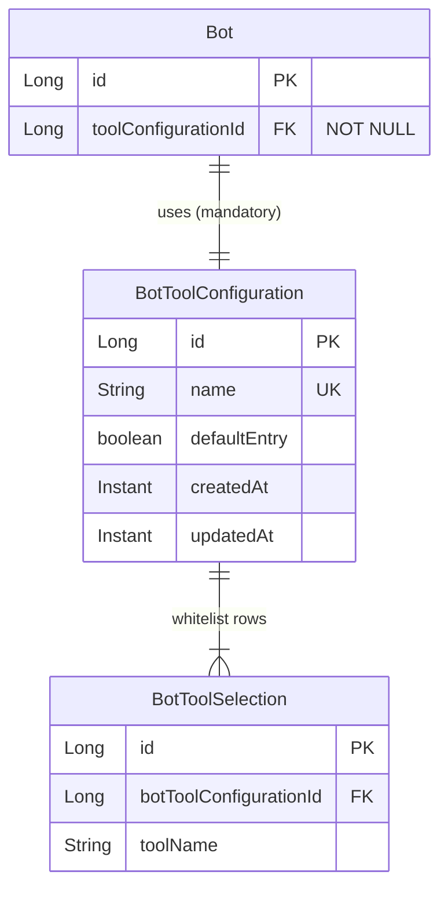
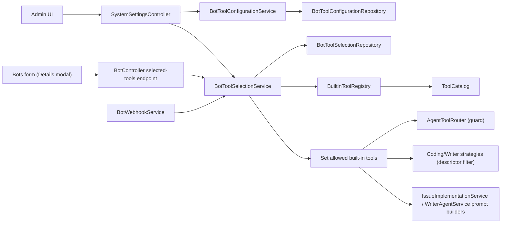

# Bot Tool Configurations

This document describes how to restrict the built-in agent tools available to a
bot via reusable **Tool configurations**, how the runtime enforces those
whitelists, and how the feature interacts with MCP tools and the legacy
prompt-based tool calling.

## Scope

- **Built-in tools** only. The catalog is the single source of truth at
  `org.remus.giteabot.agent.tools.ToolCatalog` (file tools, context tools,
  repository tools, validation tools).
- **MCP tools** are *not* part of a tool configuration; they continue to be
  managed via **System settings → MCP configurations** and per-server tool
  selection.
- Both native function-calling and the legacy prompt-based tool listing honor
  the whitelist.

## Why per-bot tool configurations?

A single instance often hosts bots with very different responsibilities. A
Java/Maven coding bot has no use for `npm`, `dotnet`, or `cargo`; a writer bot
must never see file-mutation tools. Without filtering, every bot would advertise
every tool to the LLM, which:

- wastes context (every descriptor is included in every request),
- invites the model to pick wrong tools (e.g. running `npm test` on a Maven
  project), and
- enlarges the surface for prompt-injection or accidental side effects.

Tool configurations let operators **opt bots into** the subset of built-in
tools they actually need.

## Data model

- `BotToolConfiguration` is a named, reusable whitelist of built-in tools.
- `BotToolSelection` rows are the enabled tool names (whitelist semantics —
  a missing row means the tool is **disabled** for any bot using this
  configuration).
- `Bot.toolConfigurationId` is a **mandatory** foreign key. Every bot is always
  associated with exactly one tool configuration.

## The Default configuration

On every application start, `DefaultBotToolConfigurationInitializer` ensures a
configuration named **Default** exists and is marked `defaultEntry = true`.
The initializer also **adds** any built-in tool that is missing from the
Default's selection (it never removes tools). This means:

- New built-in tools shipped in a future release are automatically enabled in
  Default, preserving backwards-compatible behavior.
- Admin-curated removals from non-default configurations are stable across
  upgrades.

The Default configuration is protected:

- It **cannot be renamed**.
- It **cannot be deleted**.
- Its selection always includes all built-in tools known to the catalog at the
  time of boot.

A tool configuration referenced by at least one bot cannot be deleted either —
the service rejects the request with a clear error and the UI surfaces it.

## Managing tool configurations in the UI

Open **System settings → Tool configurations**.

### Create / clone

1. Click **Add** to create a new configuration, or **Clone** next to an
   existing one to copy its name and selection.
2. Pick a descriptive name (for example *Java/Maven*, *Node.js*, *Writer-only*).
3. Click **Save and select tools**.

### Select tools

The tool-selection screen mirrors the MCP whitelist UX:

- rows grouped by **Kind** (FILE, CONTEXT, REPOSITORY, VALIDATION),
- free-text filter,
- kind filter,
- sortable columns (name, kind, description),
- page size + paging,
- per-row checkbox plus **select all visible** in the table header.

Click **Save** to persist. Only the checked rows become `BotToolSelection`
entries; everything else is rejected at runtime.

### Open tool selection later

- **System settings → Tool configurations → Tools**
- **Edit tool configuration → Select tools**

## Assigning a tool configuration to a bot

Open **Bots → New Bot** or **Edit Bot**. The form has a mandatory
**Tool configuration** dropdown. Use **Details** next to the dropdown to open a
read-only modal listing the currently selected built-in tools, grouped by kind.
Newly created bots default to the **Default** configuration.

## Runtime enforcement

The whitelist is enforced in three independent layers so a misbehaving model
cannot bypass it:

1. **Native function-calling surface.**
   `ToolCatalog.nativeDescriptors(role, mcpCatalog, allowedBuiltinTools)`
   filters built-in descriptors so disabled tools are never advertised to the
   provider's function-calling API. MCP tools pass through unchanged.
2. **Legacy prompt-based tool listing.**
   `IssueImplementationService.buildToolsInfo()` and
   `WriterAgentService.outputContract()` only emit names that survive the
   whitelist filter. If an operator disabled every built-in writer tool, the
   prompt explicitly says so.
3. **Router guard.**
   `AgentToolRouter.execute(...)` checks every incoming tool call before
   dispatch. Built-in calls that are not on the whitelist are rejected with
   a `ToolResult` whose error message tells the model that the tool is
   disabled for this bot. MCP tools are exempt — they are governed by
   `McpToolSelectionService`.

### Validation tools

Validation tools come from `agent.validation.available-tools` (see
[Agent Documentation](AGENT.md)). They are listed in the tool-selection screen
with kind **VALIDATION** and obey the same whitelist semantics. The Default
configuration enables all of them; restrict them per bot to avoid the agent
trying to run the wrong build tool.

### Backwards compatibility

`null` as the whitelist disables enforcement entirely. This path is used by
tests and the pre-1.7 code paths; production bots always carry a non-null
whitelist derived from their `BotToolConfiguration`.

## Migration from earlier versions

Flyway migrations `V11__bot_tool_configurations.sql` and
`V12__bot_tool_configuration_fk.sql` ship the schema and a two-step bootstrap:

1. **V11** creates `bot_tool_configurations` + `bot_tool_selections` and adds
   a nullable `bots.bot_tool_configuration_id` column.
2. **V12** backfills every existing bot to the Default configuration created
   by `DefaultBotToolConfigurationInitializer`, then sets the column to
   `NOT NULL`.

There is nothing for operators to do on upgrade — existing bots continue to
expose all built-in tools (because they reference Default), and admins can
later create narrower configurations and reassign individual bots.

## Component view

## See also

- [User Guide — Managing Bots](USER_GUIDE.md#managing-bots)
- [MCP Server Handling](MCP_SERVER_HANDLING.md)
- [Agent Documentation](AGENT.md)
- [Tool Calling](TOOL_CALLING.md)

