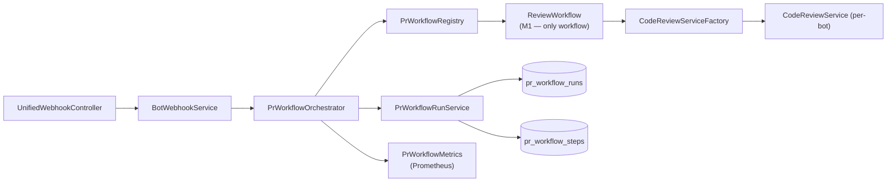
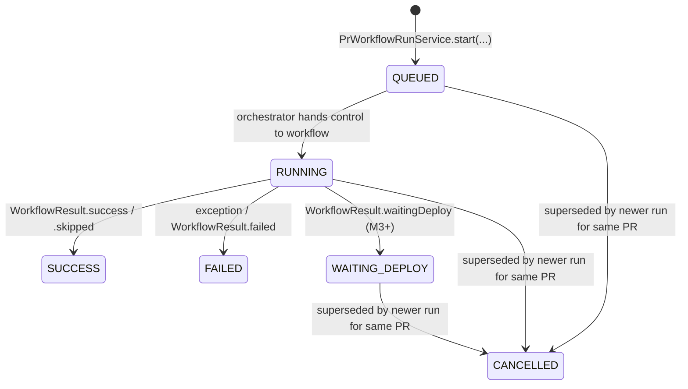
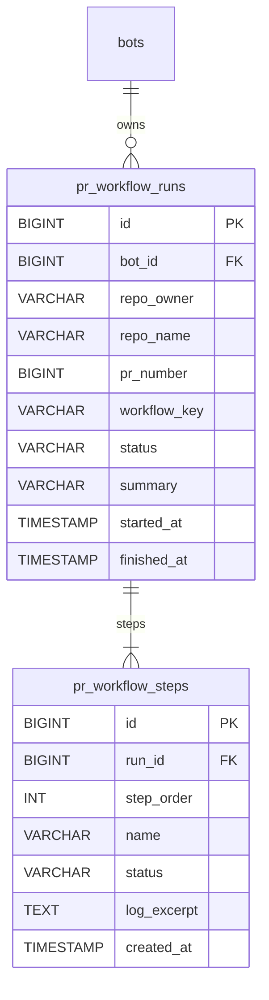

# PR Workflows

> **Status:** introduced in milestone **M1** of the
> [PR-Review Agentic Workflows](refactoring/PR_REVIEW_AGENTIC_WORKFLOWS.md) effort.
> Available since AI-Git-Bot **1.7.0-preview1**.

The PR-review path is now built on a small, pluggable Service Provider
Interface called **`PrWorkflow`**. Every pull-request webhook event passes
through a central **`PrWorkflowOrchestrator`** that resolves the configured
workflow, persists a `pr_workflow_runs` row, invokes the workflow and emits
metrics.

The legacy review code (LLM call + comment posting) is now packaged as the
first workflow — `ReviewWorkflow`, key `review` — and continues to run by
default for every bot. Future milestones add additional workflows
(`e2e-test`, `security-scan`, …) and a per-bot configuration UI.

## Components



| Class | Role |
|---|---|
| `PrWorkflow` | SPI implemented by every workflow. Stable `key()`, `displayName()`, `category()`, `run(PrWorkflowContext)`. |
| `PrWorkflowRegistry` | Auto-discovers all `PrWorkflow` beans, validates unique lower-case kebab-case keys, exposes lookup. |
| `PrWorkflowOrchestrator` | Single entry point. Starts a run, invokes the workflow, persists the terminal status, records metrics. Captures and rethrows runtime exceptions. |
| `PrWorkflowContext` | Immutable record handed to `run(...)`: bot, payload, run id, append-step callback. |
| `WorkflowResult` | Outcome (`SUCCESS`, `FAILED`, `SKIPPED`, `WAITING_DEPLOY`) + short summary. |
| `PrWorkflowRunService` | CRUD + lifecycle for runs and steps. Cancels superseded in-flight runs on every `start(...)`. |
| `PrWorkflowMetrics` | `prworkflow.run_total{workflow,status}` counter and `prworkflow.run_duration_seconds{workflow}` timer. |
| `ReviewWorkflow` | First implementation; wraps the legacy `CodeReviewService.reviewPullRequest(...)` + `postReviewAction(...)` flow. |
| `CodeReviewServiceFactory` | Per-bot construction of `CodeReviewService`, shared between `ReviewWorkflow` and the remaining `BotWebhookService` handlers. |

## Lifecycle



**Cancel-on-resync.** When a PR receives a `synchronize` (push) event while a
previous run for the same `(bot, repo, pr, workflow)` tuple is still active,
the orchestrator transitions the previous run to `CANCELLED` before starting
the new one. This prevents racing comments/reviews against an outdated diff.

## Persisted data model



The schema is created by Flyway migration `V13__prworkflow_runs.sql` (mirrored
for H2 and PostgreSQL). Step log excerpts are truncated at 8&nbsp;KB and the
run summary at 2&nbsp;000 characters — long-form output stays in the
application log.

## Observability

Two Micrometer meters are exposed at `/actuator/prometheus`:

| Metric | Tags | Meaning |
|---|---|---|
| `prworkflow.run_total` | `workflow`, `status` | One increment per terminal run. |
| `prworkflow.run_duration_seconds` | `workflow` | Wall-clock duration of one terminal run. |

A Grafana dashboard is planned for milestone M4.

## Writing a new workflow

```java
@Component
public class SecurityScanWorkflow implements PrWorkflow {

    @Override public String key()                  { return "security-scan"; }
    @Override public String displayName()          { return "Security Scan"; }
    @Override public PrWorkflowCategory category() { return PrWorkflowCategory.SECURITY; }

    @Override
    public WorkflowResult run(PrWorkflowContext context) {
        context.appendStep("scan-start", "Running scan for PR #"
                + context.payload().getPullRequest().getNumber());
        // … do the work …
        return WorkflowResult.success("No issues found");
    }
}
```

That is enough — the registry picks the bean up via Spring DI, and the
orchestrator can invoke it via `orchestrator.run(bot, payload, "security-scan")`.
In M2 a UI will allow operators to opt bots into this new workflow; until
then it is only callable from code/tests.

## See also

- [Concept & architecture](refactoring/PR_REVIEW_AGENTIC_WORKFLOWS.md)
- [Implementation plan (M1–M7)](refactoring/PR_REVIEW_AGENTIC_WORKFLOWS_IMPLEMENTATION.md)
- [ARCHITECTURE.md](ARCHITECTURE.md) — overall system design
- [AGENT.md](AGENT.md) — coding/writer agents reused by future PR workflows

