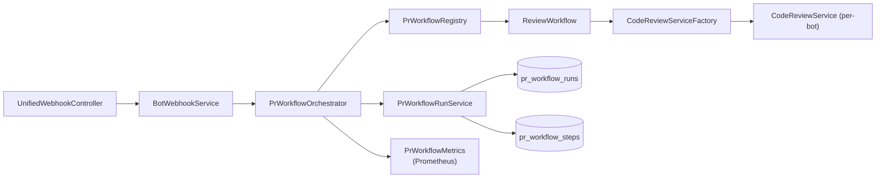
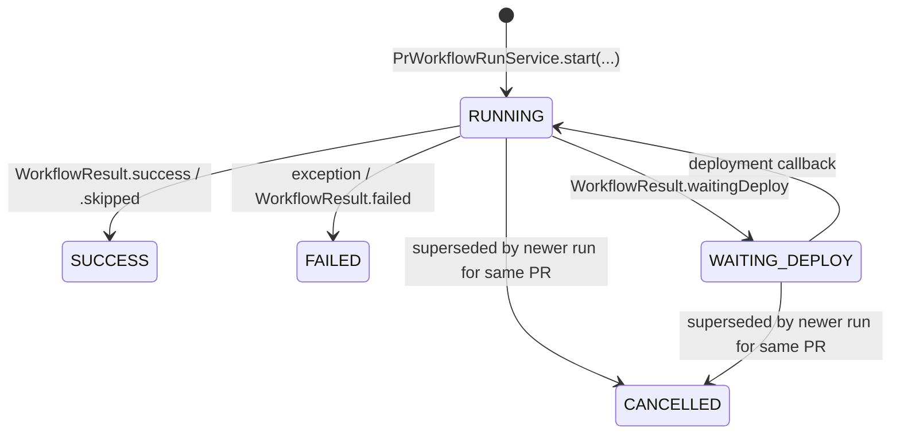
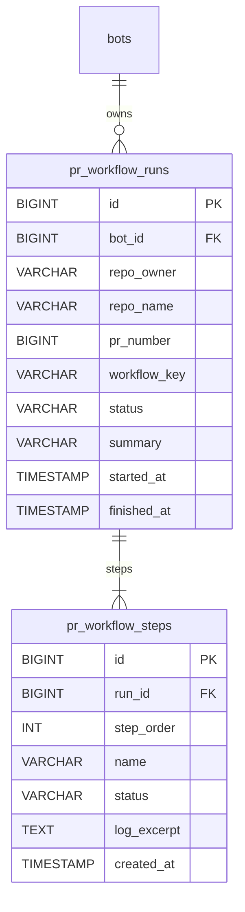
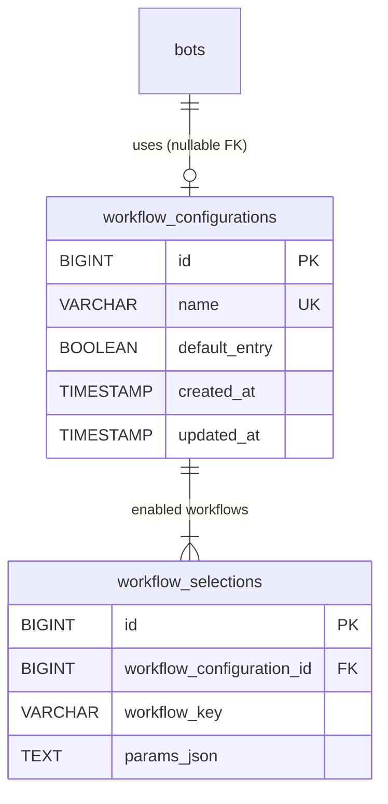
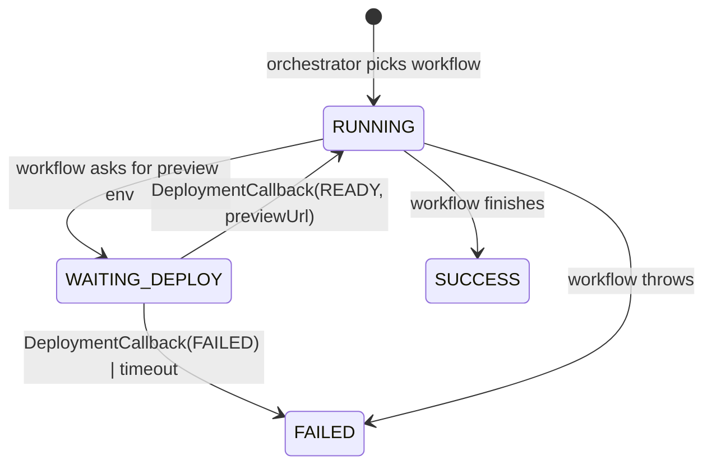

# PR Workflows

> The PR-workflow subsystem is part of every AI-Git-Bot release since
> **1.7.0**. Conceptual overview: [`agentic-workflows/CONCEPT_AND_ARCHITECTURE.md`](agentic-workflows/CONCEPT_AND_ARCHITECTURE.md).

The PR-review path is now built on a small, pluggable Service Provider
Interface called **`PrWorkflow`**. Every pull-request webhook event passes
through a central **`PrWorkflowOrchestrator`** that resolves the configured
workflow, persists a `pr_workflow_runs` row, invokes the workflow and emits
metrics.

The legacy review code (LLM call + comment posting) is now packaged as the
first workflow — `ReviewWorkflow`, key `review` — and continues to run by
default for every bot. Future milestones add additional workflows
(`e2e-test`, `security-scan`, …) and a per-bot configuration UI.

> **Agentic PR Review.** An opt-in, read-only agentic alternative to the
> one-shot `review` workflow — the LLM can iteratively call repository and MCP
> tools before writing its review. See
> [`PR_WORKFLOWS_AGENTIC_REVIEW.md`](PR_WORKFLOWS_AGENTIC_REVIEW.md).

> **Unit-Test Author.** An opt-in, read-write workflow (category `TESTING`,
> key `unit-test-author`) that generates white-box unit tests for the PR diff,
> runs them with the project's own test runner and commits them onto the PR
> branch. No deployment target / browser required. See
> [`PR_WORKFLOWS_UNIT_TEST.md`](PR_WORKFLOWS_UNIT_TEST.md).

## Components




| Class | Role |
|---|---|
| `PrWorkflow` | SPI implemented by every workflow. Stable `key()`, `displayName()`, `category()`, `run(PrWorkflowContext)`. |
| `PrWorkflowRegistry` | Auto-discovers all `PrWorkflow` beans, validates unique lower-case kebab-case keys, exposes lookup. |
| `PrWorkflowOrchestrator` | Single entry point. Starts a run, invokes the workflow, persists the terminal status, records metrics. Captures and rethrows runtime exceptions. |
| `PrWorkflowContext` | Immutable record handed to `run(...)`: bot, payload, run id, append-step callback. |
| `WorkflowResult` | Outcome (`SUCCESS`, `FAILED`, `SKIPPED`, `WAITING_DEPLOY`) + short summary. |
| `PrWorkflowRunService` | CRUD + lifecycle for runs and steps. Cancels superseded in-flight runs on every `start(...)`. |
| `PrWorkflowMetrics` | `prworkflow.run_total{workflow,status}` counter and `prworkflow.run_duration_seconds{workflow}` timer. |
| `ReviewWorkflow` | First implementation; wraps the legacy `CodeReviewService.reviewPullRequest(...)` + `postReviewAction(...)` flow. |
| `CodeReviewServiceFactory` | Per-bot construction of `CodeReviewService`, shared between `ReviewWorkflow` and the remaining `BotWebhookService` handlers. |
| `AgentReviewWorkflow` | Read-only **agentic** review (key `agentic-review`). Runs an `AgentLoop` with the read-only `ReviewAgentStrategy` so the LLM can explore the repo via context/MCP tools before commenting. See [`PR_WORKFLOWS_AGENTIC_REVIEW.md`](PR_WORKFLOWS_AGENTIC_REVIEW.md). |

## Lifecycle



> There is intentionally **no** `QUEUED` intermediate state — the orchestrator
> owns the transition from "webhook received" to "workflow executing" inside a
> single synchronous call to `PrWorkflowRunService.start(...)`, which inserts
> the row directly in `RUNNING`. No separate scheduler observes a
> pre-execution row.

**Cancel-on-resync.** When a PR receives a `synchronize` (push) event while a
previous run for the same `(bot, repo, pr, workflow)` tuple is still active,
the orchestrator transitions the previous run to `CANCELLED` before starting
the new one. This prevents racing comments/reviews against an outdated diff.

## Persisted data model



The schema is created by Flyway migration `V13__prworkflow_runs.sql` (mirrored
for H2 and PostgreSQL). Step log excerpts are truncated at 8&nbsp;KB and the
run summary at 2&nbsp;000 characters — long-form output stays in the
application log.

## Observability

Two Micrometer meters are exposed at `/actuator/prometheus`:

| Metric | Tags | Meaning |
|---|---|---|
| `prworkflow.run_total` | `workflow`, `status` | One increment per terminal run. |
| `prworkflow.run_duration_seconds` | `workflow` | Wall-clock duration of one terminal run. |

A reference Grafana dashboard ships under `doc/observability/` for these meters.

## Writing a new workflow

```java
@Component
public class SecurityScanWorkflow implements PrWorkflow {

    @Override public String key()                  { return "security-scan"; }
    @Override public String displayName()          { return "Security Scan"; }
    @Override public PrWorkflowCategory category() { return PrWorkflowCategory.SECURITY; }

    @Override
    public WorkflowResult run(PrWorkflowContext context) {
        context.appendStep("scan-start", "Running scan for PR #"
                + context.payload().getPullRequest().getNumber());
        // … do the work …
        return WorkflowResult.success("No issues found");
    }
}
```

That is enough — the registry picks the bean up via Spring DI, and the
orchestrator can invoke it via `orchestrator.run(bot, payload, "security-scan")`
or — once enabled in a `WorkflowConfiguration` (see below) — automatically as
part of `orchestrator.runAll(bot, payload)`.

## Workflow configurations

Operators decide **which** `PrWorkflow`s run for a given bot via reusable
**workflow configurations**. A configuration is an ordered whitelist of
workflow keys plus per-key tuning parameters; the same configuration can be
shared by many bots.

### Data model



Tables are created by `V14__workflow_configurations.sql` (H2 + PostgreSQL).
The unique constraint `(workflow_configuration_id, workflow_key)` prevents
duplicate entries within the same configuration.

### Services

| Class | Role |
|---|---|
| `WorkflowConfiguration` / `WorkflowSelection` | JPA entities under `org.remus.giteabot.prworkflow.config`. |
| `WorkflowConfigurationService` | CRUD + clone, guards the `defaultEntry` (cannot be renamed, deleted or lose its flag) and blocks deletion while bots still reference the configuration. |
| `WorkflowSelectionService` | Add/remove/update selections; validates `params_json` against the workflow's `paramsSchema()` via `WorkflowParamsValidator`; exposes `enabledWorkflowKeys(configurationId)` in deterministic alphabetical order. |
| `DefaultWorkflowConfigurationInitializer` | `ApplicationRunner` that on every startup (a) creates the `Default` configuration if missing, (b) additively enables every newly registered `REVIEW`-category workflow, and (c) backfills bots whose `workflow_configuration_id` is still null. Workflows with `category != REVIEW` are **never** auto-enabled — operators must opt in explicitly. |

### Orchestrator dispatch

`BotWebhookService.reviewPullRequest(...)` no longer asks for a specific
workflow key; it delegates to:

```java
prWorkflowOrchestrator.runAll(bot, payload);
```

`runAll(...)` resolves the bot's configuration (falling back to `ReviewWorkflow`
alone if `bot.workflowConfiguration` is null), iterates the enabled keys in
deterministic order and invokes each `PrWorkflow` sequentially. One failing
workflow does **not** abort the remaining ones — every invocation is wrapped
by `run(bot, payload, key)`, so its terminal status is persisted independently
in `pr_workflow_runs`.

Unregistered workflow keys (e.g. an entry persisted before a workflow bean was
removed) are logged with `WARN` and skipped.

## Trigger conditions

PR workflows are invoked only when the webhook handler decides that the event
is relevant for the bot. Two mutually reinforcing conditions gate every
create/open event across all four Git providers (GitHub, Gitea, Bitbucket,
GitLab):

| Condition | Default | Effect |
|---|---|---|
| Bot is listed as a **requested reviewer** on the PR | always checked | Triggers the workflow when the bot is explicitly asked to review. |
| Bot has **Run on PR creation** enabled | `false` | Triggers the workflow on every new PR, regardless of reviewer assignment. |

The effective predicate is:

```java
bot.isRunOnPrCreation() || hasBotReviewer(payload)
```

> **Scope.** The flag applies exclusively to PR/MR **create** and **open**
> events. It does *not* affect `synchronize` (push), `updated`, `closed`,
> `review_requested`, comment or approval events — those follow their own
> rules unchanged.

### Configuration

On the **Bots → New / Edit bot** form, the toggle lives in the **Workflow
Configuration** section:

> ☐ **Run workflow when PR is opened**
> When enabled, the bot executes its configured PR workflow when a pull request is created or opened, even if the bot is not assigned as reviewer.

The field is persisted as `bots.run_on_pr_creation BOOLEAN NOT NULL DEFAULT
FALSE` (Flyway migration `V25__bots_run_on_pr_creation.sql`, mirrored for
H2 and PostgreSQL). Existing bots keep their previous behaviour (flag off);
no manual migration step is required.

### Use cases

- **Mandatory review policy.** Enable the flag on a compliance bot that must
  review every PR in a repository, even when developers forget to add it as
  a reviewer.
- **Selective review.** Leave the flag off (default) so the bot only runs
  when explicitly requested — useful for expensive agentic reviews or bots
  shared across many repositories.

### Admin UI

Three touchpoints, all reusing the existing table-plus-modal pattern:

1. **System settings → Workflow configurations**
   (`/system-settings/workflow-configurations/`):
   list, add, edit, clone, delete. The edit page exposes a sub-page
   `…/{id}/workflows` for selecting which workflow keys are enabled and
   editing their `params_json` against the workflow's `paramsSchema()`.
2. **Bots → New / Edit bot**: a **Workflow Configuration** dropdown plus a
   **Details** modal that loads `…/{id}/selected-workflows` (JSON) to show
   the enabled workflow keys without leaving the bot form. New bots default
   to the `Default` configuration.
3. **System settings overview**: the new entry appears next to MCP and tool
   configurations.

### Upgrade behaviour

- `V14__workflow_configurations.sql` adds the `workflow_configurations` /
  `workflow_selections` tables and the nullable `bots.workflow_configuration_id`
  column.
- `V15__workflow_configurations_default.sql` (idempotent) seeds the `Default`
  configuration, enables the built-in `review` workflow on it and backfills
  every bot whose `workflow_configuration_id` is still null. After the two
  migrations run, every existing bot keeps behaving exactly as before
  (running only the `review` workflow); no startup-time Java code is involved.

## Deployment targets

Workflows that need a per-PR preview environment (e.g. the `E2ETestWorkflow`
such as `E2ETestWorkflow`) do not deploy anything themselves — they delegate to an
operator-managed **deployment target** that wraps a pluggable
`DeploymentStrategy`. Four strategies ship today:

| Strategy | Awaits callback? | Use case |
|---|---|---|
| `WEBHOOK` | yes | Bot POSTs a signed JSON envelope to a CI job (Jenkins, GitLab pipeline trigger, GitHub `repository_dispatch`, Argo CD). The CI side calls back when the preview URL is ready. |
| `STATIC`  | no  | Provider already auto-provisions a per-PR preview (Vercel, Netlify, Render, GitLab review apps). The bot expands a URL template, optionally probes a `/healthz` until reachable, then proceeds synchronously. |
| `MCP` | no  | Internal platform MCP server already exposes deploy / status / teardown tools. The bot calls them like any other MCP tool and polls via the status tool. See [MCP_SERVER_HANDLING.md → Exposing deployment tools](MCP_SERVER_HANDLING.md#6-exposing-deployment-style-tools). |
| `CI_ACTION` | yes (poller-driven) | Bot dispatches the Git host's native CI (GitHub Actions, Gitea Actions, GitLab CI, Bitbucket Pipelines) using the existing integration token. A scheduled poller drives the run forward; workflows may additionally POST to the bot's `callbackUrl` to expose a dynamic preview URL. See [PR_WORKFLOWS_CI_ACTIONS.md](PR_WORKFLOWS_CI_ACTIONS.md). |

### Lifecycle



### Strategy configuration JSON

Stored encrypted at rest (`deployment_targets.config_json`) via
`EncryptionService` when `APP_ENCRYPTION_KEY` is configured.

**`WEBHOOK`**
```json
{
  "webhookUrl": "https://ci.acme.io/jobs/preview/build",
  "sharedSecret": "hex-or-arbitrary-string-for-hmac",
  "headers": { "X-Trigger-Source": "ai-git-bot" }
}
```
Outbound request:
```
POST {webhookUrl}
Content-Type: application/json
X-AI-Bot-Signature: sha256=<hex hmac-sha256 of body using sharedSecret>
X-AI-Bot-Run-Id:   {runId}

{ "runId": 42, "prNumber": 1234, "sha": "abc…", "branch": "feature/x",
  "repoOwner": "acme", "repoName": "web",
  "callbackUrl": "https://bot.acme.io/api/workflow-callback/42/<callbackSecret>",
  "callbackSecret": "<callbackSecret>" }
```

**`STATIC`**
```json
{
  "healthcheckPath": "/healthz",
  "expectedStatus": 200,
  "intervalSeconds": 5,
  "extraHeaders": { "X-Probe": "ai-bot" }
}
```
`previewUrlTemplate` (configured on the target row, not in the JSON) supports
the placeholders `{prNumber}`, `{sha}` and `{branch}`. Set
`"healthcheckPath": ""` to skip the readiness probe entirely.

**`MCP`**
```json
{
  "mcpConfigurationId": 7,
  "deployTool":   "platform/deploy_pr_preview",
  "statusTool":   "platform/get_preview_status",
  "teardownTool": "platform/teardown_preview",
  "argsTemplate": {
    "project": "shop-web",
    "branch":  "{branch}",
    "ref":     "{sha}",
    "pr":      "{prNumber}"
  }
}
```
- `mcpConfigurationId` references a row from **System settings → MCP
  configurations**. Every referenced tool name **must** be on that MCP
  configuration's whitelist (`McpToolSelectionService`); the save is
  rejected otherwise. The strategy enforces the same check a second time
  at runtime, so disabling a tool after the fact safely degrades to a
  `REJECTED` deployment.
- `statusTool` and `teardownTool` are optional. Omit them when the deploy
  tool returns a ready preview URL synchronously (the strategy then reports
  `READY` directly) or when the MCP side cleans up on its own.
- `argsTemplate` is the **raw argument document** passed to the deploy
  tool. Any string leaf is run through a `{placeholder}` substitution with
  the same keys exposed by the webhook envelope (`prNumber`, `sha`,
  `branch`, `repoOwner`, `repoName`, `runId`, `callbackUrl`,
  `callbackSecret`). Numbers, booleans and nested maps/lists pass through
  unchanged. Omit `argsTemplate` to fall back to a flat envelope of all
  placeholders.
- The strategy is **poll-based** (`awaitsCallback == false`): the bot's
  scheduled poller calls `statusTool` with `{ runId, prNumber, repoOwner,
  repoName, handle }` and upgrades the run from `PENDING` → `READY` when
  the response contains a `previewUrl` (or `status: "ready"|"succeeded"`).
  An MCP server is therefore not required to deliver an HTTP callback into
  the bot.

The deploy tool may return any of these shapes (all keys optional):
```json
{ "previewUrl": "https://pr-42.preview.acme.io" }   // READY
{ "handle": { "deploymentId": "d-1" } }              // PENDING
{ "status": "failed", "error": "quota exceeded" }    // FAILED
```

### Callback channel

Inbound endpoints, served by `WorkflowCallbackController`:

```
POST /api/workflow-callback/{runId}/{secret}
Content-Type: application/json
X-AI-Bot-Signature: sha256=<hex>        (optional but recommended)

{ "status": "READY|FAILED",
  "previewUrl": "https://pr-42.preview.acme.io",
  "errorMessage": "..." }
```

```
POST /api/workflow-log/{runId}/{secret}
Content-Type: text/plain

<raw log chunk, truncated to 4 KB on the server side>
```

Authentication: the `{secret}` path segment is compared to the per-run
`pr_workflow_runs.callback_secret` in constant time; mutating endpoints also
HMAC-verify the body via `X-AI-Bot-Signature` when the header is present.
**The HMAC key for inbound callbacks is the per-run `callbackSecret`** (also
delivered to the CI side in the outbound trigger payload), *not* the
target's `sharedSecret`. Using the per-run secret means a leaked signature
cannot be replayed against other runs and the bot does not have to re-load
the (encrypted) target config to verify.
Once a run reaches a terminal status the callback is a no-op (HTTP 409) so a
replayed `SUCCESS` cannot flip a `FAILED` run back to green.

### Verification recipe (Bash)

```bash
RUN_ID=42
# Both delivered to the CI side in the trigger payload.
CALLBACK_URL="https://bot.acme.io/api/workflow-callback/$RUN_ID/$CALLBACK_SECRET"
BODY='{"status":"READY","previewUrl":"https://pr-1234.preview.acme.io"}'
SIG="sha256=$(printf %s "$BODY" | openssl dgst -sha256 -hmac "$CALLBACK_SECRET" -hex | awk '{print $2}')"
curl -fsS -X POST \
  -H "Content-Type: application/json" \
  -H "X-AI-Bot-Signature: $SIG" \
  --data "$BODY" \
  "$CALLBACK_URL"
```

### Operator UI

* **System settings → Deployment targets** (`/system-settings/deployment-targets/`)
  exposes a list (card on the settings landing) plus a per-target form with
  the strategy-type selector, preview URL template, timeout and the
  per-strategy `configJson`. The form also shows the fully-qualified
  callback URL pattern for copy/paste into the remote CI config.
* **Bots → Edit bot**: an optional **Deployment target** dropdown. Bots
  without a target simply skip preview-aware workflows.

### Multi-instance caveat

`DeploymentCallbackNotifier` uses an in-process `SynchronousQueue` keyed by
run id — a callback delivered to instance B cannot wake an orchestrator
thread blocked on instance A. The persisted state update still happens, so
the next webhook re-sync picks it up, but production multi-instance
deployments should run a sticky load balancer (or move the notifier to
Redis pub/sub).

### Upgrade behaviour

`V16__deployment_targets.sql` adds the `deployment_targets` table, the
nullable `bots.deployment_target_id` FK, and three new columns on
`pr_workflow_runs` (`preview_url`, `callback_secret`,
`deployment_handle_json`). Existing bots come up with no deployment target;
the only impact is that preview-aware workflows are
skipped with a clear PR comment until an operator wires one up.

## See also

- [Concept & architecture](agentic-workflows/CONCEPT_AND_ARCHITECTURE.md)
- [Implementation plan (M1–M7)](agentic-workflows/INTERNALS.md)
- [Agentic PR Review workflow](PR_WORKFLOWS_AGENTIC_REVIEW.md)
- [Unit-Test Author workflow](PR_WORKFLOWS_UNIT_TEST.md)
- [Webhook recipes for CI systems](PR_WORKFLOWS_WEBHOOK_RECIPES.md)
- [ARCHITECTURE.md](ARCHITECTURE.md) — overall system design
- [AGENT.md](AGENT.md) — coding/writer agents reused by future PR workflows

