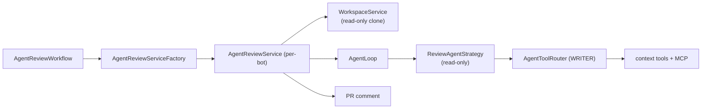

# Agentic PR Review Workflow

> Available since the agentic-review feature ships. Workflow key:
> **`agentic-review`**. Category: **REVIEW**. Opt-in per bot via the
> workflow-selection UI.

The **Agentic PR Review** workflow reviews pull requests like the built-in
[`review`](PR_WORKFLOWS.md) workflow, but instead of a single one-shot LLM call
over the diff it runs an **agent loop**: the model can iteratively call
read-only repository tools and MCP tools to explore the surrounding code before
writing its review.

It is the read-only counterpart of the issue-implementation agent
(`IssueImplementationService`) and reuses the same building blocks
(`AgentLoop`, `ToolCatalog`, `AgentToolRouter`).

## Read-only by design

The bot **can only read** the repository. There are three independent layers
enforcing this:

1. **Tool surface** — the agent advertises only the
   `ToolCatalog.Role.WRITER` descriptors: repository-exploration tools
   (`cat`, `rg`, `find`, `tree`, `git-log`, `git-blame`, `branch-switcher`),
   the read-only issue helpers (`get-issue`, `search-issues`) and any
   configured MCP tools. No file-mutation (`write-file`, `patch-file`,
   `delete-file`, `mkdir`) or build/validation tool is ever offered.
2. **Execution routing** — tools are executed through
   `AgentToolRouter.Mode.WRITER`, which rejects any tool outside the read-only
   set even if the model tries to invoke one.
3. **Workflow side-effects** — the workflow never commits, pushes, creates
   branches or posts a formal review action (approve / request-changes). The
   only externally visible effect is a single Markdown PR comment.

## Flow

1. Resolve params and build the per-bot `AgentReviewService` (AI client,
   repository client, MCP catalog/config, built-in tool whitelist).
2. Fetch the PR diff + title/body; skip cleanly when there is no diff.
3. Clone the PR head branch into a sandboxed workspace.
4. Run `AgentLoop` with `ReviewAgentStrategy`. The model explores via tool
   calls; the first assistant turn **without** tool calls is the final review.
5. Post the review as a PR comment (when enabled) and clean up the workspace.

## Parameters

Rendered automatically in the workflow-selection form from
`AgentReviewWorkflow.paramsSchema()`:

| Key | Type | Default | Description |
|---|---|---|---|
| `maxToolRounds` | integer | `12` | Upper bound (1–30) on explore/answer rounds while reading the repository. Higher = deeper analysis, higher token cost. |

The review is always posted as a PR comment.

## System prompt

The agent's role description is the operator-editable **Review-Agent
System-Prompt** on the *System settings → System prompts* page (entity column
`system_prompts.review_agent_system_prompt`, seeded by Flyway migration
`V22`). The read-only tool protocol is appended at runtime by
`SystemPromptAssembler` (using the `WRITER_AGENT` protocol template), so editing
the prompt cannot break tool calling.

## Enabling it

1. Open *System settings → Workflow configurations → Workflows* for the
   relevant configuration.
2. Tick **Agentic PR Review** and (optionally) adjust its parameters.
3. Assign that workflow configuration to the bot.

Because the orchestrator only runs explicitly-selected workflows for bots that
have a configuration, the agentic review never runs unless an operator enables
it — it does not replace or duplicate the standard `review` workflow.

## Provider support

Native function calling is used when the bot's AI integration supports it
(`AiClient.supportsNativeTools()`). For providers/integrations without native
tools (e.g. `use_legacy_tool_calling=true`), the agent **falls back to the
legacy JSON tool protocol** — exactly like `IssueImplementationService` /
`CodingAgentStrategy`: it parses the model's
`requestFiles` / `requestTools` / `runTools` envelopes, executes the requested
read-only tools (with `branch-switcher` handling and file fetching), feeds the
gathered context back, and iterates until the model replies with a plain-text
review. The number of legacy context rounds is bounded by
`agent.budget.max-context-rounds`.

