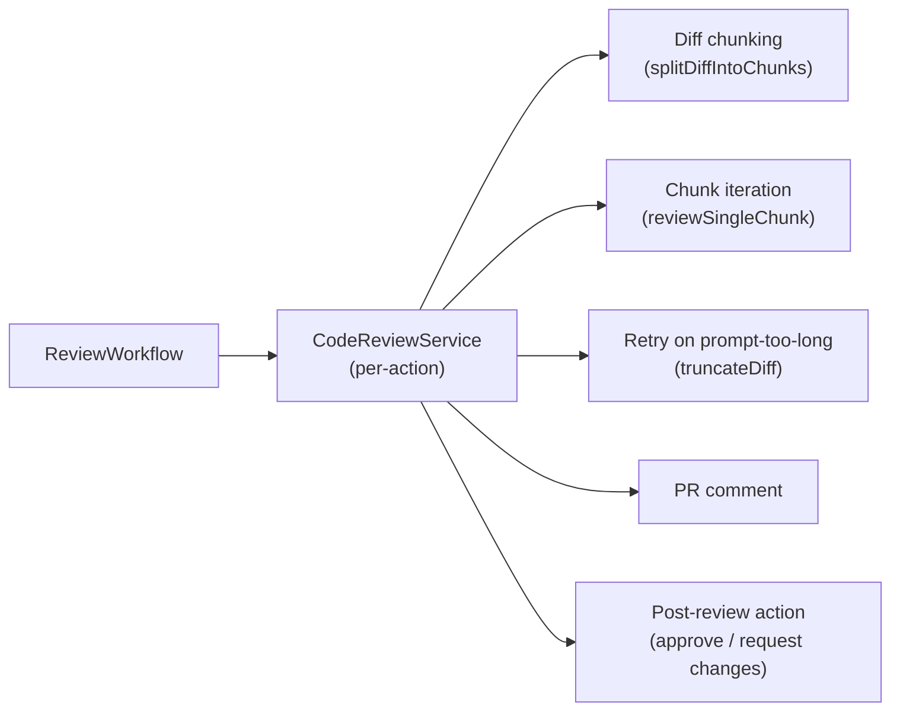

# PR Review Workflow

> Workflow key: **`review`**. Category: **REVIEW**. Enabled by default on the
> seeded `Default` workflow configuration.

The **PR Review** workflow posts an AI code review as a single Markdown comment
on every pull request that is opened or updated. It also handles conversational
follow-ups triggered by bot @-mentions, inline review comments, the submission
of traditional GitHub/Gitea review actions, and PR-close cleanup.

It is the built-in default workflow for every bot and requires no opt-in.

## Actions

The workflow handles five actions selected by a hint key (`review.action`)
passed by the orchestrator:

| Action value | Trigger | Behaviour |
|---|---|---|
| `review` | PR open / update (synchronize) | Fetches the diff, reviews it (with chunking if needed), posts a single Markdown PR comment, and optionally applies the bot's configured post-review action (`APPROVE` / `REQUEST_CHANGES`). |
| `botCommand` | `@bot` mention in a PR comment | Conversational follow-up — the model answers questions about the PR, explains review findings, or runs ad-hoc analysis. |
| `inlineComment` | Bot mention in a file-diff inline comment | Responds to a comment posted against a specific diff hunk. |
| `reviewSubmitted` | Review submission event | Processes pending review comments mentioning the bot. |
| `prClosed` | PR close | Cleans up the per-PR review session. |

## Flow

1. Resolve the bot's workflow configuration and extract PR Review params
   (`maxDiffCharsPerChunk`, `maxDiffChunks`, `retryTruncatedChunkChars`).
2. Dispatch to the appropriate handler based on the action hint.
3. For the `review` and `botCommand` actions:
   - Create a `CodeReviewService` instance with the resolved chunking params.
   - The service fetches the diff and splits it into chunks if it exceeds
     `maxDiffCharsPerChunk` characters.
   - Chunks are reviewed sequentially (up to `maxDiffChunks` total).
   - If a chunk triggers a prompt-too-long error, it is retried once after
     truncation to `retryTruncatedChunkChars` characters.
   - The final review is posted as a single PR comment.
4. For `botCommand` / `inlineComment`: the service handles the conversational
   exchange using the same AI client and chunking configuration.
5. For `reviewSubmitted`: processes pending review comments that mention the bot.
6. For `prClosed`: cleans up the in-DB review session.

## Parameters

Rendered automatically in the workflow-selection form from
`ReviewWorkflow.paramsSchema()`:

| Key | Type | Default | Description |
|---|---|---|---|
| `maxDiffCharsPerChunk` | integer | `120000` | Maximum characters per diff chunk before splitting. The full PR diff is split into chunks of this size for review. |
| `maxDiffChunks` | integer | `8` | Maximum number of diff chunks to review. Further chunks beyond this limit are skipped. |
| `retryTruncatedChunkChars` | integer | `60000` | When a chunk is too large for the model's context window (prompt-too-long error), the chunk is truncated to this many characters and retried once. |

### Setting parameters

Parameters can be set at two levels:

1. **Workflow configuration (per-bot, recommended):** Open
   **System settings → Workflow configurations → Workflows → PR Review** and
   set the values. These override the application defaults for all bots using
   this configuration.
2. **Application-level defaults:** Set the `review.chunking.*` properties in
   `application.properties` or via environment variables. These are the fallback
   when a workflow configuration does not specify a value:

   | Property | Env var | Default |
   |---|---|---|
   | `review.chunking.max-diff-chars-per-chunk` | `REVIEW_CHUNKING_MAX_DIFF_CHARS_PER_CHUNK` | `120000` |
   | `review.chunking.max-diff-chunks` | `REVIEW_CHUNKING_MAX_DIFF_CHUNKS` | `8` |
   | `review.chunking.retry-truncated-chunk-chars` | `REVIEW_CHUNKING_RETRY_TRUNCATED_CHUNK_CHARS` | `60000` |

**Recommendation:** Leave the application defaults as-is and set per-bot
overrides in the workflow configuration. This lets you fine-tune chunking for
different models (e.g., smaller context windows for local models, larger chunks
for Claude/GPT).

## System prompt

The review uses the **Code-Review System-Prompt** maintained on the *System
settings → System prompts* page (entity column
`system_prompts.code_review_system_prompt`, seeded by Flyway migration `V1`).
This prompt is operator-editable; changes take effect on the next review run.

## Post-review action

After posting the review comment, the workflow optionally triggers a formal
post-review action configured on the bot's Git integration:

| Action value | Effect |
|---|---|
| `NONE` (default) | No action beyond the comment. |
| `APPROVE` | Posts an approve/review action on the PR. |
| `REQUEST_CHANGES` | Posts a request-changes review action on the PR. |

The action is applied only when the `review` action handler posts a review
comment (i.e., the PR has a non-empty diff).

## Trigger conditions

The `review` action runs automatically on PR open/synchronize events. The bot's
trigger settings on the bot form determine when:

| Setting | Effect |
|---|---|
| Bot is requested as reviewer | Runs when developers explicitly request the bot as a reviewer. |
| Run workflow when PR is opened | Runs for every new PR even without reviewer assignment. |

## Cancellation

When a new push updates a PR while an older review run is still active, the
older run is **cancelled** automatically so that comments and actions do not
race against stale code. The cancelled run is recorded in the workflow-runs UI.

## Provider support

The workflow uses the bot's configured AI integration and supports both native
function calling and the legacy JSON tool protocol. No special configuration is
needed — the same AI client used for agentic workflows handles the review.

## Enabling / disabling

The workflow is **enabled by default** for every bot (via the seeded `Default`
workflow configuration). To disable:

1. Open **System settings → Workflow configurations → Workflows**.
2. Untick **PR Review** in the `Default` configuration (or clone it and remove
   the workflow from the clone).
3. The bot's existing configuration retains the change.

To enable additional review-category workflows (e.g., **Agentic PR Review**),
add them to the same or a different workflow configuration and assign it to the
bot.

## See also

- [`PR_WORKFLOWS.md`](./PR_WORKFLOWS.md) — PR workflows overview.
- [`PR_WORKFLOWS_AGENTIC_REVIEW.md`](./PR_WORKFLOWS_AGENTIC_REVIEW.md) — Agentic PR Review workflow.
- [`PR_WORKFLOWS_UNIT_TEST.md`](./PR_WORKFLOWS_UNIT_TEST.md) — AI Unit Tests workflow.
- [`MIGRATION_1.12_TO_1.13.md`](./MIGRATION_1.12_TO_1.13.md) — diff chunking migration guide.
