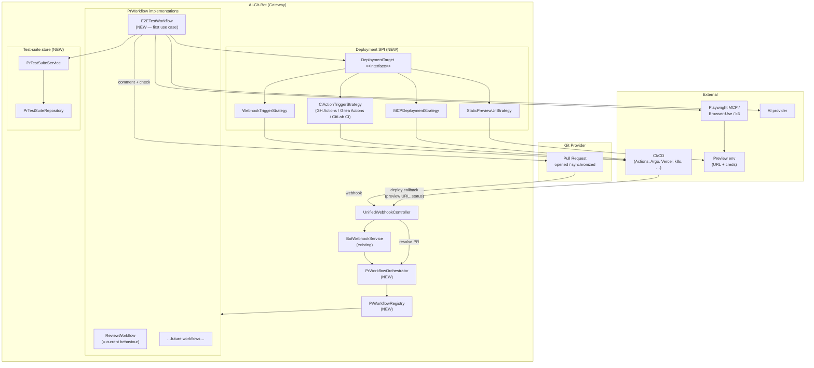
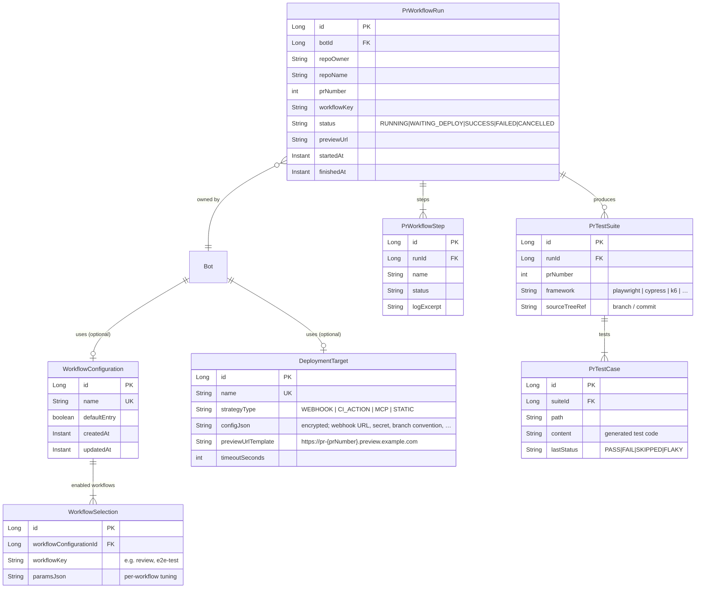
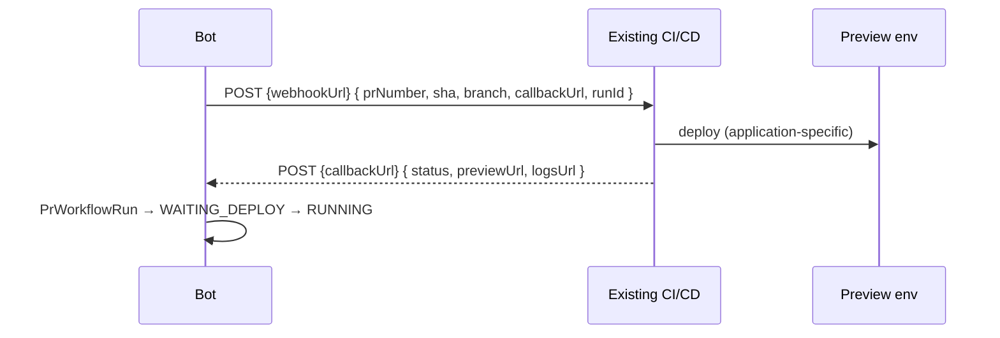
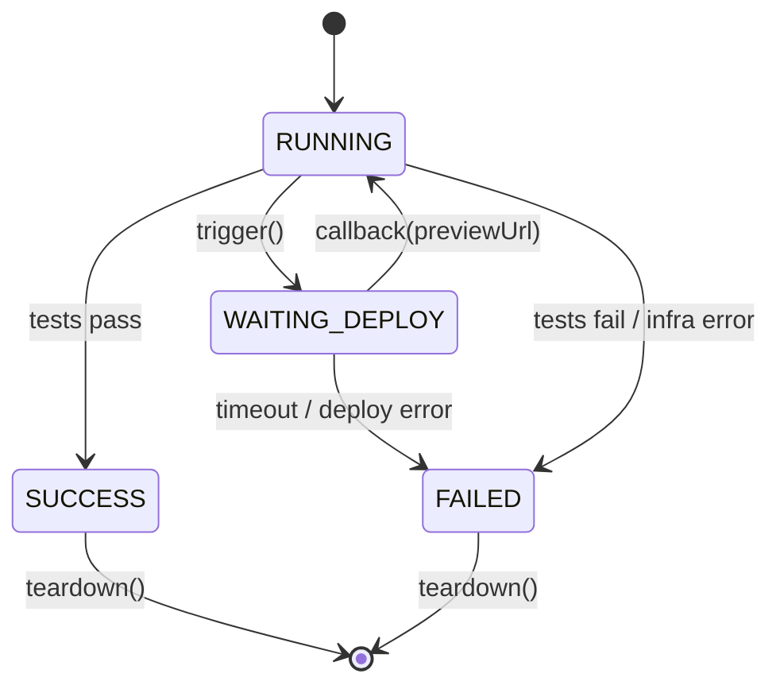
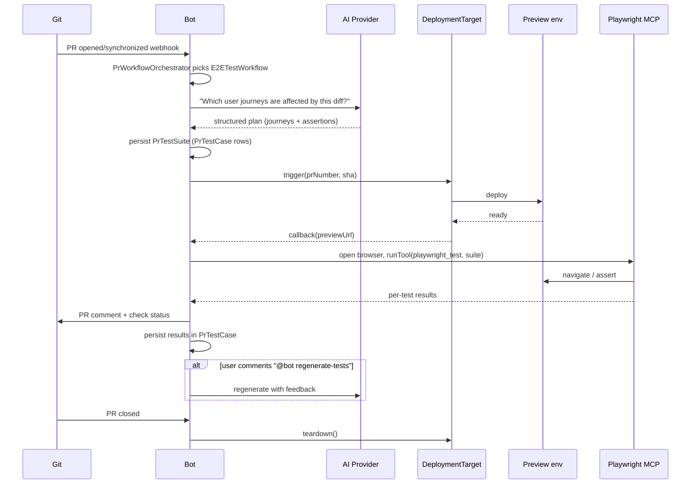

# Agentic PR Workflows — Concept &amp; Architecture

This document is the conceptual reference for the agentic PR-workflow
subsystem of AI-Git-Bot: the **`PrWorkflow`** SPI, the
**`DeploymentTarget`** abstraction, the data model, the four deployment
strategies, the `e2e-test` workflow, and the way the three E2E agents
plug into the existing `AgentLoop` infrastructure.

It is the *why* and the *what* — the *how it's wired up in code* lives
in [`INTERNALS.md`](INTERNALS.md), the operator-facing recipes live in
[`../PR_WORKFLOWS.md`](../PR_WORKFLOWS.md) /
[`../PR_WORKFLOWS_E2E.md`](../PR_WORKFLOWS_E2E.md) /
[`../PR_WORKFLOWS_CI_ACTIONS.md`](../PR_WORKFLOWS_CI_ACTIONS.md), and a
folder-level index lives in [`README.md`](./README.md).

> Related: [ARCHITECTURE.md](../ARCHITECTURE.md), [AGENT.md](../AGENT.md),
> [BOT_TOOL_CONFIGURATIONS.md](../BOT_TOOL_CONFIGURATIONS.md),
> [MCP_SERVER_HANDLING.md](../MCP_SERVER_HANDLING.md).

## 1. Motivation and Goal

The current PR-review path (`BotWebhookService → AiClient → postReviewComment`) is
a **single linear workflow**: fetch diff, send to LLM, write back review comment.
The coding-/writer-agent concepts in [AGENT.md](../AGENT.md), however, show that
a PR could trigger many more "agentic" follow-up steps:

- automatic generation of **end-to-end tests** for the affected user stories,
- building and deploying to a **test/preview environment**,
- executing the generated tests and reporting results back as a PR comment,
- additional, freely selectable workflows in the future (security scan,
  performance smoke, doc diff, migration plan, …).

The goal of this document is to integrate that extension **into the existing
gateway architecture**, sketch the first concrete use case (E2E-test agent)
end-to-end, and model the application-specific aspects (above all **deployment**)
abstractly enough that every target application can plug in its own infrastructure.

## 2. Research: What do existing solutions do?

Before designing, the following adjacent products and projects were surveyed:

| Solution | What it does | What we can borrow | What it does not solve |
|---|---|---|---|
| **GitHub Copilot Workspace / "Agents"** (2024–2026) | Generates a task plan per PR, executes build + tests in a cloud sandbox. | The **plan → execute → report** loop per PR; an isolated sandbox per PR. | No open plug-in model for custom deployment; locked to GitHub. |
| **GitLab Duo Workflow / Review** | LLM review + CI integration; reuses existing `.gitlab-ci.yml` and review apps. | The **review-app pattern**: deployment responsibility stays with the CI, the bot only consumes the preview URL. | Deeply married to GitLab CI; no multi-provider gateway. |
| **Qodo (formerly CodiumAI) PR-Agent** | `/review`, `/improve`, `/test` slash commands; generates unit tests from a diff. | Fine-grained **slash-command model** for additional workflows; great UX pattern. | No real build/deploy pipeline, only static test generation. |
| **Sweep / Aider / Devin** | Autonomous coding agents with their own sandbox, build, test, PR. | **Sandbox lifecycle** (provision, run, teardown) + tool loop very close to our `IssueImplementationService`. | No UI for non-coding workflows per PR; not designed for self-hosted gateways. |
| **Playwright MCP server**, **Browser-Use**, **Stagehand** | MCP/tool servers that expose browser automation as tools. | **Directly usable** as MCP servers for E2E test execution. | No test generation, no deployment trigger. |
| **Argo CD / Flux / Octopus PR environments**, **Render/Fly/Vercel preview deployments** | Create a preview URL on PR open. | **Webhook callback "preview-ready"** as a standard integration point for our bot. | The actual configuration is application-specific — exactly the gap we need to close. |
| **k6 Cloud, BrowserStack, Sauce Labs (MCP wrappers emerging)** | Test execution as a service. | Optional alternative executor to running Playwright locally. | Cost and data-protection considerations. |
| **Renovate, Mergify** | Rule-based PR pipelines, no LLM. | **Rule / workflow DSL** as inspiration for our `PrWorkflow` definition. | No generative part. |

**Conclusions:**

1. There is **no** open-source product that offers *configurable, agentic PR
   follow-up workflows* combining **test generation + deployment + test execution**
   while staying **provider-agnostic** (Gitea/GitHub/GitLab/Bitbucket) and
   **AI-provider-agnostic**. → Exactly the gap AI-Git-Bot can fill.
2. For **browser/E2E control**, the **Playwright MCP server** is a mature,
   pluggable building block we can **embed directly** instead of rebuilding.
3. For **deployment**, all successful solutions (Vercel/Render/Argo/GitLab review
   apps) are **callback-based**: the bot does not push anything itself, it
   subscribes to a "preview-ready" signal. We adopt that.

## 3. Conceptual model

We introduce two new first-class concepts:

- **`PrWorkflow`** — a reusable, configurable follow-up workflow that runs after
  (or instead of) the classical review on a PR.
  Examples: `e2e-test`, `security-scan`, `doc-diff`, `perf-smoke`.
- **`DeploymentTarget`** — an *abstract* description of how a preview/test
  instance for a PR is provisioned and torn down again. Four strategies (§6).

Both concepts are assignable **per bot** (analogous to `BotToolConfiguration`
and `McpConfiguration`) and therefore plug seamlessly into the existing data model.

## 4. High-level architecture



The extension is **additive**: the existing path (diff → LLM → review comment)
becomes the first registered `PrWorkflow` (`ReviewWorkflow`) and stays enabled
by default. New workflows can be opted into per bot without changing the
established behaviour.

## 5. Data-model extension



Important properties:

- **`WorkflowConfiguration` is optional** (nullable FK on `Bot`). If missing,
  only today's `ReviewWorkflow` runs — full backwards compatibility.
- **`PrTestSuite` lives per PR**, not per repository: the agent may generate
  PR-specific tests without "polluting" the main codebase. Optionally, a suite
  can be merged into the repo via a follow-up PR (see §7.4).
- **`DeploymentTarget.configJson`** is persisted encrypted via `EncryptionService`
  just like API keys.

## 6. Deployment abstraction (`DeploymentTarget`)

Deployment is **the most application-specific** component. We do not solve it
by performing deployments ourselves; instead, we offer **four interchangeable
strategies** — the operator picks the one that fits their existing infrastructure.

### 6.1 Strategy A — `WebhookTriggerStrategy` (recommended default)



- **Requirement on the customer side:** an existing deploy job that can be
  triggered via HTTP webhook (Jenkins, GitLab pipeline `trigger`, Argo CD
  ApplicationSet, custom script).
- **Bot side:** new endpoints
  `POST /api/workflow-callback/{runId}/{secret}` (status + preview URL)
  and `POST /api/workflow-log/{runId}/{secret}` (optional log stream).
- **Configuration:** webhook URL, secret header/token, payload template.

### 6.2 Strategy B — `CiActionTriggerStrategy` (provider-native)

Instead of a generic webhook, the **native CI** of the Git provider is invoked:

| Provider | Trigger | Status source |
|---|---|---|
| GitHub | `POST /repos/.../actions/workflows/{id}/dispatches` | Workflow run status via `RepositoryApiClient` |
| Gitea | `POST /repos/.../actions/workflows/{id}/dispatches` (Gitea Actions ≥ 1.21) | Run status |
| GitLab | `POST /projects/.../trigger/pipeline` | Pipeline status |
| Bitbucket | `POST .../pipelines/` with `custom:` pipeline | Pipeline status |

Pro: no extra infrastructure, status checks appear automatically on the PR.
Con: tied to that specific CI, the preview URL must be returned as an action
output (convention: a step writes `preview_url=…` into `$GITHUB_OUTPUT` /
`dotenv` / a pipeline variable).

### 6.3 Strategy C — `MCPDeploymentStrategy`

An **MCP server** exposes tools such as `deploy-pr-preview`,
`get-preview-status`, `teardown-preview`. The agent invokes them like any other
MCP tool. Useful when the customer already runs an internal MCP server for
platform actions (Backstage MCP, platform MCP, Kubernetes MCP). Fully
integrated into the existing [MCP whitelist model](../MCP_SERVER_HANDLING.md).

### 6.4 Strategy D — `StaticPreviewUrlStrategy` (fallback)

For apps that **already** auto-provision a preview deployment per PR (Vercel,
Render, Netlify, GitLab review apps). Nothing is triggered — only a URL
template and an optional status probe are configured
(`https://pr-{prNumber}.preview.acme.io`, healthcheck `/healthz`).

### 6.5 Lifecycle



`teardown()` is optional. When supported by the strategy, it runs at the
latest on `pullRequest closed/merged` (hook into `handlePrClosed()`).

## 7. First concrete use case: `E2ETestWorkflow`

### 7.1 Flow



### 7.2 Who decides what?

Deliberately delegate **a lot** of the decision-making to the LLM — analogous to
the coding agent:

| Decision | Who | How |
|---|---|---|
| Which user stories to test | LLM | Prompt contains diff + repo tree + existing tests |
| Choose test framework | LLM with hint | `WorkflowSelection.paramsJson` may set `preferredFramework`; otherwise the LLM infers from `package.json`/`pom.xml`/`Cargo.toml` |
| Generate test code | LLM via `write-file` tool (into the PR test workspace, **not** the repo workspace) |
| Run tests | Built-in tool `pr-test-run` OR an MCP server (`playwright_test`, `cypress_run`, `k6_run`) |
| Flaky detection | Bot (retry × N, then status `FLAKY`) |
| Re-run / regenerate | Human via slash commands (`@bot rerun-tests`, `@bot regenerate-tests`) |

### 7.3 New built-in tools (category `PR_WORKFLOW`)

| Tool | Args | Behaviour |
|---|---|---|
| `pr-test-write` | `path`, `content` | Writes a test file into the PR-specific test-suite workspace |
| `pr-test-run` | `framework`, `args[]` | Runs the suite (or a subset) against the preview env |
| `preview-url` | — | Returns the current preview URL (from the deployment target) |
| `preview-status` | — | Health probe / deploy status |
| `attach-artifact` | `path` | Attaches screenshots/videos to the PR comment |

These tools are togglable through the existing
[BotToolConfiguration](../BOT_TOOL_CONFIGURATIONS.md) — same whitelist
mechanism as today.

### 7.4 Test-suite lifecycle

A separate **isolated test-suite branch / folder pair** exists per
promotion attempt: the generated files live under `tests/e2e/pr-{n}/`,
while follow-up PR modes use a dedicated branch such as
`ai-tests/pr-{n}-r{runId}`. Options for what happens to it at the end:

1. **`ephemeral` (default):** suite lives only as a DB record, deleted on
   `pullRequest closed`.
2. **`offer-as-pr`:** the bot opens a **follow-up PR** against the feature
   branch that places the generated tests under `tests/e2e/pr-{n}/`.
3. **`promote-on-merge`:** when the feature PR is merged, the suite is
   automatically promoted into `tests/e2e/` (whitelist path, the human reviews
   it in the follow-up PR).

Configurable per `WorkflowSelection`.

## 8. UI sketch (as simple as possible)

Three UI touchpoints — all reuse the existing admin UI pattern (table +
detail modal, as used for MCP and tool configurations).

### 8.1 System settings → **Workflow configurations** (new)

```
┌────────────────────────────────────────────────────────────────────┐
│ Workflow configurations                           [ + Add ]        │
├────────────────────────────────────────────────────────────────────┤
│ Name              | Workflows enabled            | Used by | Edit │
│ Default           | review                       |   3     | ✎    │
│ Full-stack QA     | review, e2e-test             |   1     | ✎    │
│ Backend only      | review, security-scan        |   0     | ✎    │
└────────────────────────────────────────────────────────────────────┘
```

Edit dialog (`Add / Edit workflow configuration`):

```
Name: [ Full-stack QA                                    ]
Enabled workflows:
  ☑ review              (always-on recommended)
  ☑ e2e-test            [ Configure… ]
  ☐ security-scan
  ☐ doc-diff
  ☐ perf-smoke
[ Cancel ]                            [ Save ]
```

`Configure…` opens the per-workflow params panel (e.g. for `e2e-test`:
framework hint, suite lifecycle, max test count, timeout).

### 8.2 System settings → **Deployment targets** (new)

```
┌─────────────────────────────────────────────────────────────────┐
│ Deployment targets                              [ + Add ]       │
├─────────────────────────────────────────────────────────────────┤
│ Name           | Strategy        | Preview URL template  | ✎   │
│ Staging-K8s    | WEBHOOK         | https://pr-{n}.…     | ✎   │
│ Vercel-auto    | STATIC          | https://pr-{n}.…     | ✎   │
│ GH-Actions     | CI_ACTION       | (from action output)  | ✎   │
└─────────────────────────────────────────────────────────────────┘
```

The edit dialog shows different fields per strategy
(webhook URL + secret / workflow-file path / MCP tool name / URL template).

### 8.3 Bots → **Edit bot** (extended)

Two additional optional dropdowns:

```
Workflow configuration:  [ Default            ▾ ]   [ Details ]
Deployment target:       [ — none —           ▾ ]   [ Details ]
```

`Details` shows read-only which workflows are active, respectively which
strategy/fields the target uses (secrets masked).

### 8.4 Dashboard → **Workflow runs** (new, read-only)

```
Repo            PR    Workflow    Status         Preview            Duration
acme/web        #142  e2e-test    ✅ SUCCESS     pr-142.preview…    1m 42s
acme/web        #143  e2e-test    🟡 RUNNING     pr-143.preview…    34s
acme/api        #88   e2e-test    ❌ FAILED       —                 22s   [logs]
```

Click on a row → detail view with steps, generated tests, and full log
excerpt (analogous to existing bot detail pages).

## 9. Intervention in the existing code

Incremental, additive throughout:

1. **`PrWorkflow` interface** + `PrWorkflowRegistry` (analogous to
   `AiProviderRegistry` / `RepositoryProviderRegistry`).
2. `BotWebhookService.reviewPullRequest()` calls the new
   `PrWorkflowOrchestrator.run(bot, payload)` instead of the LLM directly. The
   current code is moved 1:1 into a `ReviewWorkflow` implementation → no
   behaviour change for existing bots.
3. **New endpoints** `/api/workflow-callback/{runId}/{secret}` in
   `UnifiedWebhookController` (with a dedicated secret per `PrWorkflowRun`).
4. **New services**: `PrWorkflowOrchestrator`, `PrTestSuiteService`,
   `DeploymentTargetService`, `WorkflowConfigurationService` + repositories.
5. **New built-in tools** in `ToolCatalog` (category `PR_WORKFLOW`),
   automatically added by `DefaultBotToolConfigurationInitializer` (additive
   migration — see [BOT_TOOL_CONFIGURATIONS.md](../BOT_TOOL_CONFIGURATIONS.md)).
6. **Flyway migration** `V13__pr_workflows.sql` for the five new tables.
7. **MCP recommendation in docs/UI**: a preconfigured template for
   `playwright-mcp` in the MCP-configurations help text.

## 10. Agent modelling — what is really "the agent" here?

Three cooperating agents, all with the same loop pattern
(`requestTools → runTools`) as the coding agent:

| Agent | Role | Context | Tools |
|---|---|---|---|
| **TestPlannerAgent** | Which journeys to test, which framework, how many cases | Diff, repo tree, existing tests, PR description | `cat`, `rg`, `tree`, `get-issue` |
| **TestAuthorAgent** | Writing concrete test code | Plan + relevant source files + framework doc snippets | `cat`, `pr-test-write`, optionally `patch-file` (only in the test workspace) |
| **TestRunnerAgent** | Executing, interpreting, optionally correcting | Plan + suite + preview URL | `pr-test-run`, `preview-status`, `attach-artifact`, optionally MCP Playwright |

These three agents run **sequentially** within the same `PrWorkflowRun`, but
keep **separate conversations** with the LLM — this keeps the context window
small and allows different models per step (`TestPlannerAgent` may be cheap,
`TestAuthorAgent` needs the stronger model). Configurable via the existing
`AiIntegration` selection per workflow parameter.

**Reuse**: all three agents extend the existing `AgentStrategy`/`AgentLoop`
infrastructure (see [AGENT.md](../AGENT.md) — "Provider-native function
calling"). That means native tool calls, plan persistence, schema validation
and telemetry work without extra effort.

## 11. Risks and open questions

| Risk | Mitigation |
|---|---|
| Cost explosion from long test runs per PR | Workflow param `maxTestCases`; reuse the token budget from `agent.budget.*`; opt-in per repo (`workflow.allowed-repos`). |
| Security issue: bot triggers a prod deploy | Hard separation "deployment target = non-prod"; UI requires explicit acknowledgement that the target is a test env; secret scoping per target. |
| Generated tests are brittle / flaky | Retry with `N` reruns; tagging `FLAKY`; `regenerate-tests` slash command; promote workflow leaves the final say with a human. |
| App has no deployment setup at all | `MCPDeploymentStrategy` + recommendation doc "minimal setup with GH Actions + Render free tier". |
| Data protection for preview env vs. test data | Hint in the UI; workflow param `useSyntheticData`; MCP tool `seed-test-data` (optional). |
| Parallel workflow runs per PR (race) | DB constraint `unique(botId, prNumber, workflowKey, status in RUNNING/WAITING)` + cancel-on-resync. |

## 12. Summary

- **`PrWorkflow`** is a generic, registrable extension of the PR path.
  The classic review runs as the first workflow (`ReviewWorkflow`) → zero
  risk for existing bots.
- The first concrete new workflow is **`e2e-test`**, modelled as three
  cooperating agents (`Planner`, `Author`, `Runner`) on the existing
  agent-loop infrastructure.
- **Deployment** is not done by the bot itself — it is abstracted via
  four interchangeable **`DeploymentTarget`** strategies (`STATIC`,
  `WEBHOOK`, `MCP`, `CI_ACTION`); operators pick the one that fits the
  CI / platform world they already live in.
- The **test suite lives per PR** and can optionally be promoted into
  the repository via a follow-up PR or a direct commit (see
  [`SUITE_PROMOTION_USER_STORY.md`](./SUITE_PROMOTION_USER_STORY.md)).
- The UI stays true to the existing pattern (three small new areas:
  workflow configurations, deployment targets, workflow runs) and adds
  two optional dropdowns on the bot form.
- Existing market solutions (Copilot Workspace, GitLab Duo, Qodo,
  Aider/Sweep, Playwright MCP) provide building blocks, but no complete
  solution with our multi-provider / multi-LLM gateway focus — exactly
  where the added value of this feature lies.

