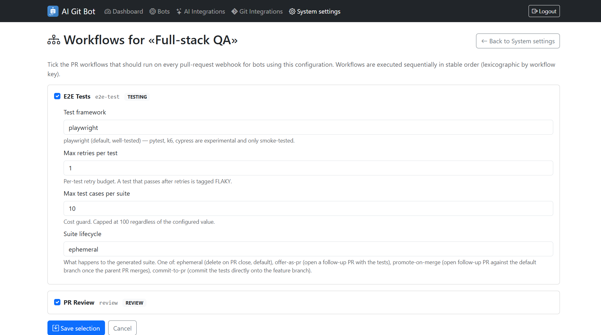
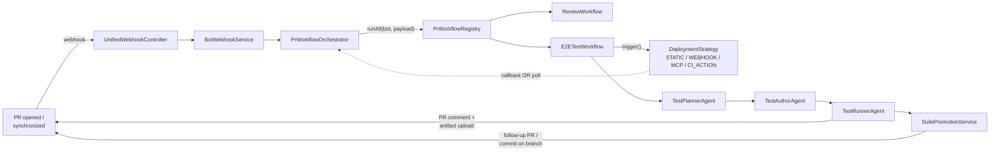
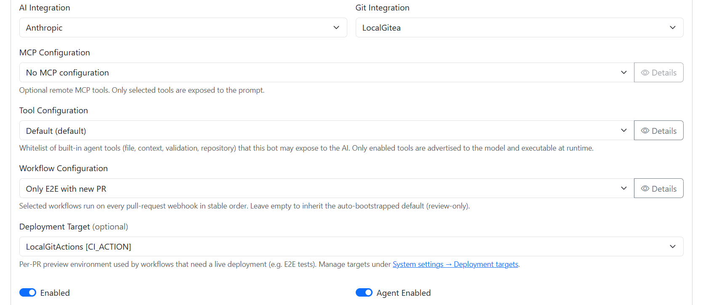

# Agentic PR Workflows

AI-Git-Bot turns a pull request into a small, configurable pipeline of
**agentic workflows**: every PR event flows through a central
`PrWorkflowOrchestrator` that picks one or more `PrWorkflow`
implementations, optionally spins up a preview environment through a
pluggable `DeploymentStrategy`, runs the workflow's agents, and writes
results back to the PR.

This folder is the **feature documentation** for that subsystem. It
explains *what* the feature is, *why* it exists, and *how* the pieces fit
together. Operator-facing recipes (one per Git provider / one per
deployment strategy) live next to it under [`../`](..), and laptop-runnable
walkthroughs live under [`../../systemtest/`](../../systemtest/README.md).

---

## What the feature gives you

Out of the box AI-Git-Bot ships with the following workflows registered
on `PrWorkflowRegistry`:

| Workflow key   | Category | What it does                                                                                          |
|----------------|----------|--------------------------------------------------------------------------------------------------------|
| `review`       | REVIEW   | The classical PR review — diff → LLM → inline + summary comments. Always-on for every bot by default. |
| `e2e-test`     | TESTING  | Plans, authors and runs Playwright specs against a per-PR preview deployment. Opt-in per bot.         |

Workflows are reusable — adding a new one is a matter of implementing
`PrWorkflow` and letting Spring DI register it (see
[`CONCEPT_AND_ARCHITECTURE.md` § 9](./CONCEPT_AND_ARCHITECTURE.md#9-intervention-in-the-existing-code)
and [`INTERNALS.md` § Writing a workflow](./INTERNALS.md#writing-a-new-workflow)).

The four deployment strategies the `e2e-test` workflow can target:

| Strategy     | Best for                                                                  | User story                                                                  |
|--------------|---------------------------------------------------------------------------|------------------------------------------------------------------------------|
| `STATIC`     | Vercel / Netlify / GitLab review apps — anything that already publishes a preview-per-PR URL. | [Marco the Frontend Lead](./STATIC_DEPLOYMENT_USER_STORY.md)                |
| `WEBHOOK`    | Jenkins / TeamCity / scripts behind a firewall — anything that can `curl` a callback. | [Priya the DevOps Engineer](./WEBHOOK_DEPLOYMENT_USER_STORY.md)            |
| `MCP`        | Internal platform teams already exposing deploy/status/teardown over MCP. | [Alex the Platform Engineer](./MCP_DEPLOYMENT_USER_STORY.md)                |
| `CI_ACTION`  | Provider-native CI (GitHub Actions / GitLab CI / Bitbucket Pipelines / Gitea Actions). | [Sam the SRE](./CI_ACTION_DEPLOYMENT_USER_STORY.md)                        |

The generated test suites are not throw-away — see
[`SUITE_PROMOTION_USER_STORY.md`](./SUITE_PROMOTION_USER_STORY.md) for the
four `suiteLifecycle` modes (`ephemeral` / `commit-to-pr` / `offer-as-pr`
/ `promote-on-merge`).

---

## Documents in this folder

| Document | Purpose | Audience |
|---|---|---|
| **[CONCEPT_AND_ARCHITECTURE.md](./CONCEPT_AND_ARCHITECTURE.md)** | The *why* and the *what*: motivation, conceptual model, high-level architecture, data model, deployment abstraction, the E2E workflow, UI sketches, agent modelling, risks. | Architects, tech leads, anyone forming a mental model of the feature. |
| **[INTERNALS.md](./INTERNALS.md)** | The *how it's wired*: package layout, SPI shapes, persistence schema, Spring beans, extension points, cross-cutting concerns. | Engineers extending the SPI, debugging a workflow run, adding a new strategy. |
| **[STATIC_DEPLOYMENT_USER_STORY.md](./STATIC_DEPLOYMENT_USER_STORY.md)** | Persona-driven feature description for the `STATIC` strategy. | Frontend leads on Vercel / Netlify / Render. |
| **[WEBHOOK_DEPLOYMENT_USER_STORY.md](./WEBHOOK_DEPLOYMENT_USER_STORY.md)** | Persona-driven feature description for the `WEBHOOK` strategy. | DevOps engineers running Jenkins / TeamCity / custom CI. |
| **[MCP_DEPLOYMENT_USER_STORY.md](./MCP_DEPLOYMENT_USER_STORY.md)** | Persona-driven feature description for the `MCP` strategy. | Platform engineers running internal MCP servers. |
| **[CI_ACTION_DEPLOYMENT_USER_STORY.md](./CI_ACTION_DEPLOYMENT_USER_STORY.md)** | Persona-driven feature description for the `CI_ACTION` strategy. | SREs standardised on provider-native CI. |
| **[SUITE_PROMOTION_USER_STORY.md](./SUITE_PROMOTION_USER_STORY.md)** | Persona-driven feature description for the suite-promotion modes. | QA leads who want generated tests to stop being throw-away. |

Related operator-facing docs (one level up):

- [`../PR_WORKFLOWS.md`](../PR_WORKFLOWS.md) — workflow configurations, deployment targets, callback channel.
- [`../PR_WORKFLOWS_E2E.md`](../PR_WORKFLOWS_E2E.md) — the `e2e-test` workflow recipe (planner / author / runner / lifecycle modes).
- [`../PR_WORKFLOWS_CI_ACTIONS.md`](../PR_WORKFLOWS_CI_ACTIONS.md) — per-provider recipes for `CI_ACTION`.
- [`../PR_WORKFLOWS_WEBHOOK_RECIPES.md`](../PR_WORKFLOWS_WEBHOOK_RECIPES.md) — per-CI recipes for `WEBHOOK`.
- [`../MCP_SERVER_HANDLING.md`](../MCP_SERVER_HANDLING.md) — MCP whitelist model reused by the `MCP` deployment strategy.

Laptop-runnable walkthroughs:

- [`../../systemtest/README.md`](../../systemtest/README.md) — index of all systemtest scenarios.
- E2E sample app: [`../../systemtest/docker-compose-e2e-sample.yml`](../../systemtest/docker-compose-e2e-sample.yml)
- MCP deployment: [`../../systemtest/README-mcp-deployment.md`](../../systemtest/README-mcp-deployment.md)
- CI-action deployment: [`../../systemtest/README-ci-action.md`](../../systemtest/README-ci-action.md)
- Suite promotion: [`../../systemtest/README-suite-promotion.md`](../../systemtest/README-suite-promotion.md)

---

## How a single PR run looks

For the full state machine and per-component responsibilities see
[`CONCEPT_AND_ARCHITECTURE.md` § 4](./CONCEPT_AND_ARCHITECTURE.md#4-high-level-architecture)
and [`INTERNALS.md`](./INTERNALS.md).

---

## Enabling the feature on your bot

1. **Pick a workflow configuration.** In *System settings → Workflow
   configurations* the `Default` config runs only `review`; the seeded
   `Full-stack QA` config additionally runs `e2e-test`. Clone either to
   tweak per-workflow params.
2. **(For `e2e-test` only) wire up a deployment target.** In
   *System settings → Deployment targets* pick one of the four
   strategies and fill in the per-strategy form; the user-story
   documents in this folder explain *which* strategy fits *which* world.
3. **Assign both to a bot.** In *Bots → Edit bot* set the **Workflow
   configuration** and **Deployment target** dropdowns. Existing bots
   keep their pre-1.7 behaviour (only `review`) when both fields stay
   blank.

---

## Common questions

**Will this break my existing bots?**
No. Bots without a deployment target run only `review`, exactly as before.

**Do I need a deployment target to use AI-Git-Bot?**
No. Only the `e2e-test` workflow requires one; `review` and the
coding/writer agents work without it.

**Our CI is Jenkins — can we use this?**
Yes — pick the `WEBHOOK` strategy and add one `curl` call to your
existing Jenkins job. See
[`WEBHOOK_DEPLOYMENT_USER_STORY.md`](./WEBHOOK_DEPLOYMENT_USER_STORY.md).

**Our previews already exist on Vercel / Netlify.**
Use `STATIC`. The bot computes the preview URL from a template and
optionally waits for `/healthz`. See
[`STATIC_DEPLOYMENT_USER_STORY.md`](./STATIC_DEPLOYMENT_USER_STORY.md).

**Can I regenerate tests if they're flaky?**
Yes — `@bot regenerate-tests <feedback>` re-runs planner + author with
the operator hint threaded through; `@bot rerun-tests` just re-executes
the existing suite. See [`../PR_WORKFLOWS_E2E.md`](../PR_WORKFLOWS_E2E.md).

**Can the generated tests survive PR close?**
Yes — pick `offer-as-pr`, `promote-on-merge` or `commit-to-pr` on the
`e2e-test` workflow params. See
[`SUITE_PROMOTION_USER_STORY.md`](./SUITE_PROMOTION_USER_STORY.md).

---

## Feedback

Found an issue, question, or suggestion? Please open a GitHub issue
tagged `documentation` against the main repo, or start a discussion and
link back to this folder.

